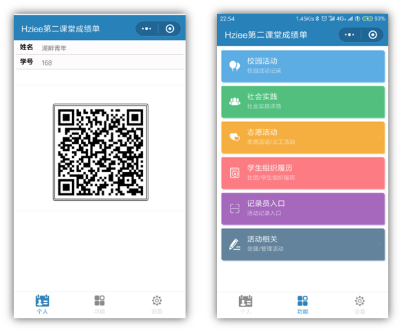
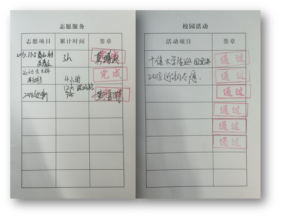

# 第二课堂 产品展示

---

面向对象： 学生 \ 需要了解产品的商家等

----

## 直观页面感受

用户界面操作等 

- 带壳截图 生成使用画面
- 首页介绍页面对截图进行阴影处理 加强直观感受

---

## 优势

### 与传统纸质记录相比

- 易丢失
- 易造假 笔迹造假 章造假
- 数据易遗漏 纸张容易丢失 
- 不方便修改 笔迹
- 盖章流程复杂 大型活动现场需要较多人以及巨大工作量
- 字迹潦草不易阅读统计 签名 时间 等因素影响

部分学校要求使用app记录 但是对于隐私信息的保护不够

 将手动签章改为线上扫码，并且个人专属二维码配备动态图案以及10s自动刷新的功能，极大的降低了作弊的可能性。  

微信程序用户已达到8000余人，受到大众一致好评。

线下校园活动记录册签章时间为20s/人， “第二课堂成绩系统”签章时间为0.5S/人，签章效率提升97%。

商业APP校园记录软件 普遍评价较差

- 不能立足于学生真实的生活所需
- 隐私保护
- 程序稳定性 使用者操作 效率偏低等
- 课后服务 无法通过行政手段进行消除

观点

第二课堂成绩系统线上校园活动记录册固然便捷，但大众观念还一时难以跟上。其中最重要的便是又很多高校认为比起线上，他们更愿意相信纸质的东西，害怕线上会有数据泄露等问题。

可能会认为没有必要去花钱去开发这样的一个线上的系统。这就是需要我们去解释说明的东西了

首先我们的系统不存在任何隐私泄露，我们不保存任何隐私数据。再有就是我认为一个新的东西出来总归要去尝试，总是只想着坚持陈旧的东西，不去尝试新事物，是会被时代所淘汰的。

----

## 技术细节

活动章导入方式有2种

第一种线下盖章，活动组织承办方负责人提供现场扫码员名单，通过管理员创建活动并授权，在活动结束后扫码员以扫描小程序个人二维码的方式，给在场参与活动的同学盖章

第二种，线上导入，由活动承办方在活动结束后提供活动参与成员名单（按照标准模板格式），后台技术端进行直接导入。相对而言此种方式导入最为简单，方便，快捷。但这也要求到前期对报名信息收集完整、准确度高，避免不正确信息导入不成功的情况。

目前仅有一个总服务器，客户端的信息首先传输到总服务器。随着总用户量不断增加（用户在线数量低峰100人次高峰8000人次），系统内容框架会不断完善扩增，我们会设置分服务器，总服务器的信息传输到分服务器，实现信息交互

（高并发 负载均衡需要后续处理

效益分析表

| 项目               | 成本/元 | 费用/元 |
| ------------------ | ------- | ------- |
| 服务器             | 10000   | 10000   |
| 域名               | 500     | 500     |
| 人力成本           | 60000   | 5000*12 |
| 宣传成本           | 2000    | 2000    |
| 预计产生的经济效益 |         | 47500   |

### 技术风险

- 技术不足 实现不够优雅 性能偏低 
  - 加强学习 多版本迭代
- 页面设计 交互不足 用户体验低
  - 导致用户流失

Github 版本更替

定期 敏感隐私密码更改

**前后端分离**

本项目开发使用了前后端分离技术，即前端专注于数据展示与交互，后端专注业务逻辑的处理。在架构上分离解耦，逐渐摆脱前后端在架构上的依赖，前后端单独开发，通过 Restful接口传递数据。减轻后端服务器的压力，后端服务器不再负责页面渲染，只负责输入数据，提升吞吐量。

Git

Maven

Nginx

Hybird渲染模式

二维码 JSON

{

"legal":"No2Class",

"stuId":"17905215",

"stuName":"XXX",

"timestamp":1554900949268

}

Base64加密

 