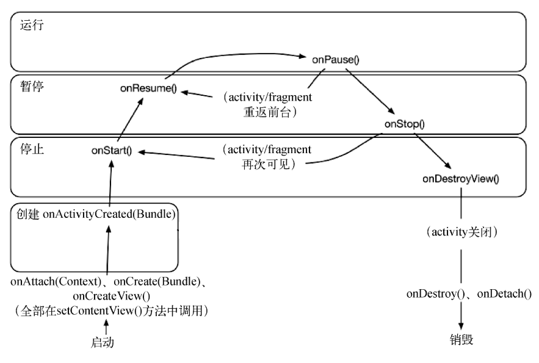
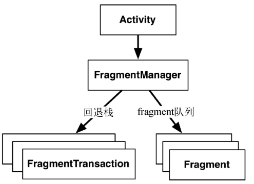
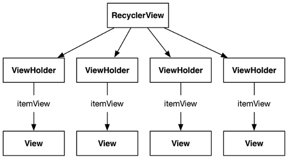
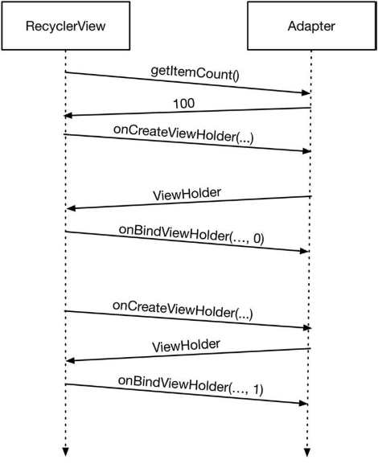

# Criminal Intent - Learning Notes

---

## Before

会大概依据章节进行同步

参考书籍: Android 编程权威指南


创建底层的`Crime`类

```java
public Crime() {
    mId = UUID.randomUUID();
    mDate = new Date();
}
```

UUID 是唯一的ID 值


## Fragment

> 

需要先设计一个`CrimeFragment`的  `UI fragment` 进行管理

再设计一个`CrimeActivity`托管`CrimeFragment` 实例

托管有两种方式

- 在`activity`**布局**中添加`fragment`
  - 简单 无法替换`fragment` 的视图
- 在`activity`**代码**中添加`fragment`
  - 复杂 但是可以动态控制


[^依赖]: 添加`AppCompat`支持库


### Fragment 生命周期

> 


---

**CrimeFragment.java**

#### onCreate()

```java
public class CrimeFragment extends Fragment {
    private Crime mCrime;
    
    @Override
    public void onCreate(Bundle savedInstanceState) {
        super.onCreate(savedInstanceState);
        mCrime = new Crime()
    }
}
```

与`activity`不同 这里的`onCreate()`方法是`public`的 因为托管`fragment`的`activity`需要控制它的生命周期


#### onCreateView()

`fragment`的视图在这里还没有创建

- `LayoutInflater`
- `ViewGroup`
  - 都是实例化布局必要的参数
- `Bundle`
  - 用于存储恢复用的数据
- `View`
  - 将实例化后的`View`返回给`activity`


```java
@Override
public View onCreateView(LayoutInflater inflater, ViewGroup container, Bundle savedInstanceState) {
    View v = inflater.inflate(R.layout.fragment_crime, container, false);
    return v;
}
```


视图的生成:　`LayoutInflater.inflate`

参数

- 布局文件
- 父视图
- 是否将生成的视图添加给父视图


### FragmentManager

> 
>
> - fragment 队列
> - fragment 事务回退栈


直接在`Activity`中获取

```java
FragmentManager fm = getSupportFragmentManager();
```

添加fragment

```java
Fragment fragment = fm.findFragmentById(R.id.fragment_container);

if (fragment == null) {
    fragment = new CrimeFragment();
    fm.begintransaction()
        .add(R.id.fragment_container, fragment)
        .commit();
}
```

以上代码的大概流程可理解为 : 创建一个fragment事物 -> 执行 添加Fragment -> 提交事务

`add()`方法是整个的核心 参数:

- 容器视图资源ID
  - 告知: `Fragment`视图该出现的`Activity`中的哪个位置
  - `FragmentManager`队列中的唯一标识
- 新创建的Fragment


流程小结

> 通过`FragmentManager` 在队列中 尝试获取到已经存在的`Fragment` 
>
> 如果没获取到 就新建一个所需要的
>
> 启动一个事务 并把`fragment`放到里面
>
> [^为什么会已经存在?]: 如设备旋转或者回收内存时 销毁`Activity`时 `fragment`队列会被保留下来 重建的时候会获取到队列并恢复队列


### Fragment 布局

```xml
<FrameLayout 		xmlns:android="http://schemas.android.com/apk/res/android"
    android:id="@+id/fragment_container"
    android:layout_width="match_parent"
    android:layout_height="match_parent">

</FrameLayout>
```


由于这个布局通用性很高 于是把这个布局文件命名为`activity_fragment.xml`


## RecyclerView

新建 `CrimeListActivity` 和 `CrimeListFragment`

> 
>
> Adapter
>
> > - 创建必要的`ViewHolder`
> > - 绑定`ViewHolder`至模型层数据

RecyclerView - Adapter 会话过程

> 

- `getItemCount`
  - 获取数组列表包含多少个对象
- `onCreateViewHolder(ViewGroup, int)`
  - 创建`ViewHolder`及其要显示的视图
- `onBindViewHolder(ViewHolder, int)`
  - 用模型填充视图 到`ViewHolder`视图上


在布局文件中使用`RecyclerView`视图

```xml
<?xml version="1.0" encoding="utf-8"?>
<androidx.recyclerview.widget.RecyclerView
    xmlns:android="http://schemas.android.com/apk/res/android"
    android:id="@+id/crime_recycler_view"
    android:layout_width="match_parent"
    android:layout_height="match_parent">

</androidx.recyclerview.widget.RecyclerView>
```


将视图与`fragment`进行关联

```java
private RecyclerView mCrimeRecyclerView;

@Override
public View onCreateView(@NonNull LayoutInflater inflater, @Nullable ViewGroup container, @Nullable Bundle savedInstanceState) {
        View view = inflater.inflate(R.layout.fragment_crime_list, container, false);
        mCrimeRecyclerView = view.findViewById(R.id.crime_recycler_view);
        // 必须要 Layout manager
        mCrimeRecyclerView.setLayoutManager(new LinearLayoutManager(getActivity()));

        return view;
    }
```

没有`LayoutManager`的支持 `RecyclerView`无法工作 而且应用会崩溃

`RecyclerView`并不能摆放列表项 所以`LayoutMangaer`就显得很重要了

暂时先使用`LinearLayoutManager` 后续会学到其他的布局方式

目前还什么都没有

#### ViewHolder

```java
    private class CrimeHolder extends RecyclerView.ViewHolder implements View.OnClickListener {

        private TextView mTitleTextView;
        private TextView mDateTextView;
        private ImageView mSolvedImageView;

        private Crime mCrime;

        public CrimeHolder (LayoutInflater inflater, ViewGroup parent) {
            super(inflater.inflate(R.layout.list_item_crime, parent, false));
            itemView.setOnClickListener(this);

            mTitleTextView = itemView.findViewById(R.id.crime_title);
            mDateTextView = itemView.findViewById(R.id.crime_date);
            mSolvedImageView = itemView.findViewById(R.id.crime_solved);
        }

        public void bind (Crime crime ) {
            mCrime = crime;
            mTitleTextView.setText(mCrime.getTitle());
            mDateTextView.setText(mCrime.getDate().toString());
            mSolvedImageView.setVisibility(crime.isSolved() ? View.VISIBLE : View.GONE);
        }

        @Override
        public void onClick(View v) {
            Intent intent = CrimeActivity.newIntent(getActivity(),mCrime.getId());
            startActivity(intent);

        }
    }
```


```java
    private class CrimeAdapter extends RecyclerView.Adapter<CrimeHolder> {
        private List<Crime> mCrimes;

        public CrimeAdapter (List<Crime> crimes) {
            mCrimes = crimes;
        }

        @NonNull
        @Override
        public CrimeHolder onCreateViewHolder(@NonNull ViewGroup parent, int viewType) {

            LayoutInflater layoutInflater = LayoutInflater.from(getActivity());

            return new CrimeHolder(layoutInflater, parent);
        }

        @Override
        public void onBindViewHolder(@NonNull CrimeHolder holder, int position) {
            Crime crime = mCrimes.get(position);
            holder.bind(crime);

        }

        @Override
        public int getItemCount() {
            return mCrimes.size();
        }
    }

```


