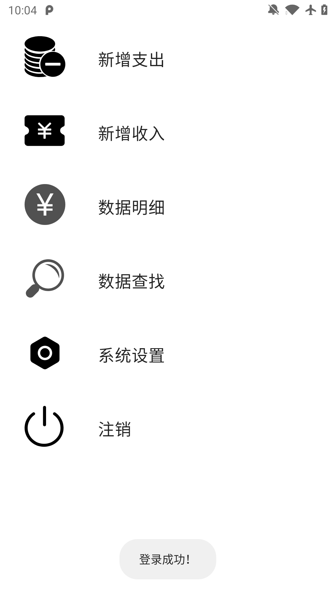
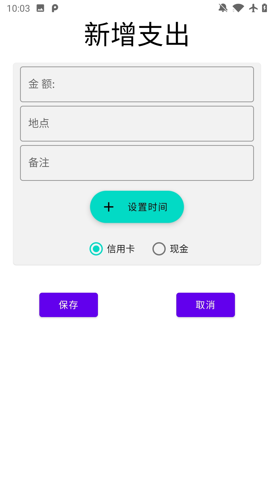
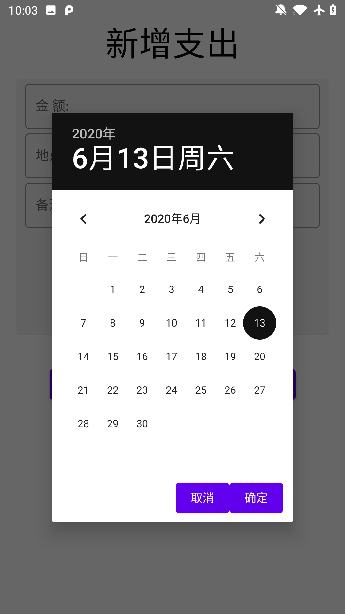
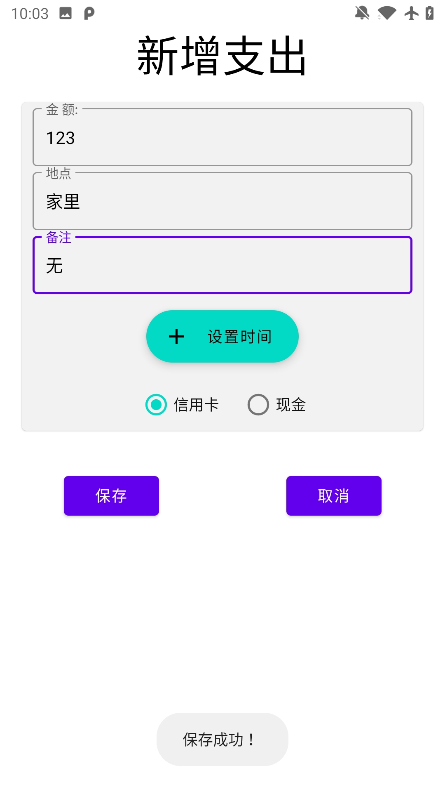
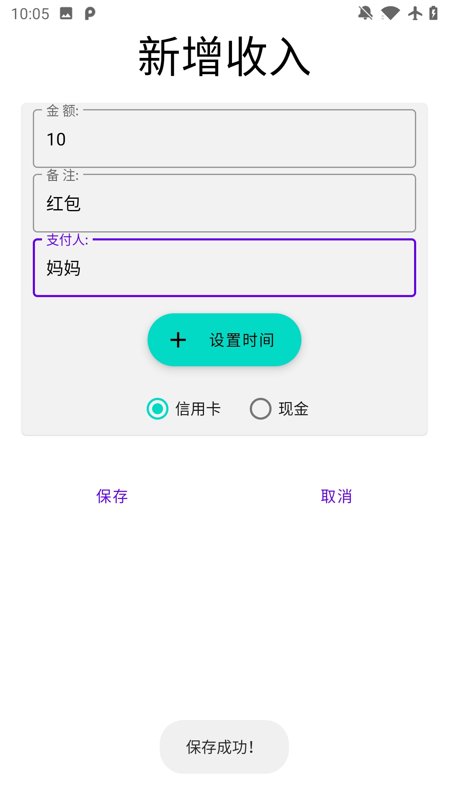
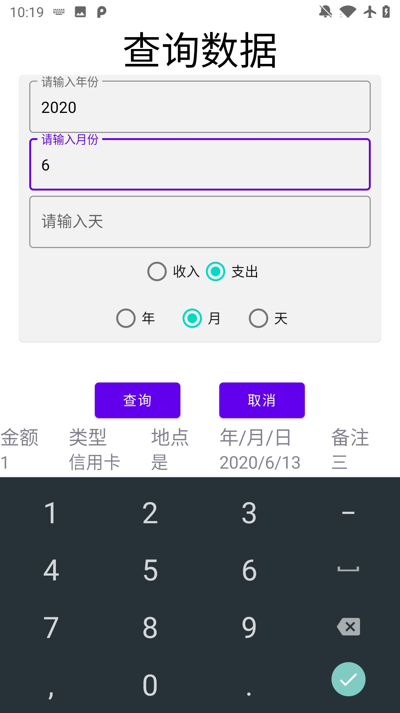
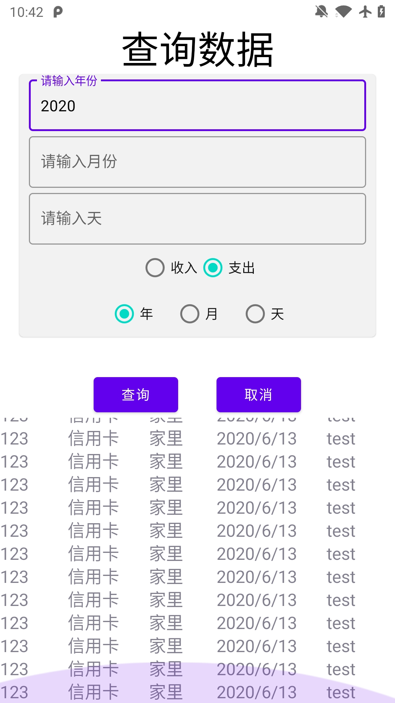

# 项目总结报告

---

## 功能简介

打开应用  进入输入密码界面 正确输入密码之后 进入主界面

点击新增支出 输入新增的信息

点击设置时间 在弹出的界面中设置好时间

点击确定后 点击保存 即可成功将支出信息保存到APP的数据库中

同样的 点击新增收入 也可像上述过程一样录入收入信息

按取消键 返回到主页菜单 点击 数据明细

即可看到支出的信息 点击删除键可以对对应的信息进行删除

左右滑动可以切换支出和收入两个分类

按Back键 在主页面上选择查询数据

对需要查询的信息进行选择分类 和时间的不同 

其中 时间的选项上 

> 选择年份只需要输入 年
>
> 选择月份 需要输入 年 和 月
>
> 选择天 需要输入 年 月 天

如果不点击对应的选项 其他的项目是不能输入的

输入需要查询的信息 点击查询 即可看到结果

如果查询的结果过多 在查询结果处可进行上下的滑动 对结果进行查看

按取消或者Back键 返回到主页 选择系统设置 对当前的密码进行修改

如果输入的当前密码错误 或者重复密码错误 会进行对应的提示

