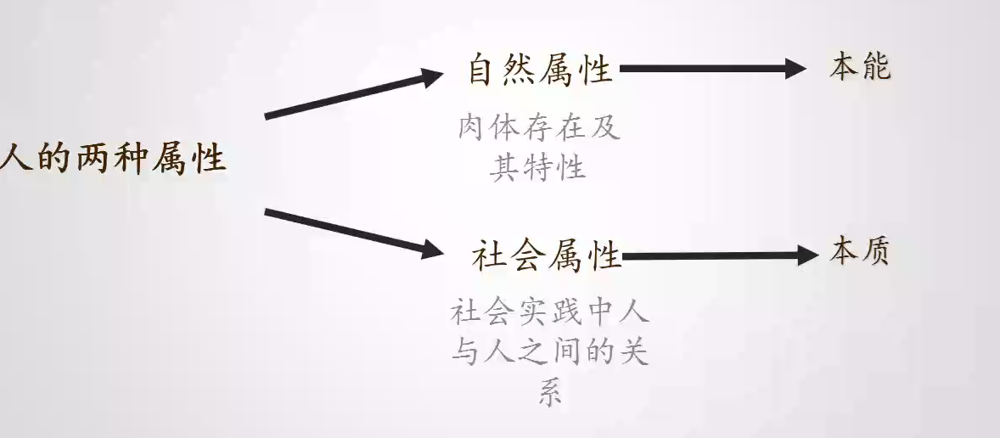
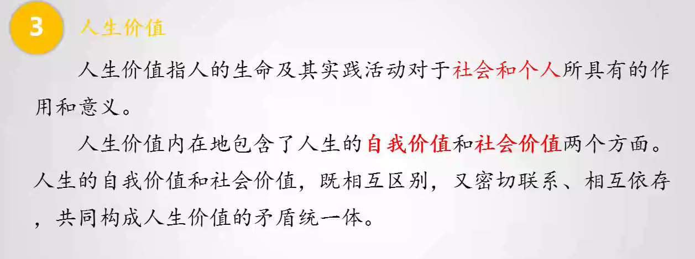
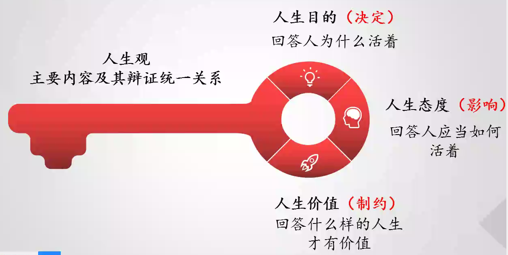
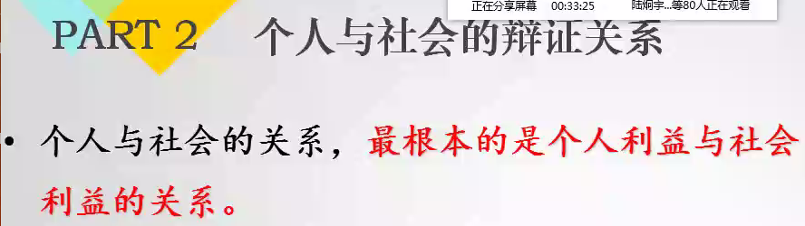

# 思想道德修养

via 陈丽媛

Tel 18868806368

格致楼218

## 总体章节划分

1-3: 思想道德修养

4-5: 道德修养

6: 法治修养

----

## Day 1

核心围绕: 如何做一个真正的人

一条主线：培育践行社会主义核心价值观

两个素质：思想道得素质和法律素质

三个内容:  思想 道得 法制

五项:         世界观 人生 价值 道德 法制

意义:

> 领悟人生真谛 鉴定理想信念 爱国主义 改革创新的主力军
>
> 道德认知 明大德 守功德 严私德
>
> 尊法 学法 守法 用法

### 学习课程的基本方法

- 坚持学思结合
- 注重学以致用
- 坚持交流监督

### 中国特色社会主义新时代

#### 新？体现？

新时代是理解当前历史方位的关键词

党得十九大报告指出

> 改革开放近40年 综合实力进入世界前列 推动国际地位实现前所未有的提升

三个意味着

> 迎来实现中华民族伟大复兴的光明前景
>
> 在世界上高高举起了中国特色社会主义伟大旗帜
>
> 为解决人类问题贡献了中国智慧和中国方案

五个是

> - 承前启后 继往开来 在新的历史条件下继续夺取中国特色社会主义伟大胜利的时代
> - 是决胜全面建成小康社会 进而全面建设社会主义现代化强国的时代
> - 是全国各族人民团结奋斗 不断创造美好生活 逐步实现全体人民共同富裕的时代
> - 是全体中华儿女 戮力同心 奋力实现中华民族伟大复兴中国梦的时代
> - 是我过日益走进世界舞台中央  不断为人类做出更大贡献的时代

#### 强国一代

**奋斗仍是这一代人的人生主题**

---

#### 新时代 宏大的目标

1.崇高的理想信念 牢记使命 自信自励

2.要有高强的本领才敢 勤奋学习 全面发展

3.要有天下兴亡 匹夫有责的担当精神

#### 思高思想道德素质 和法治素养

#### 道德与法律的相互关系

道德为法律提供了价值准则和道义基础

法律为道德建设提供了制度保障

**国家和社会治理需要道德和法律的共同作用**

习大大：人民有信仰 国家有力量 民族有希望

人若犯我 = > 寻求法律帮助

---

思考题

// 交打印稿

> 1. 改革开放40周年 身边的变化   
> 2. 学期伊始 大学规划做好了吗 是什么呢 

---

## Day2 人生的青春之词

### 人生观看法

 

人的两种属性

- 自然属性
  - 肉体存在及其特性
  - 本能

主要内容

## Day 3

### 积极进取的人生态度

### 正确评价人生价值

#### 坚持能力有大小与贡献尽力相统一

#### 坚持物质贡献与精神贡献相统一

#### 坚持完善自身与贡献社会相统一

----

## Day 4

### 理想信念的内涵和重要性

### 理想的崇高信念

### 在实现中国梦的实践中放飞青春梦想

