# 数字电路

---

## 第一章 数字和逻辑基础

### 1.1 模拟信号与数字电路

#### 数字信号和模拟信号

1.模拟信号

> 时间和数值 均连续变换的电信号

2.数字信号

> 时间和数值是是离散的信号
> 
> 每次变化都是某个值的整数倍

最常见的就是二进制信号

3.比较

- 数字电路的特点
  - 只处理 `0 1`两种信号
  - 由于信号不是连续的 信号表示为 **有 / 无** 或者 **高电平 低电平**
- 数字电路研究的内容
  - 电路输出输入间的逻辑关系 
  - 主要的工具是逻辑代数 
  - 电路的功能用真值表 逻辑表达式及波形图表示

### 数字电路特点

- 研究对象

- 主要优点

#### 数字电路分类

- 根据电路结构不同
  - 分立元件电路
  - 集成电路
- 根据半导体导电类型分
  - 双极型数字集成电路
  - 单极型数字集成电路
- 根据集成密度
  - SSI 小规模
  - MSI 中规模
  - LSI 大规模
  - VLSI 超大规模

#### 数字信号参数

1.理想的周期性数字信号

参数

- $V_m$ 信号幅度

- $T$ 周期

- $t_W$ 脉冲宽度

- $q(\beta)$ 占空比
  
  - $$
    q ( \% ) = \frac {t_W} {T} \times 100%
    $$

2.实际脉冲波形和参数

- $T$ 周期
- $t_W$ 脉冲幅值为50%的两个时间所跨越的时间
- $t_r$上升时间 $t_f$ 下降时间
  - **从脉冲幅值10%倒90% 上升 / 下降 所经历的时间 典型值`ns`**

#### 数字电路的基本功能及其应用

温度检测和控制电路实例

### 数制

数码所处位置不同时 所代表的数值不同

若表示为各位加权系数之和 则称为按权展开式

> (3176.54)~10~ = 3 ✖ **10^3^** + 7 ✖ **10^1^** + 6 ✖ **10^0^** + 5 ✖ **10^-1^** + 7 ✖ **10^-2^**

> (1011.11)~B~ = 1 ✖ **2^3^** + 0 ✖ **2^2^** + 1✖**2^1^** + 1✖**2^0^** + 1✖**2^-1^** + 1✖**2^-2^**

$$
(N)_R = \sum_{i=-m}^{n} d_i \times R^i
$$

|         | 二进制    | 八进制   | 十进制     | 十六进制        |
| ------- | ------ | ----- | ------- | ----------- |
| 名称      | Binary | Octal | Decimal | Hexademical |
| 数码 (系数) | 0 1    | 0~7   | 0-9     | 0~F         |
| 权       | 2^i^   | 8^i^  | 10^i^   | 16^i^       |
| 基数      | 2      | 8     | 10      | 16          |

#### 不同数制间的关系与转换

1. 各种数制转换成十进制  **按权展开求和**

2. 十进制转换为二进制

> 整数和小数分别转换
> 
> 整数部分: 除2取余
> 
> 小数部分: 乘2取整

> 两个部分的读数顺序不一样

> 如果十进制数较大时 用与其相当的2的幂次数进行比较 简化过程

3. 二进制与八进制的相互转换
- 二进制-> 八进制 
  - 从小数点开始 整数部分向左 小数部分向右 三位一组 最后不足三位的加0不足三位
- 八进制 -> 二进制
  - 每位八进制用三位二进制数代替 再按原顺序排列
4. 二进制和十六进制间的转换
- 二进制 -> 十六进制
- 部分向左 小数部分向右 四位一组
- 最后不足四位的加0不足四位 
- 再按顺序写出各组对应十六进制
- 反过来同理

### 带符号数的表示方式

#### 原码

- 在原来数字的前面加一位符号位 

- `0 1` = 正数 / 负数

#### 反码

- 正数不变

- 负数 **除符号位外 每位取反**

#### 补码

- 正数不变

- 负数在反码最后一位加`1`

### 数的码制

将若干个二进制数码 0 和 1 按照一定规则排列起来表示某种含义的代码称为二进制代码

用数码的特定组合表示特定信息的过程称编码

常用二进制码

- 自然二进制码
- 二十进制码
- 格雷码 循环码
- 奇偶校验
- ASCII码

#### 自然二进制码

按自然数排序排列的二进制吗

#### 二进制数码

BCD码 即 Binary Coded Decimal

使用4位二进制数表示1位十进制数

最常用的是 **8421BCD码** 每一位有固定的权

有权码

> 8421码 5421码 2421A码 2421B码

 无权码 

> 余3码 余3BCD码 格雷码

**注意 : BCD码和数制的区别**

#### 可靠性代码

- 奇偶校验码
  - 1位校验码 0/1 **以使**代码中1的个数为奇数或者偶数
  - 只能检测是否有错误 不能修正
  - 但因为容易实现 广泛采用
- 格雷码 (循环码 反射码)
  - 具有相邻性
    - 相邻代码之间仅有一位数码不同
  - 具有反射性
    - 以中轴为对称的两组码最高位相反 其余位相同
- 汉明 Hamming 

#### 信息交换代码

ASCII (American Standard Code for Information Interchange)

---

## 第二章 数字与逻辑门

### 基本逻辑门运算

高电平和低电平为某规定范围的电位值 非一固定值

- 正逻辑体制
- 负逻辑体制

### 基本逻辑函数

- 与逻辑
- 或逻辑
- 非逻辑

#### 与逻辑

$$
F= A \cdot B
$$

#### 或逻辑

$$
F = A +B
$$

#### 非逻辑

$$
F = \overline{A}
$$

### 复合逻辑符号

#### 与非 NAND

由 与和非 组合成

$$
F = \overline {A\cdot B}
$$

| A   | B   | F   |
| --- | --- | --- |
| 0   | 0   | 1   |
| 0   | 1   | 1   |
| 1   | 0   | 1   |
| 1   | 1   | 0   |

#### 或非

由 或和非 组合成

$$
F = \overline {A+B}
$$

| A   | B   | F   |
| --- | --- | --- |
| 0   | 0   | 1   |
| 0   | 1   | 0   |
| 1   | 0   | 0   |
| 1   | 1   | 0   |

#### 异或

$$
F = A\overline B + \overline AB = A \oplus B
$$

| A   | B   | F   |
| --- | --- | --- |
| 0   | 0   | 0   |
| 0   | 1   | 1   |
| 1   | 0   | 1   |
| 1   | 1   | 0   |

#### 同或

$$
F = AB + \overline A \; \overline B = A \odot B \\
A \odot B = \overline {A \oplus B}
$$

| A   | B   | F   |
| --- | --- | --- |
| 0   | 0   | 1   |
| 0   | 1   | 0   |
| 1   | 0   | 0   |
| 1   | 1   | 1   |

### 集成电路逻辑门

#### 逻辑门电路的分类

按逻辑功能分

- 与门 或门 非门 异或门 与非门 或非门 与或非门

按电路结构

- TTL 集成门
- CMOS 用互补对称MOS管构成的逻辑门电路

按功能特点

- 普通门
- 输出开路门
- 三态门
- CMOS传输门

#### TTL 集成门应用要点

按工作温度和电源允许变化范围不同分

- CT74
  
  - 民用

- CT54
  
  - 军品
1. 实际使用中的最高工作频率 $f_m$ 应不大于逻辑门最高工作频率 $f_{max}$ 的一半

2. 不用系列的TTL中 器件型号后面几位数字相同时 通常逻辑功能 外形尺寸 外引线排列都相同 但工作速度（平均传输延迟时间 $t_{pd}$ 和平均功耗不同 实际使用时 高速门电路可以替换低速 反之不可

3. 电源电压用 +5V 74系列需要满足 5V+- 5%

4. 输出端的连接
   
   - 普通TTL门输出端不允许直接并联使用
   - 三态输出门的输出端可并联使用 但同一时刻只能有一个门工作 其他门输出处于高阻状态
   - 集电极开路门输出端可并联使用 但公共输出端和电源 $V_{CC}$ 之间应接负载电阻 $R_L$ 
   - 输出端不允许直接接电源 $V_{CC}$ 或直接接地 输出电流应小于产品手册上规定的最大值

5. 多余输入端的处理
   
   - 与门和与非门的多余输入端接逻辑1或者与有用输入端并接

**输入端悬空时相当于输入高电平**

> 做实验时与门和与非门等的多余输入端可悬空，但使用中多余输入端一般不悬空，以防止干扰

与有用输入端并接

- 或门和或非门的多余输入端接逻辑0或者与有用输入端并接

#### CMOS集成应用要点

1.CMOS数字集成电路系列

> CMOS4000 系列
> 
> 功耗极低 抗干扰能力强
> 
> 电源电压范围宽 $V_{DD} = 3 \sim 15V$
> 
> 工作频率低 $f_{max} = 5 \; MHz$
> 
> 驱动能力差

> 高速CMOS系列 （ HCMOS系列
> 
> 功耗极低 抗干扰能力强
> 
> 电源电压范围 $V_{DD} = 2 \sim 6 \; V$ 
> 
> 工作频率高 $F_{max} = 50\;MHz$
> 
> 驱动能力强 

##### 使用要点

1. 注意不同系列CMOS电路允许的电源电压范围不同 一般多用 +5V 电源电压越高 抗干扰能力越强

2. 闲置输入端的处理
   
   - 不允许悬空
   - 可与使用输入端并联使用 但这样会增大输入电容 使速度下降 因此工作频率高的时不宜采用
   - 与门和与非门的闲置输入端可接正电源或高电平
   - 或门和或非门的闲置输入端可接地或低电平

3. 5V CMOS 逻辑器件的输入 输出逻辑电平
   
   - 

4. 传输延迟时间
   
   - 
   
   - 输入电压波形上升沿0.5 U~Im~ 处到输出电压下降沿 0.5 U~om~处间隔的时间称导通延迟时间t~PHL~
   
   - 输入电压波形下降沿0.5 U~Im~ 处到输出电压上升沿 0.5 U~om~处间隔的时间称截止延迟时间t~PLH~
   
   - 平均传输延迟时间t~pd~
     
     - $$
       t_{pd} = \frac {t_{PHL} + t_{PLH}} {2}
       $$
     
     - T~pd~ 越小 则门电路开关速度越高 工作频率越高

5. 负载能力
   
   - 通常安照负载电流的流向将与非门负载分为
     - 灌电流负载
       - 负载电流流入与非门的输出端
     - 拉电流负载
       - 负载电流从与非门的输出端向外负载
   - 灌电流负载
     - 
   - 拉电流负载
     - 
     - 实用中常用扇出系数N~OL~ 表示电路的负载能力
       - N~OL~
       - 门电路输出低电平时允许带同类门电路的个数
       - 输出 除以输入 取较小的

6. 集成逻辑门器件的功耗
   
   - $$
     P_D = V_{CC} ( \frac {I_{CCH} + I_{CCL}} {2} )
     $$

7. 功耗-延迟积
   
   - 性能优越的门电路应具有功耗低、工作速度高的特点，然而这两者矛盾
   
   - 常用功耗 P 和平均传输延迟时间 tpd 的乘积(简称
     功耗 – 延迟积)来综合评价门电路的性能，即
   
   - $$
     M = P \ t_{pd}
     $$
   
   - $M$ 又称品质因素 值越小 说明综合性能越好

#### TTL 与CMOS 集成电路的接口技术

1. CMOS 门相比 TTL 的主要特点
   - 功耗极低
   - 抗干扰能力强 
   - 电源电压范围宽
   - 输出信号摆幅大( $U_{OH} \approx V_{DD} \ , \ U_{OL} \approx  0 \ V$) .
   - 输入阻抗高 
   - 扇出系数大 
     - CMOS 电路的扇出系数大是由于其负载门的输入阻抗很高，所需驱动功率极小，**并非 CMOS 电路的驱动能力比 TTL 强**
     - 实际上 CMOS4000 系列驱动能力远小于 TTL，HCMOS 驱动能力与 TTL 相近
2. 集成逻辑门电路的选用
   - 若要求功耗低、抗干扰能力强，则应选用 CMOS 电路
   - 若对功耗和抗干扰能力要求一般，可选用 TTL 电路

#### 辅助门电路

##### 三态门

1. 逻辑符合和工作原理
   
   - 三态门有三种逻辑状态
   - 高电平（“1”）、低电平（“0”）和高阻状态（Z）
   - 高电平使能
     - 
     - EN=0，Y=Z
       EN=1，Y=A
   - 低电平使门
     - 
     - EN=0，Y=A
       EN=1，Y=Z

2. 使能端的两种控制方式
   
   - 使能端高电平有效
     
     - 
       
       - | EN  | Y               |
         |:---:|:---------------:|
         | 1   | $\overline{AB}$ |
         | 0   | $Z$             |
   
   - 使能端低电平有效
     
     - 
     
     - | EN  | Y                |
       |:---:|:----------------:|
       | 0   | $ \overline{AB}$ |
       | 1   | $Z$              |

3. 应用
   
   - 构成单向总线
     - 
     - 任何时刻 $EN_1 , EN_2, EN_3$ 中只能有一个为有效电平
     - 使相应三态门工作，而其他三态输出门处于高阻状态，从而实现了总线的复用。
   - 构成双向总线 
     - 
     - EN = 1 时，数据 D~O~ 经 G~1~ 反相后传送到总线上。 

##### 集电极开路与非门

1. 电路、逻辑符号和工作原理 
   
   - 
   - 输入都为高电平时 V~2~ 和 V~5~ 饱和导通 输出为低电平 $U_{OL} \approx 0.3 \ V$
   - 输入有低电平时 V~2~和 V~5~ 截止 输出为高电平 $U_{OH} \approx V_C$ 
   - 因此具有**与非**功能
   - 
   - OC门
     - 
     - 

2. 应用
   
   - 实现线与
     
     - 两个或多个 OC 门的输出端直接相连，相当于将这些输出信号相与，称为线与
     
     - 
     
     - $$
       F = F_1 \cdot F_2 = \overline {AB} \cdot \overline {CD}
       $$
     
     - **只有 OC 门才能实现线与。普通 TTL 门输出端不能并联，否则可能损坏器件**
       
       - 四OC门例子
         - 由4个二输入OC与门的线与实现1个8输入的与门
         - 
   
   - 实现电平转换
     
     - TTL 与非门有时需要驱动其他种类门电路，而不同种类门电路的高低电平标准不一样。应用 OC 门就可以适应负载门对电平的要求
     - 
     - 　　OC 门的 $U_{OL} \approx 0.3 \ V$ $U_{OH} \approx V_{DD}$正好符合 CMOS 电路 $U_{IH} \approx V_{DD} , U_{IL} \approx 0$的要求

---

## 第三章 逻辑函数

### 概述

#### 逻辑 代数

$$
AB + A \overline{B} = A \\
A + AB = A \\
A + \overline{A}B = A + B
$$

De Morgan
$$
\overline{A\cdot B} = \overline{A} + \overline{B} \\
\overline {A+B } = \overline{A} \cdot \overline{B}
$$

eg. 

$$
A+AB= A \\
AB + \overline{A}C + BC = AB + \overline{A}C
$$

$$
Y = AB + AB(E+F) = AB \\
\begin{align}
Y &= ABC + \overline{A}D + \overline{C}D + BD \\
&= ABC + D(\overline{A}+\overline{C}) + BD \\
&= ACB + \overline{AC} \cdot D + BD \\
&= ACB + \overline{AC}D \\
&= ABC + \overline{A}D + \overline{C}D
 \end{align}
$$

$$
A+\overline{A}B = A+B \\
\begin{align}
Y &= AB + \overline{A}C + \overline{B}C \\
&= AB + (\overline{A}+\overline{B})C \\
&= AB + \overline{AB}C \\
&=AB + C \\

\\
Y &= A\overline{B} + \overline{A}B + ABCD + \overline{A} \overline{B} CD \\
&= A\overline{B} + \overline{A}B + CD(AB+ \overline{a}\overline{B}) \\
&= A\oplus B + CD \cdot \overline{A \oplus B} \\
&= A \oplus B + CD \\
&= A\overline{B} + \overline{A}B + CD

\end{align}
$$

​              
$$
A+\overline{A} = 1 \quad A \cdot \overline {A} = 0 \\ 
\begin{align}
Y &= AB + \overline{B}\overline{C} + A\overline{C}D \\
&= AB + \overline{B}\overline{C} + A\overline{C}D \cdot (B+\overline{B}) \\
&= AB + \overline{B}\overline{c} + AB\overline{C}D + A\overline{B}\overline{C}D \\
&= AB + \overline{B}\overline{C} \\
\\

Y &= AB\overline{C} + \overline{ABC}\cdot \overline{AB} \\
&= AB\overline{C} + \overline{ABC} \cdot \overline{AB} + AB \cdot \overline{AB} \\
&= AB (\overline{AB} + \overline{C})+\overline{ABC}\cdot \overline{AB} \\
&= AB \cdot \overline{ABC} + \overline{ABC} \cdot \overline{AB} \\
&= \overline{ABC} \\
&= \overline{A} + \overline{B} + \overline{C}
\end{align}
$$

#### 常用公式

- $A + AB = A$
- $A(A+B) = A$
- $A + \overline{A}B = A+B$
- $AB + A\overline{B} = A$
- $(A+B)(A+\overline{B}  = A$

#### 基本规则

- 代入规则
- 反演规则
- 对偶规则
  - 一般用于证明两个式子相等 可证两个式子的对偶式相等

#### 化简方法

- 并项法
- 吸收法
  - $A+AB = A$
- 消去法
  - $AB + \overline{B} = \overline{B} + A$
- 消项法 
  - $AB + \overline{A}C + BCD = AB + \overline{A}C$
- 配项法
  - $A + \overline{A} = 1 \\ A+A=A \\ A \cdot A = A \\ 1 + A = 1$

#### 逻辑函数的两种标准形式

##### 最小项

> $n$个变量有 2^n^ 种组合，可对应写出 $2^n$ 个乘积项
> 
> 这些乘积项均具有下列特点：
> 
> 包含全部变量
> 
> 每个变量在该乘积项中 (以原变量或反变量)只出现一次
> 
> 这样的乘积项称为这 n 个变量的最小项
> 
> 也称为 n 变量逻辑函数的最小项

##### 最大项

> $n$个变量有 2^n^ 种组合，可对应写出 $2^n$ 个相加项
> 
> 这些乘积项均具有下列特点：
> 
> 包含全部变量
> 
> 每个变量在该乘积项中 (以原变量或反变量)只出现一次
> 
> 这样的相加项称为这 n 个变量的最大
> 
> 也称为 n 变量逻辑函数的最大项

一个例子即可理解

$m_0 = ABC \\ M_0 = A + B + C$

写成标准与或表达式:

$\sum m(2,3,4,5)$

$\prod M (0,1,6)$

**注意符号的写法**

### 卡诺图化简法

> 优点
> 
> > 简单 直观 容易判断
> 
> 缺点
> 
> > 只适合变量较少的情况下

#### 性质

- 对任意一最小项 只有一组变量取值使它的值为 1  而其余各种变量取值均使其值为 0
- 不同的最小项，使其值为 1 的那组变量取值也不同
- 对于变量的任一组取值 任意两个最小项的乘积为 0
- 对于变量的任一组取值 全体最小项的和为 1 

#### 相邻最小项

> 两个最小项中只有一个变量互为反变量，其余变量均相同，称为相邻最小项，简称相邻项

**两个相邻最小项相加可合并为一项 消去互反变量 化简为相同变量相与**

#### 表示逻辑函数

> 每一个与项都是最小项的与 - 或逻辑式
> 
> 称为标准与 - 或式，又称最小项表达式

 卡诺  图化 简法 步骤 

- 画函数卡诺图

- 对填 1 的相邻最小项方格画包围圈 

- 将各圈分别化简

- 将各圈化简结果逻辑加 

- 面包围圈规则

- > 包围圈必须包含 2^n^ 个相邻 1 方格 且必须成方形
  > 
  > 先圈小再圈大 圈越大越是好 1 方格可重复圈
  > 
  > 但须每圈有新 1 个格
  > 
  > 每个“1”格须圈到 
  > 
  > 孤立项也不能掉

### 无关项的逻辑函数化简

无关项

- 特殊的最小项
- 取值组合 **不允许出现** or **不会出现**
- 约束项和随意项都不会出现 取0 或 1 都可
- 在卡诺图和真值表中用 $\times \ \phi$ 标记
- 逻辑式中用 字母 $d$ 和相应的编号表示

---

## 第四章 组合逻辑电路

- 数字逻辑电路根据功能特点的不同分为
  
  - 组合逻辑电路
    - 输出仅取决xxxxxxx于该时刻**输入信号的组合**
  - 时序逻辑电路
    - 输出 与 **输入信号的组合** **原有状态** 都有关

- 分析思路
  
  - 根据给定的逻辑电路 找出输入输出之间的逻辑关系

- 基本步骤
  
  - 写出输出逻辑式
    - 列真值表
  - 分析逻辑功能

### 手工分析

1. 逻辑函数表达式
2. 卡诺图 公式法 化简
3. 真值表
4. 说明逻辑功能

### 基本设计方法

- 设计思路
- 基本步骤
  - 真值表
  - 最简输出逻辑式
  - 逻辑图

### 编码器

#### 普通编码器 Encoder

就是在任何时刻**只允许输入一个有效编码信号**，否则输出将发生混乱

> e.g. 三位二进制普通编码器
> 
> 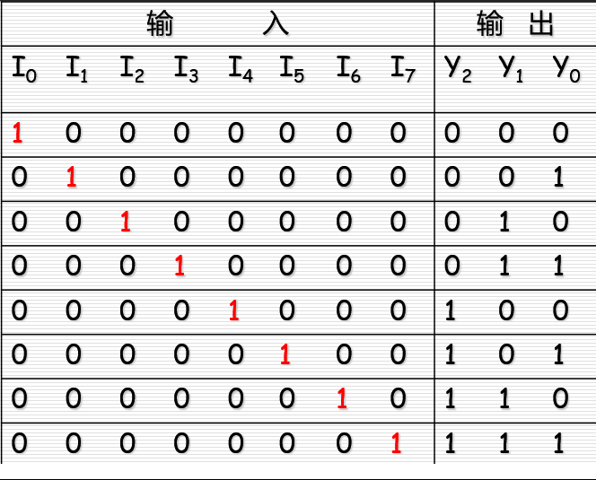
> 
> 利用无关项化简得

> 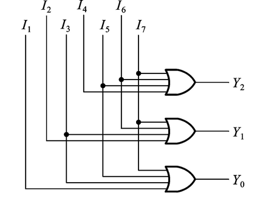

$$
Y_0 = I_1 + I_3 + I_5 + I_7 \\
Y_1 = I_4 + I_5 + I_6 + I_7 \\
Y_2 = I_4 + I_5 + I_6 + I_7
$$

#### 优先编码器 Priority Encoder

允许同时输入两个以上的有效编码信号。当同时输入几个有效编码信号时，优先编码器能按预先设定的优先级别，只对其中优先权最高的一个进行编码

e.g.

> 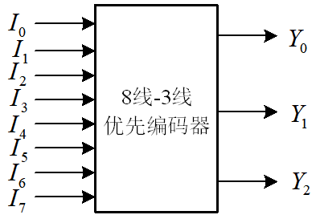
> 
> 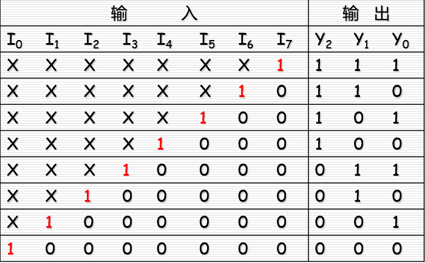

74148

### 译码器

Decoder 是编码器的逆过程

地址高低位

> 有 n 个输入端 $2^n$个输出端
> 
> 一般为低电平有效
> 
> 使能控制端 $\overline{E}$ 为 1 时 输出均为 1

> 74HC138    3-8 线译码器
> 
> 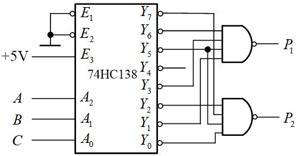
> 
> 三个使能端
> 
> 需满足 $\overline{E_1} = \overline{E_2} = 0, E_3 = 1$ 才能正常工作

### 其他译码器

#### 二 - 十 进制译码器

> 将BCD码的十组代码译成 0~9 十个对应输出信号的电路 称 **4线 - 10线 译码器**
> 
> 7442 芯片
> 
> 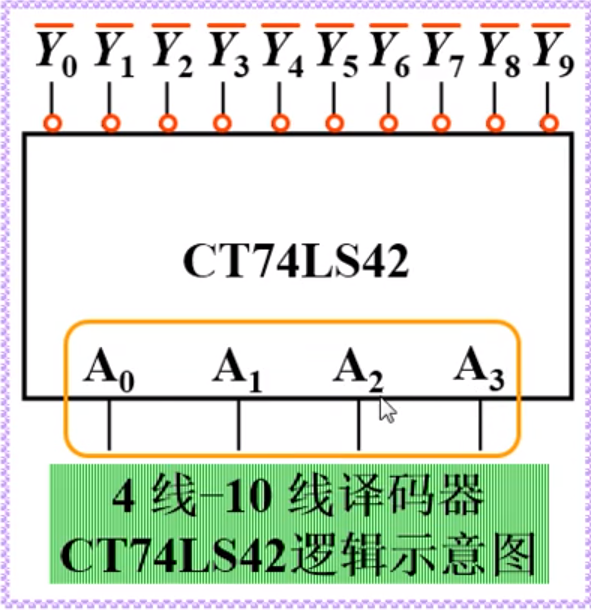
> 
> 从高到地位 依次为 $A_3 , A_2, A_1, A_0$
> 
> 低电平有效
> 
> 有伪码 74HC142 可以拒绝伪码

常见译码器芯片 74HC154

> 
> 
> $\overline{E_1},\overline{E_2}$是使能端 
> 
> 功能表
> 
> 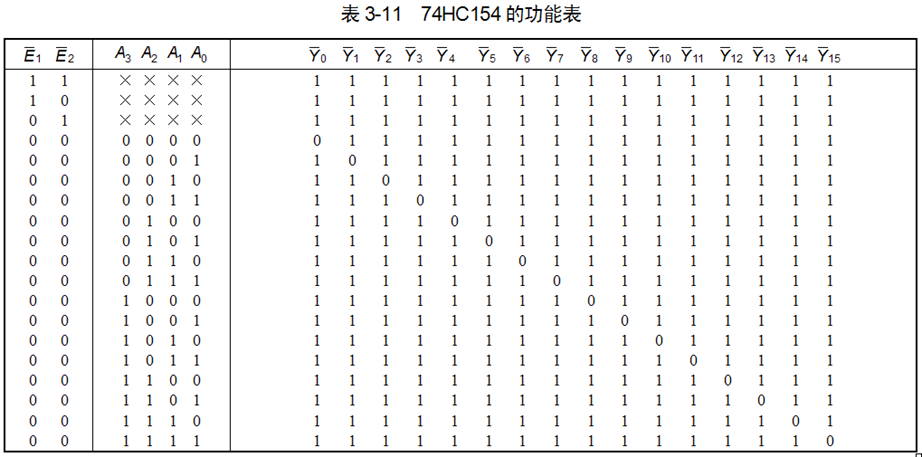

##### 数字显示译码器

> 将输入的BCD码译成相应输出信号 驱动显示器显示出相应的数字的电路
> 
> 常用七段半导体数码显示器 LED

内部接法

- 共阳接法
  
  - 需要输出低电平有效的译码器
  - 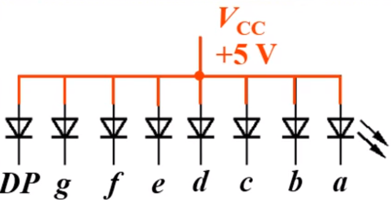

- 共阴接法
  
  - 需要输出高电平有效的译码器
  - 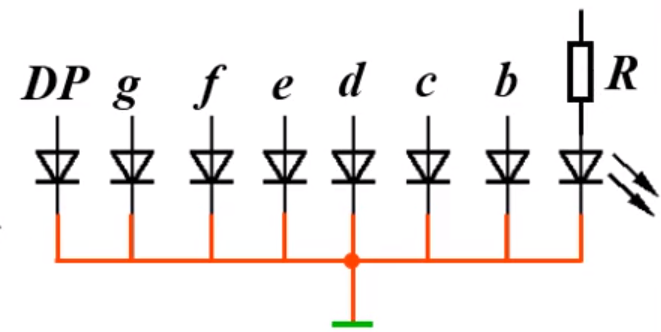

- 优点
  
  - 清晰 电压低 体积小 可靠 响应速度快 等

- 缺点
  
  - 工作电流大 每字段约 10mA

### 数据选择器 和 数据分配器

数据选择器 Data Selector

> 根据地址码的要求 从多路输入信号中选择其中一路输出的电路
> 
> 数据选择器的输入信号个数 N 与地址码个数n的关系为 $N = 2^n$

常用的数据选择器

- 2 选 1

- 4 选 1
  
  - 了解
  
  - > 74HC153
    > 
    > 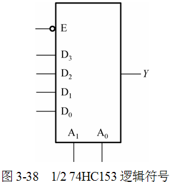
    > 
    > 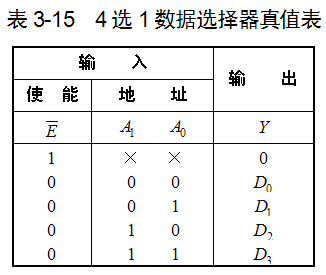
    > 
    > $Y = \overline{A_1}\overline{A_0}D_0 + \overline{A_1}A_0 D_1 + A_1 \overline{A_0}D_2 + A_1 A_0 D_3 = m_0D_0 + m_1D_1 + m_2D_2 + m_3D_3$

- 8 选 1
  
  - 掌握
  
  - > 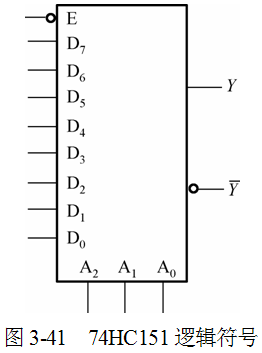
    > 
    > 
    > 
    > $Y = m_0D_0 + m_1D_1 + m_2D_2 + m_3D_3 + m_4D_4 + m_5D_5 + m_6D_6 + m_7D_7$
    > 
    > $E$ 使能端 低电平有效

- 16 选 1

  数据分配器

> 根据地址码的要求 将一路数据分配到指定输出通道上去的电路

#### 用数据选择器实现组合逻辑函数

用数据选择器可以实现任何组合逻辑函数

当逻辑函数的变量个数和数据选择器的地址输入变量个数相同时

可直接 将逻辑函数输入变量有序地接数据选择器的地址输入端

> 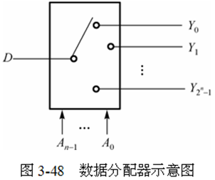
> 
> - n=2：1路-4路数据分配器 
> - n=3：1路-8路数据分配器 
> - n=4：1路-16路数据分配器
> 
> 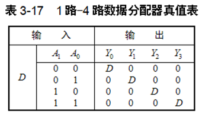

常用的有 74HC138译码器构成的数据分配器

> 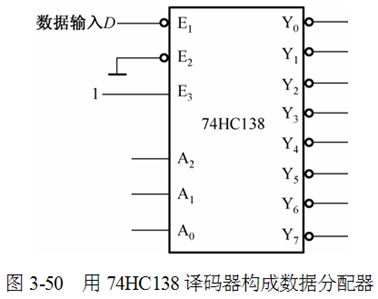
> 
> $E_1$ 数据输入 $E_2,E_3$ 使能端
> 
> 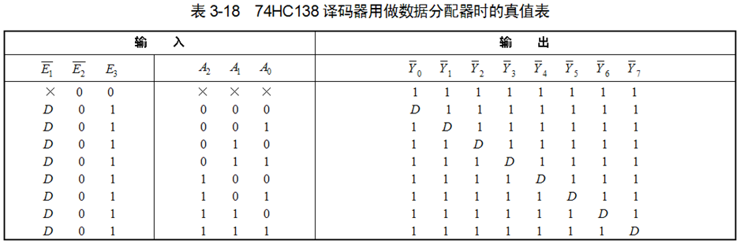

#### 加法器

基本单元 ---  半加器 Half Adder HA 

> 只将两个1位二进制数相加 不考虑低位来的进位
> 
> 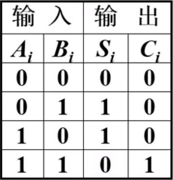
> 
> 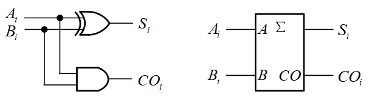
> 
> $S_i = A_i \overline{B_i} + \overline{A_i}B_i = A_i \oplus B_i \\ CO_i = A_iB_i$

  全加器 Full Adder FA x    

> 能将本位的两个二进制数和相邻位来的进位数进行相加
> 
> 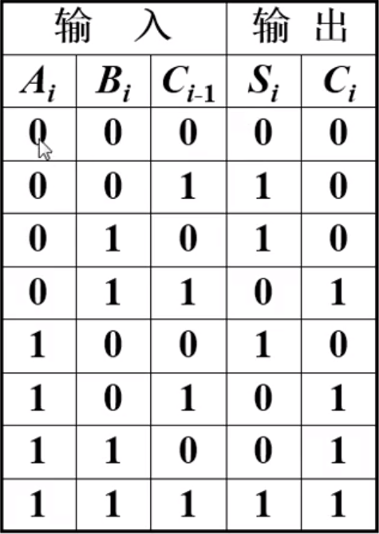
> 
> 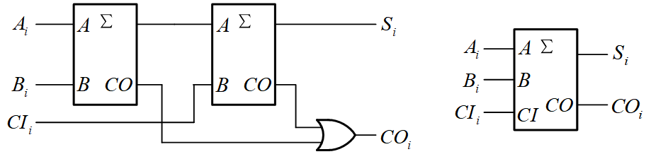
> 
> $S_i = A_i \oplus B_i \oplus C_{i-1} \\ C_i = (A_i \oplus B_i)C_{i-1} + A_i B_i$

全加器可以由半加器实现

多位加法器

- 串行进位加法
  
  - 先计算低位 逐渐到高位
  
  - 效率很低
  
  - > 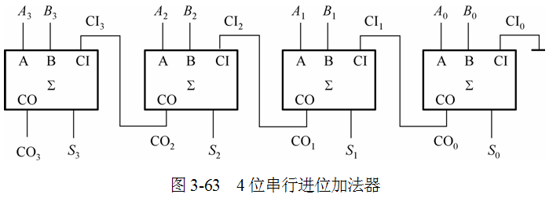

- 超前进位加法
  
  - Carry Look-ahead 也成为 Fast Carry 加法器
  
  - 每位的进位只由被加数和加数决定，而与低位的进位无关，
    克服了串行进位加法器由于受到进位信号的限制使得运算
    速度慢的缺点 
  
  - 常用的有 74LS283
  
  - > 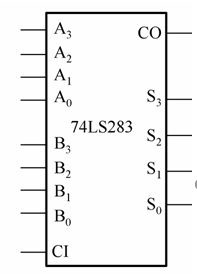
  
  - 例子 **8421BCD码到余3码的转换**
    
    - > 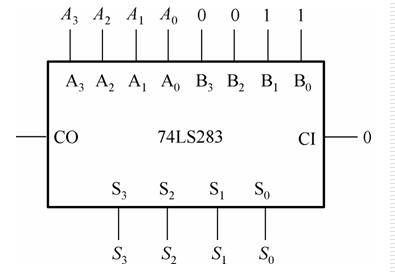
      > 
      > 真值表
      > 
      > 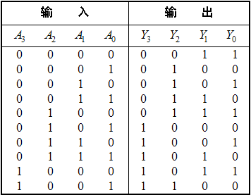

### 本章小结

重点需要掌握的内容

- 掌握组合逻辑电路的分析和设计
- 能用中规模器件实现组合逻辑电路
- 能应用译码器74138 和 数据选择器 74151 / 74153 实现组合逻辑电路的输出
- 能简单应用加法器 74283

> 组合逻辑电路指的是 **任一时刻的输出仅取决于该时刻输入信号的取值组合 与电路原有状态无关**的电路
> 
> - 不能存储 记忆
> - 由各种门电路组合 不含记忆单元
> - 没有反馈回路

描述方法主要有

1. 真值表
2. 卡诺图
3. 逻辑图

#### 基本分析方法

1. 根据给定电路逐级写出输出函数式
2. 进行必要的化简和变换 
3. 列出真值表
4. 确定逻辑功能

#### 基本设计方法

1. 根据给定的设计任务进行逻辑抽象
2. 列出真值表
3. 写出输出函数式
4. 进行适当的化简和变换
5. 画出或得到最佳的逻辑电路

#### 基本的应用

- **数据选择器**
  - 根据地址码 从多路信号中选择其中一路输出
- **数据分配器**
  - 将一路数据分配到指定输出通道上去
- **编码器的作用**
  - 将具有特定含义的信息编程相应二进制代码输出
  - 常用的有 二进制编码器 二-十进制编码器 优先编码器
- **译码器的作用**
  - 将表示特定意义信息的二进制代码翻译出来
  - 常用的有 二进制译码器 二-十进制译码器 数码译码器
- **数值比较器**
  - 用于比较两个 二进制数 的大小
- **加法器**
  - 实现多位加法运算
  - 基本单元电路有 半加器 全加器
  - 集成电路有串行进位加法器和超前进位加法器

---

## 第五章 触发器

### Flip-Flop 双稳态触发器

- 有两个稳定状态  用来表示 0 和 1
- 在输入信号的作用下 触发器的两个稳定状态可相互转换
  - 输入信号消失后 新状态可长期保持下来 因此具有记忆功能
  - 可存储一位 二进制数码

触发器和门电路是构成**数字电路的基本单元**

触发器有记忆功能 由他构成的电路在某时刻的输出

- 不仅取决于该时刻的输入 

- 还与电路**原来状态有关**

触发器的类型

根据逻辑功能不同分为

- RS 触发器
- **D 触发器**
- **JK 触发器**
- T 触发器
- T' 触发器

根据触发方式

- 电平触发器
- 边沿触发器
- 主从触发器

根据电路结构

- 基本RS 触发器
- 同步 触发器
- 主从 触发器
- **边沿 触发器**

触发器逻辑功能的描述方法

- 特性表
- 特性方程
- 驱动表 激励表
- 状态转换图
- 波形图 - (时序图)

---

### 基本 RS 触发器

异步触发器

由与非门组成的基本RS触发器

> 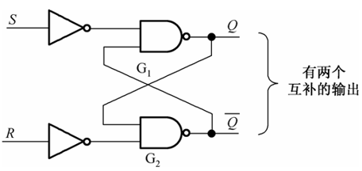
> 
> 由两个稳定状态   
> 
> - 置位 `set`
>   - 此时记忆二进制数`1`
> - 复位`reset`
>   - 此时记忆二进制数`0`
> 
> 逻辑符号：
> 
> 
> 
> 加非说明 低电平有效
> 
> 特性表：
> 
> 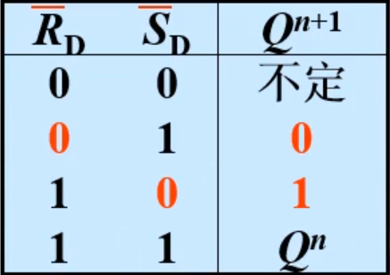
> 
> 优点
> 
> - 电路简单 是构成各种触发器的基础
> 
> 缺点
> 
> - 输出受输入信号的直接控制 不能定时控制
> - 有约束条件
>   - $RS = 0$

- 次态
  
  - $Q^{n+1}$

- 现态
  
  - $Q^n$

### 同步触发器

#### 同步 RS 触发器

Clock Pulse - 矩形脉冲

为触发器增加一个时钟控制端

其中 同步RS触发器是其中最简单的一种

> 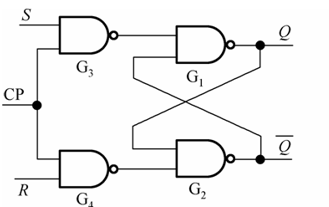
> 
> 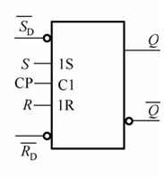
> 
> 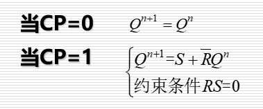
> 
> 功能简表 -- CP为 1
> 
> 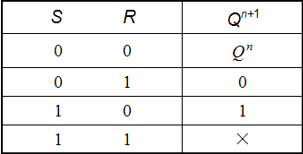
> 
> $S_D , R_D$是置位和复位端
> 
> 置位时输出 1
> 
> 复位时输出0
> 
> 两者不能同时为1
> 
> **原电路是低电平有效**

#### 同步 D 触发器

迟延触发器(delay) 锁存器(latch)

是由同步RS触发器改进而得 

令 $D = S = \overline{R}$

> 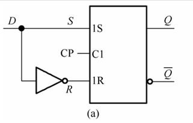
> 
> 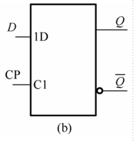
> 
> 功能表
> 
> 
> 
> 特性表
> 
> 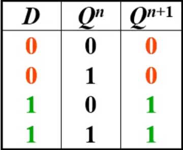

没有约束条件

在`CP=1`期间 能发生多次反转 这种现象称为 **空翻**

##### 特性方程

$Q^{n+1}= S+\overline{R}Q^n \\ Q^{n+1} = D$

##### 驱动表

| $Q^n \rightarrow Q^{n+1}$ | D   |
| ------------------------- | --- |
| 0 0                       | 0   |
| 0 1                       | 1   |
| 1 0                       | 0   |
| 1 1                       | 1   |

##### 状态转换图

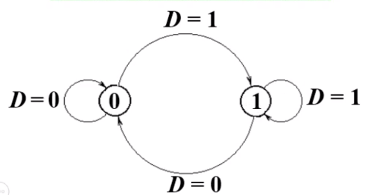

同步触发器的特点

- 触发方式
  - 电平出发
    - 正负电平触发
    - CP = 1 \ 0 
- 缺点
  - 存在 **空翻**
    - 脉冲作用器件 输入信号多次发生变化时 触发器的输出状态也相应发生多次变化的现象 称为空翻
    - **可能导致电路工作失控**

### JK 触发器

> 逻辑符号
> 
> 
> 
> 功能表
> 
> 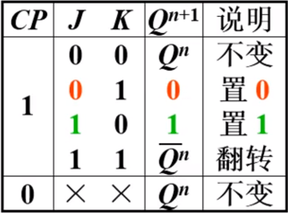
> 
> > JK = 00 保持
> > 
> > JK = 11 翻转
> > 
> > J $\neq$ K 置 0 \ 1
> 
> 特性方程
> 
> $Q^{n+1} = J\overline{Q^n} + \overline{K}Q^n$
> 
> 　
> 
> 驱动表
> 
> 
> 
> 　
> 
> 状态转换图
> 
> 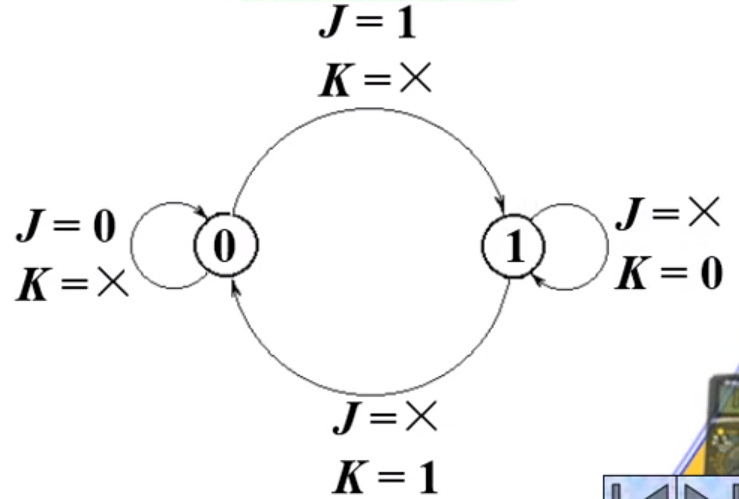

---

### 边沿触发器

边沿 D-FF 边沿JK-FF 的工作特点

Edge - Triggered Flip - Flop

工作特点

> 只能在CP上升沿 或下降沿 时刻接受信号
> 
> 电路状态只能在CP上升沿或下降沿时刻翻转
> 
> 边沿触发式

#### 边沿D触发器

> 
> 
> 
> 
> 		 
> 
> $Q^{n+1} = [D] \cdot CP \uparrow$

#### 边沿JK触发器

> 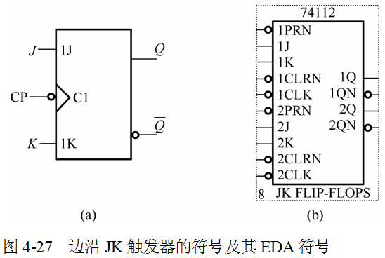
> 
> 
> 
> $Q^{n+1} = S + \overline{R}Q^n  = J\overline{Q^n} + \overline{K}Q^n$
> 
> $Q^{n+1} = [J\overline{Q^n} + \overline{K}Q^n] \cdot CP \downarrow$

### 触发器的应用

#### 四种逻辑功能的比较

**RS功能**

> 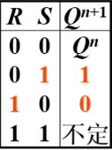
> 
> 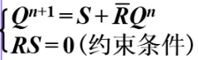

**D功能**

> 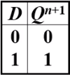
> 
> 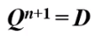

**JK功能**

> 
> 
> 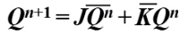

**T功能**

> 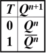
> 
> 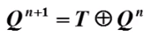

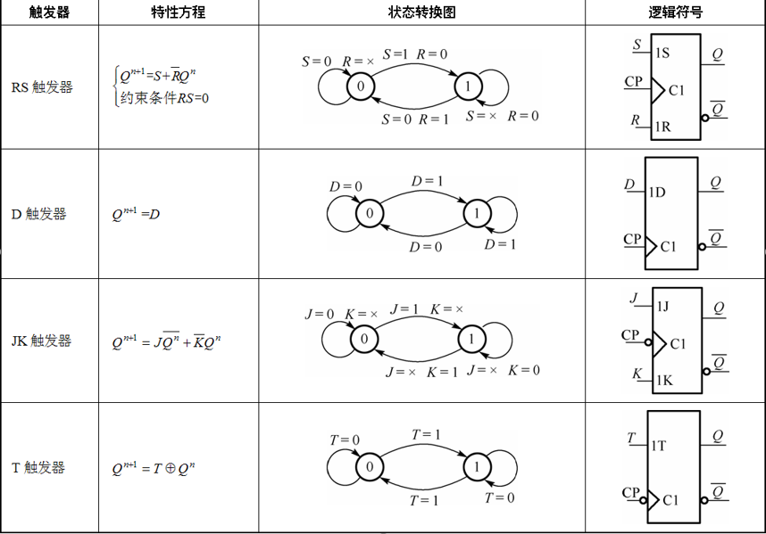

#### 不同逻辑功能间的相互转换

---

## 第六章 时序逻辑电路

### 概述

- 逻辑功能特点
  - 任何时刻的输出
  - 不仅取决于该时刻的输入信号
  - 还与电路原有的状态有关
- 电路结构特点
  - 由存储电路和组合逻辑电路组成
- 类型
  - 同步时序逻辑电路
    - 触发器连在一起
    - 所有触发器在同一个时钟脉冲CP控制下同步工作
  - 异步时序逻辑电路
    - 时钟脉冲只出发部分触发器 其余触发器由电路内部信号触发
    - 不在同一时钟的作用下工作

### 时序逻辑电路的分析方法

1. 根据给定的电路 写出**输出方程**和**驱动方程** 求出**状态方程**
2. 列 **状态转换真值表**
3. 分析逻辑功能
4. 画 **状态转换图** 和 **时序图**

### 异步时序逻辑电路的分析方法

1. 列方程
   1. 时钟方程
   2. 输出方程
   3. 驱动方程
   4. 状态方程
2. 列状态转换真值表
   1. 现态
   2. 次态
   3. 输出
   4. 时钟脉冲

### 计数器

74161 74290 的逻辑和应用

能够利用已有的计数器构成N进制的计数器

#### 计数器的作用与分类

时钟

计数增减分

二进制加法计数器

计数的最大数目称为计数器的 **模** 用 $M$ 表示

模也成为计数长度或计数容量

> $n$个触发器有$2^n$种输出 最多可实现模 $2^n$计数

#### 异步计数器

##### 异步二进制计数器

 

#### 74LS290的应用

> 
>
> | **输   入**               | **输   出**                 |
> | ------------------------- | --------------------------- |
> | RD=R1·R2  PD=P1·P2  CP    | Q3    Q2  Q1  Q0            |
> | **1         0         ×** | **0     0**   **0**   **0** |
> | **0         1         ×** | **1     0**   **0**   **1** |
> | **0         0         ↓** | **加法计数**                |

#### 同步计数器

> 最根本的事时钟控制不同 导致的电路结构不同

