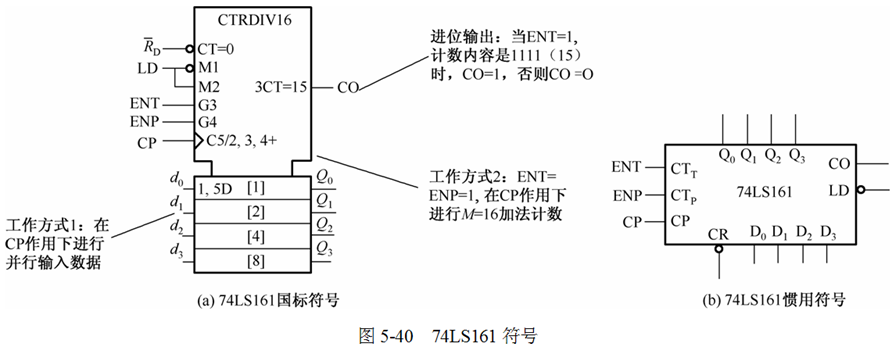
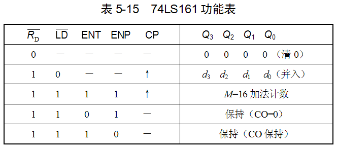
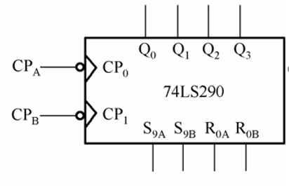
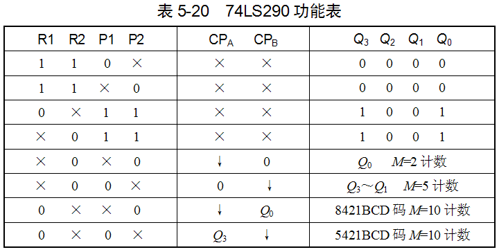
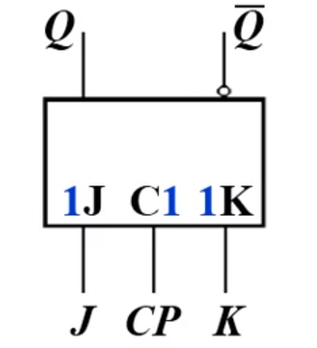
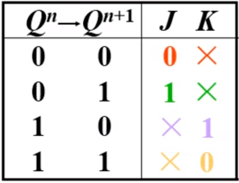
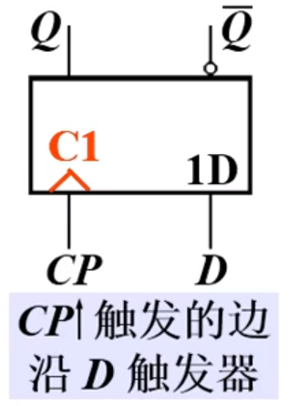
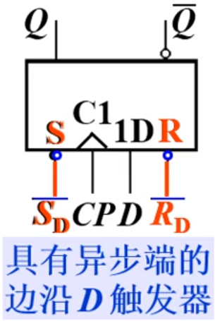
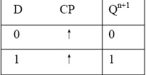
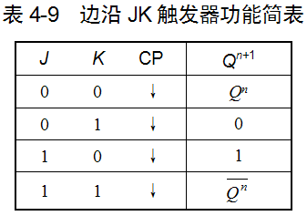

# 期末针对性复习攻略计划

---

## 元件编号

### 74138

译码器

>  三个使能端 $\overline{E_1} = \overline{E_2} = 0, E_3 = 1$

即输入3个信号 进行选择后 会输出8个信号中的一个

### 74151

数据选择器

> 输入 8  + 3 个信号
>
> 	

### 74153

数据选择器

> 输入 4 + 2 个信号
>
> 

### 74283

超前进位加法

> 输入 4 + 4 个信号作为加法的两个数 1 个 CI 作为低位加法
>
> 输出 1 个 CO 高位的进位 4个数据作为加法的结果
>
> 

### 74161

> 四位同步二进制计数器
>
> 
>
> 

### 74290

> 2-5 计数器 
>
> 内置一个二进制计数器 和 一个五进制计数器
>
> 
>
> 

---

## 触发器

### 基本触发器

#### RS触发器

异步触发器

由与非门组成的基本RS触发器

> 
>
> 由两个稳定状态   
>
> - 置位 `set`
>   - 此时记忆二进制数`1`
> - 复位`reset`
>   - 此时记忆二进制数`0`
>
> 逻辑符号：
>
> 
>
> 加非说明 低电平有效
>
> 特性表：
>
> 
>
> 优点
>
> - 电路简单 是构成各种触发器的基础
>
> 缺点
>
> - 输出受输入信号的直接控制 不能定时控制
> - 有约束条件
>   - $RS = 0$

---

#### D-FF

迟延触发器(delay) 锁存器(latch)

是由同步RS触发器改进而得 

令 $D = S = \overline{R}$

> 
>
> 
>
> 功能表
>
> 
>
> 特性表
>
> 

没有约束条件

在`CP=1`期间 能发生多次反转 这种现象称为 **空翻**

##### 特性方程

$Q^{n+1}= S+\overline{R}Q^n \\ Q^{n+1} = D$

##### 驱动表

| $Q^n \rightarrow Q^{n+1}$ | D    |
| ------------------------- | ---- |
| 0 0                       | 0    |
| 0 1                       | 1    |
| 1 0                       | 0    |
| 1 1                       | 1    |

##### 状态转换图

同步触发器的特点

- 触发方式
  - 电平出发
    - 正负电平触发
    - CP = 1 \ 0 
- 缺点
  - 存在 **空翻**
    - 脉冲作用器件 输入信号多次发生变化时 触发器的输出状态也相应发生多次变化的现象 称为空翻
    - **可能导致电路工作失控**

---

#### JK-FF

逻辑符号

功能表

> JK = 00 保持
>
> JK = 11 翻转
>
> J $\neq$ K 置 0 \ 1

特性方程

$Q^{n+1} = J\overline{Q^n} + \overline{K}Q^n$

　

驱动表

　

状态转换图

----

### 边沿触发器

#### 边沿D触发器

> 
>
> 
>
> 		 
>
> $Q^{n+1} = [D] \cdot CP \uparrow$

---

#### 边沿JK触发器

> 
>
> 
>
> $Q^{n+1} = S + \overline{R}Q^n  = J\overline{Q^n} + \overline{K}Q^n$
>
> $Q^{n+1} = [J\overline{Q^n} + \overline{K}Q^n] \cdot CP \downarrow$

