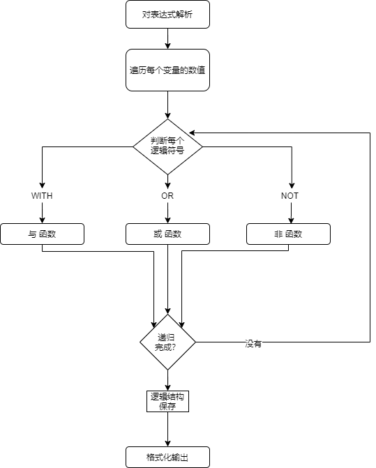
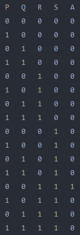
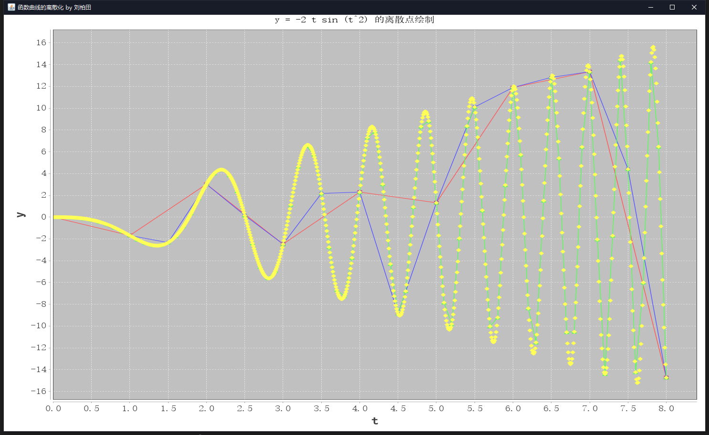

## 必做 : 命题公式真值表输出

### 规划与设计

#### 需求

需求是把一个已知表达式的真值表输出

变量仅有 4 个

需要进行 **与 或 非** 的逻辑操作


#### 流程图




#### 小技巧

在对每个变量取值的时候 要对每个变量的 0 或 1 都取到

```java
for (int i = 0 ; i < rows ; i ++) {
	for (int j = 3; j >= 0 ; j --) {
			variables[j] = i/(int) Math.pow(2, j)%2 ;
    	}
	printTruthTables(variables);
}
```

对 2 取余 能够对每个变量的不同取值都取到 不重复 而且效率很高 

比 4个for循环要快一些 同时 更改 `rows` 的值 也能够适应 `n` 个变量的情况


### 核心代码段分析

对逻辑函数进行手工的分析 并用函数进行逻辑处理

```java
int result = WITH( NOT(OR(variables[0],variables[1])),WITH(OR(variables[0],variables[2]),variables[3]) );
```


三个逻辑函数的实现

```java
	// 或
    private static int OR (int a, int b){
        if (a == 0 && b == 0){
            return 0;
        } else {
            return 1;
        }
    }

    // 与
    private  static int WITH (int a, int b){
        if (a == 1 && b == 1){
            return 1;
        } else {
            return 0;
        }
    }


    // 非
    private static int NOT (int a){
        return a == 0 ? 1 : 0 ;
    }
```


### 结果

正确输出真值表




### 心得体会

- 对逻辑符号和表达式有了浅层的认识

- 初步实现了模块化的处理问题

- 对一些想要的功能 如 自动化处理一个表达式 自动分析逻辑符号并调用函数等

  由于个人能力不佳 不能短时间内实现 

- 能力有待提示 处理的方式还能更加完美


### 其他

对 word 排版表示抗拒 此文档使用的`Markdown` 编写 并通过 `Pandoc` 转换成 word 格式


---


## 函数曲线的离散化

### 需求

对指定函数 $x(t) = -2t \sin (t^2)$ 在 $[0,8]$上画出函数图像 且需要有不同的间隔


对`Java`原生的画图不是很熟悉 用了第三方的库 `jfreecharts`


需求在逻辑上比较简单 只需要通过`for`循环 就能对变量的变化量 即 `delta` 进行控制


### 核心代码分析

由于过多组数据会影响观感 因此就做了四组

```java
		//* 0.01
        XYSeries mFirst = new XYSeries("First");
        for (double x = 0; x <= 8;  x += 0.01) {
            double y = -2*x* Math.sin(x*x);
            mFirst.add(x, y);
        }

        //* 0.1
        XYSeries mSecond = new XYSeries("Second");
        for (double x = 0; x <= 8;  x += 0.1) {
            double y = -2*x* Math.sin(x*x);
            mSecond.add(x, y);
        }

        //* 0.5
        XYSeries mThird = new XYSeries("Third");
        for (double x = 0; x <= 8;  x += 0.5) {
            double y = -2*x* Math.sin(x*x);
            mThird.add(x, y);
        }

        //* 1
        XYSeries mForth = new XYSeries("Forth");
        for (double x = 0; x <= 8;  x += 1) {
            double y = -2*x* Math.sin(x*x);
            mForth.add(x, y);
        }
```


### 结果

函数图像绘制完美 同时不同组的数据 图标和颜色也不同




### 心得体会


- 对`Java 2D` 的数据绘制产生了兴趣
- 对数据可视化 数据处理产生了兴趣
- 会模仿 并简单使用了第三方库对功能的实现
- 离散程度越高 越接近真实情况


### 其他

在对名字命名的时候 出现了乱码的现象

后来几经搜查 将字体换了一个 解决了乱码

```java
StandardChartTheme mChartTheme = new StandardChartTheme("CN");
mChartTheme.setLargeFont(new Font("黑体", Font.BOLD, 20));
mChartTheme.setExtraLargeFont(new Font("宋体", Font.PLAIN, 15));
mChartTheme.setRegularFont(new Font("宋体", Font.PLAIN, 15));
```


