# 函数在二维离散数据处理中的实际应用

---

## Task 2.1

### 思路与技巧


### 核心代码分析

全局的一个`File`对象 即原图片文件

```java
private static File imageFile = new File("E:\\University\\Discrete离散数学\\PracticalWork\\src\\Resources\\img.jpg");
```

创建存储的数组

```java
int[] rgbPixels = new int[bufferedImage.getWidth()*bufferedImage.getHeight()];
```

获取全部的像素 放到数组中

```java
bufferedImage.getRGB(0,0,bufferedImage.getWidth(),bufferedImage.getHeight(),rgbPixels,0,bufferedImage.getWidth());
```

遍历每个数组 

```java
for (int i = 0 ; i < rgbPixels.length ; i ++) {...}
```

对每个像素进行变换

```java
Color color = new Color(rgbPixels[i]);
int red = color.getRed();
int blue = color.getBlue();
int green = color.getGreen();

rgbPixels[i] = new Color(pixelChange(red,R),pixelChange(green,R),pixelChange(blue,R)).getRGB();
```

变换的函数 注意 `RGB`值的区间是 $[0.255]$

```java
private static int pixelChange(int value, double R) {
	return Math.min((int) Math.pow(value, R), 255);
}
```

写入图片

```java
bufferedImage.setRGB(0, 0, bufferedImage.getWidth(), bufferedImage.getHeight(), rgbPixels, 0, bufferedImage.getWidth());
```

生成文件

```java
ImageIO.write(bufferedImage,"jpg",new File("E:\\University\\Discrete离散数学\\PracticalWork\\src\\Resources\\Processed" + String.valueOf(R) + ".jpg"));
```


### 结果展示

- 原图
  - 
- `R = 0.1`
  - 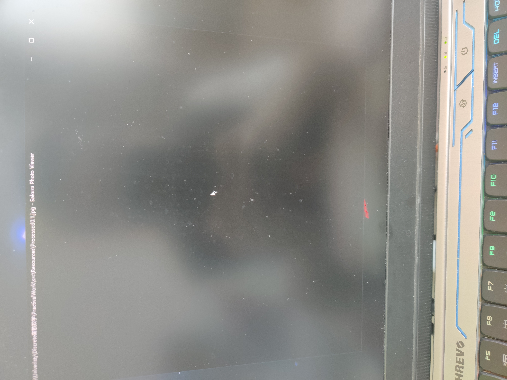
- `R = 0.4 `
  - 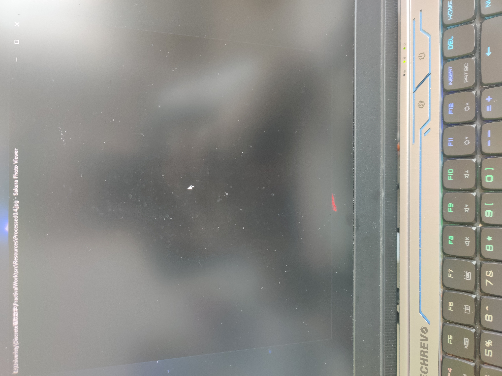
- `R = 0.6 `
  - 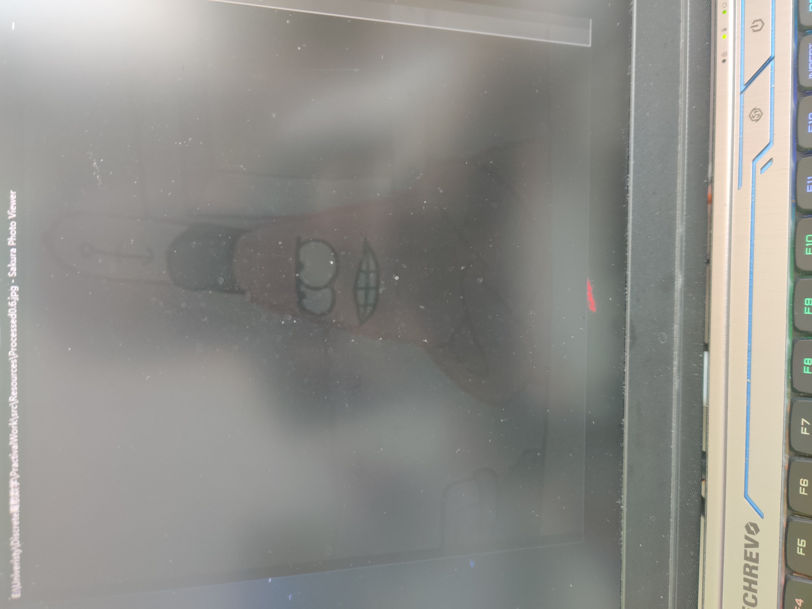
- `R = 0.8`
  - 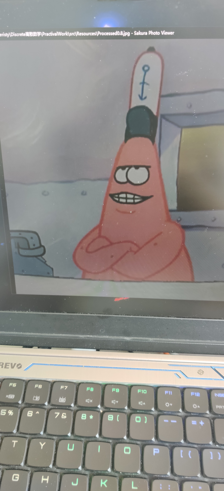
- `R = 1.0`
  - 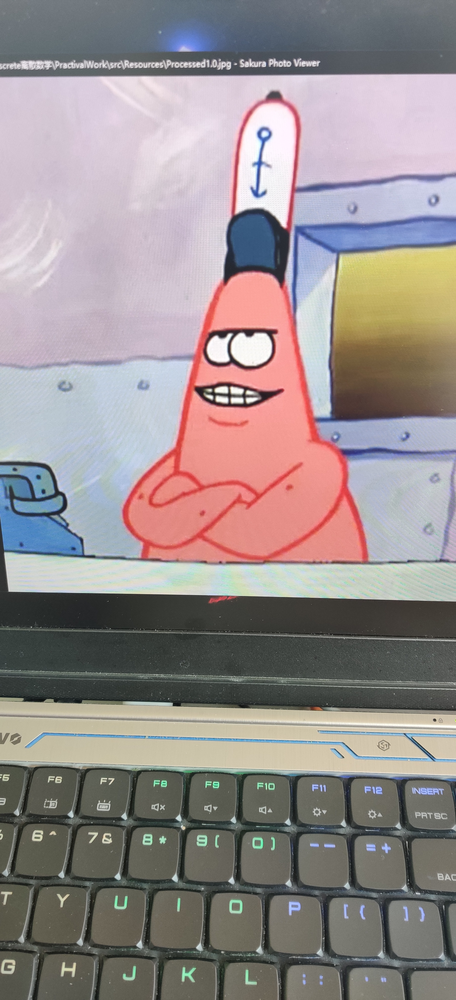
- `R = 1.2`
  - 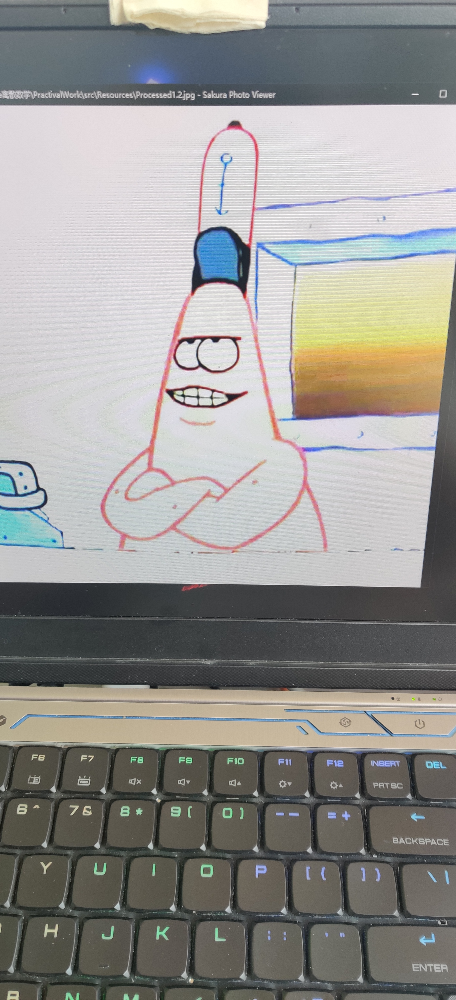
- `R = 1.5`
  - 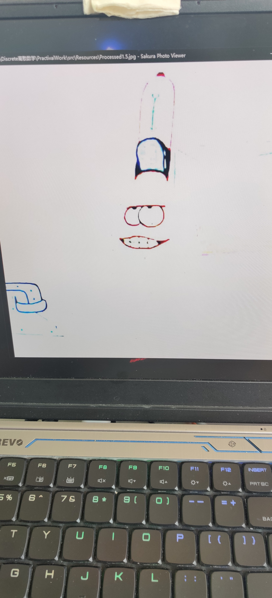
- `R = 1.8`
  - 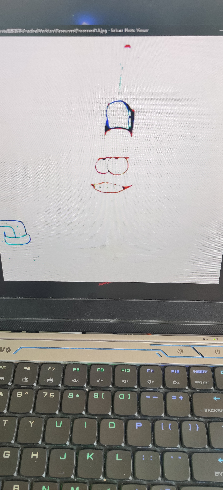
- `R = 2.0`
  - 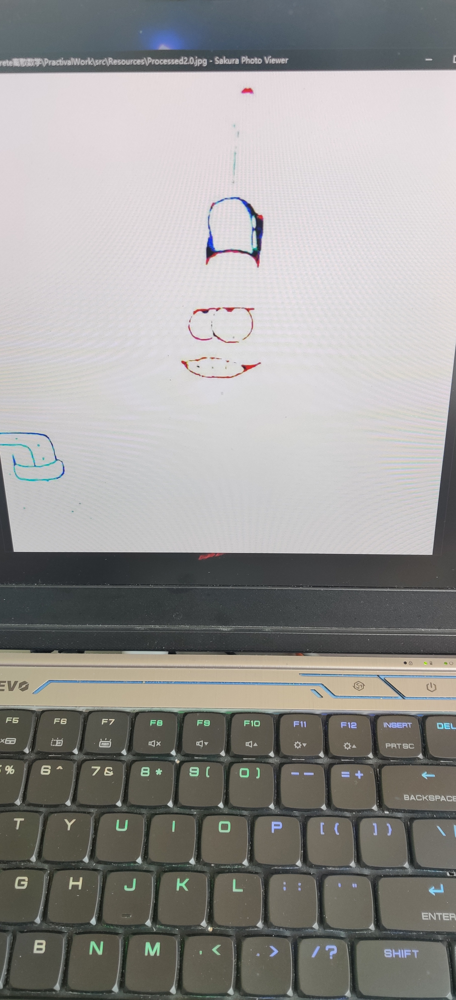


### 心得体会

RGB的值是一个从 `0~255` 的值 这三个值控制了一个像素点的颜色

多个离散的像素点结合在一起 就形成了图片

显然 在对图片进行一次方的处理时 得到的是原图

随着`R`值的改变 图片会呈现一个 **黑化到白化**的现象

因为RGB值越接近 0 越黑 越接近 255 越白

当然这样描述不是很准确 因为单独改变RGB三个中的一个是不会有很直观的白或者黑的感受

在对全体像素进行同样的处理后 就会得到一张黑或白化的图片 

如果对局部的像素进行处理 就会获得类似滤镜的效果 

调色 滤镜 美图 以及我们熟知的部分图片处理方法如 马赛克 高斯模糊

都是采用的类似如上的方法 只不过在对像素选取方式 像素处理的参数上更为复杂

从简单的对图片进行处理 让我将以前所了解过的一些技术名词和效果 得以亲身体验了一把 

从实践中我窥到了图片处理和离散数据的秘密 收获颇丰！


---


## Task 2.2

### 思路与技巧

在很久之前看过 阮一峰先生的一篇文章 http://www.ruanyifeng.com/blog/2011/07/principle_of_similar_image_search.html

简单讲了下Google当时新出的以图搜图的功能

我想简单的实现下这个想法

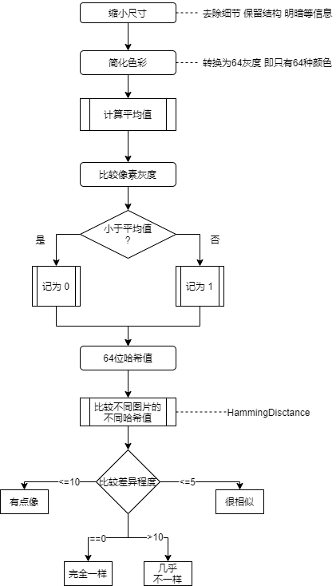

### 核心代码展示

先写了一个工具类 `ImageHelper`

获取根目录

```java
public static final String path = System.getProperty("user.dir");
```

生成缩略图

等比缩放

```java
		// X 的缩放
        double sx = (double) width / source.getWidth();
        // Y 的缩放
        double sy = (double) height / source.getHeight();

        // 等比缩放
        if (b) {
            if (sx > sy) {
                sx = sy;
                width = (int) (sx * source.getWidth());
            } else {
                sy = sx;
                height = (int) (sy * source.getHeight());
            }
        }
```

绘制图片 返回

```java
        g.setRenderingHint(RenderingHints.KEY_RENDERING,
                RenderingHints.VALUE_RENDER_QUALITY);
        g.drawRenderedImage(source, AffineTransform.getScaleInstance(sx, sy));
        g.dispose();
        return target;
```

读取图片

```java
    /**
     * 读取图片
     * @param filename 文件名
     * @return BufferedImage 图片对象
     */
    public static BufferedImage readImage(String filename)
    {
        try {
            File inputFile = new File(filename);
            BufferedImage sourceImage = ImageIO.read(inputFile);
            return sourceImage;
        } catch (FileNotFoundException e) {
            e.printStackTrace();
        } catch (IOException e) {
            e.printStackTrace();
        }

        return null;
    }
```

通过RGB计算灰度值

```java
    /**
     * 灰度值计算
     * @param pixels 像素
     * @return int 灰度值
     */
    public static int rgbToGray(int pixels) {
        // int _alpha = (pixels >> 24) & 0xFF;
        int _red = (pixels >> 16) & 0xFF;
        int _green = (pixels >> 8) & 0xFF;
        int _blue = (pixels) & 0xFF;
        return (int) (0.3 * _red + 0.59 * _green + 0.11 * _blue);
    }
```


计算灰度数组的平均值

```java
    public static int average(int[] pixels) {
        float m = 0;
        for (int i = 0; i < pixels.length; ++i) {
            m += pixels[i];
        }
        m = m / pixels.length;
        return (int) m;
    }
```

在主类`imageSearch`中 先写一个获取图片指纹的方法

```java
        BufferedImage source = ImageHelper.readImage(fileName);

        int width = 8;
        int height = 8;
```

在建立了`8*8`的图片大小后 缩小尺寸

```java
        // 1 : 缩小尺寸
        BufferedImage thumb = ImageHelper.thumb(source,width,height,false);
```

简化色彩

```java
        // 2: 简化色彩 - 64级灰度
        int[] pixels = new int[width*height];

        for (int i = 0 ; i < width ; i++){
            for (int j = 0 ; j < height ; j ++) {
                pixels[i*height + j] = ImageHelper.rgbToGray(thumb.getRGB(i, j));
            }
        }
```

计算灰度平均值

```java
        // 3 : 计算灰度平均值
        int avgPixelValue = ImageHelper.average(pixels);
```

与平均值比较

```java
        // 4 : 与平均值比较

        int[]  comparativeResult = new int[width*height];

        for (int i = 0 ; i < comparativeResult.length ; i ++ ){
            if (pixels[i] >= avgPixelValue) {
                comparativeResult[i] = 1;
            }else {
                comparativeResult[i] = 0;
            }
        }
```

得到哈希值

```java
        // 5 : 计算哈希值
        StringBuffer hashCode = new StringBuffer();

        for (int i = 0 ; i < comparativeResult.length ; i += 4 ) {
            int result = comparativeResult[i] * (int) Math.pow(2, 3) + comparativeResult[i+1]*(int)Math.pow(2, 2) + comparativeResult[i + 2]*(int) Math.pow(2, 1) + comparativeResult[i+3];
            hashCode.append(binaryToHex(result));
        }

        return hashCode.toString();
```

计算`HammingDistance`的函数

```java
    private static int HammingDistance (String sourceHashCode, String hashCode) {
        int difference = 0;

        for (int i = 0; i < sourceHashCode.length(); i++) {
            if (sourceHashCode.charAt(i) != hashCode.charAt(i)) {
                difference++;
            }

        }
        return difference;
```

获取所有图片的哈希值 输出

```java
        ArrayList<String> hashCodes = new ArrayList<String>();

        String fileName = ImageHelper.path + "\\images\\";


        for (int i = 0 ; i< 3 ; i++){
            String hashCode = produceFingerPrint(fileName + "demo" + (i + 1) +  ".jpg");
            hashCodes.add(hashCode);
        }

        System.out.println("目标文件们的哈希值: " + hashCodes);

        System.out.println("源文件: "+ produceFingerPrint(fileName + "source.jpg"));
```

计算每个目标图片与原图片的`HammingDistance`

```java
        for (int i = 0 ; i < hashCodes.size() ; i ++ ){
            int difference = HammingDistance(produceFingerPrint(fileName+ "source.jpg"),hashCodes.get(i));
            System.out.println("Hamming Distance :  " + difference);
            CompareHammingDistance(difference,i);

        }
```

其中二进制到十六进制的转换函数 这里就不列出了

不同的`HammingDistance`  输出对应的结果

```java
    private static void CompareHammingDistance(int difference, int i){
        if (difference == 0){
            System.out.println("Source.jpg与demo"+ i + ".jpg 一样" );
        } else if (difference <= 5) {
            System.out.println("Source.jpg与demo"+ i + ".jpg 很相似" );
        } else if (difference <= 10 ) {
            System.out.println("Source.jpg与demo"+ i + ".jpg 有点像" );
        } else {
            System.out.println("Source.jpg与demo"+ i + ".jpg 几乎不一样" );
        }
    }
```

### 结果展示

这里我准备了一个原图片 3个目标图片 其中的1张是从`Task 2.1` 中处理后得到的图片

一张是一样的图片 一样是完全不同的图片 


然后运行程序 查看比较的结果

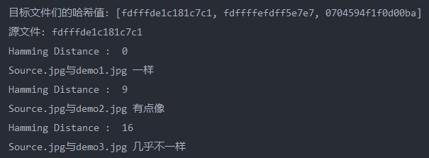


### 心得体会

从一个简单的博文上获取到了灵感 

虽然现在以图搜图的技术已经相当成熟 能够做到的搜索远比我目前所做出来要更加精细

实际应用中 会采用 [Phash](http://www.phash.org/) 和 [SIFT](https://en.wikipedia.org/wiki/Scale-invariant_feature_transform) 等复杂的算法

但是我也从简单的图片处理中学习到了离散数据的查询与对比 寻找等非常有意思的功能

相似的 也可以对声音等信息进行相似搜索 如 **哼歌识曲** 这些都是对一个比较大的数据 获取它的细小的数据节点 如声音的波纹 图片的像素点 通过算法对数据进行变换和处理 比对得到结果 

以前觉得很神奇的功能 自己通过所学也能够简单实现 收获了成就感 


