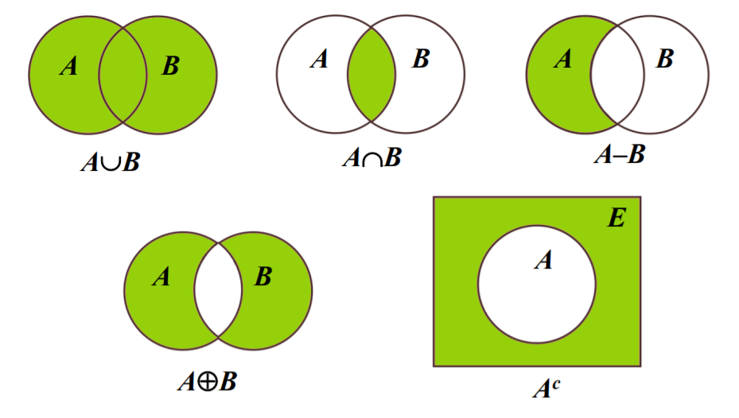
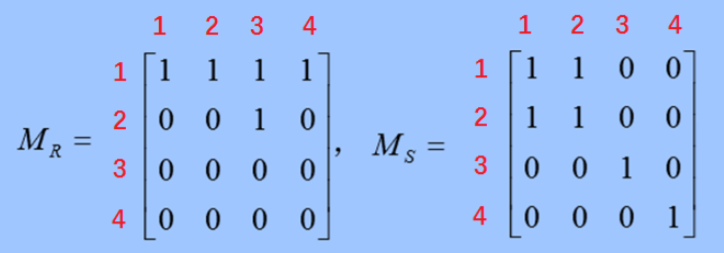
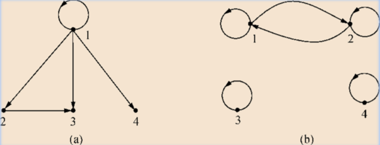
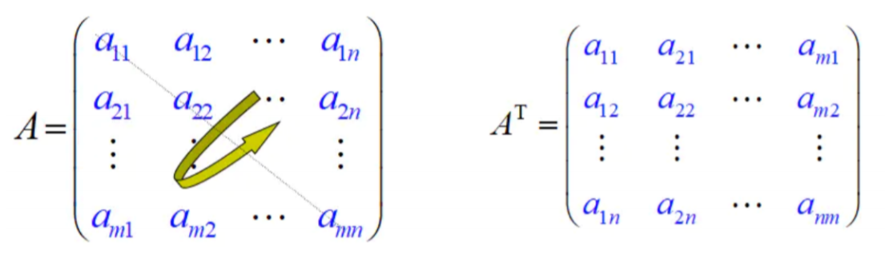
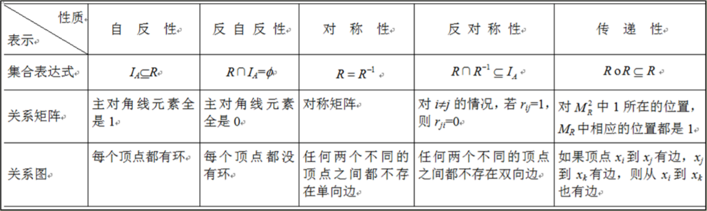
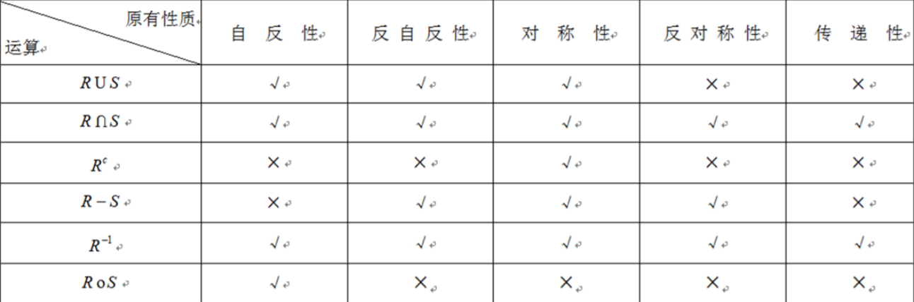

# 离散数学

---

## 第三章 集合与关系

### 3.1 集合及其运算

#### 3.1.1 基本概念

- 集合是数学中最基本的概念之一，如同几何中的点、线、面等概念一样，是不能用其他概念精确定义的原始概念。集合是什么呢？直观地说，把一些东西汇集到一起组成一个整体就叫做集合，而这些东西就是这个集合的元素或叫成员。

- 集合的表示方法通常有两种：**列举法**和**描述法**。

  > **列举法**：
  >
  > ​		列举法是列出集合中的所有元素，元素之间用逗号隔开，并把它们用花括号括起来。下面是用列举法表示的集合：
  > $$
  > \begin{align}
  > A&=\{sun,earth,moon\} \\
  > B&=\{a,b,c,\dots,z\}\\
  > C&=\{1,2,3,4\dots\}
  > \end{align}
  > $$
  > ​		有时列出集合中所有元素是不现实或不可能的，如上面的$B $和$C $，但只要在省略号前或后列出一定数量的元素，能使人们一看就能了解哪些元素属于这个集合就可以。

  > **描述法**：
  >
  > ​		描述法是用谓词描述出元素的公共特性，其形式为$S=\{x\vert P(x)\}$，表示$ S $是使为真的$ x $的全体。下面是用描述法表示的集合：
  > $$
  > \begin{align}
  > A&=\{x\vert x是自然数且1\le x\le100\} \\
  > B&=\{x\vert x是实数且x^2-1=0\}
  > \end{align}
  > $$

介绍表示集合的有关符号和方法：

> $a\in A$：表示$a$是集合$A$中的元素，读作$a$**属于**$A$；
>
> $A\subseteq B$：表示集合$A$中的每个元素都是集合$B$中的元素，即$A$是$B$的**子集**，读作$A$**包含**于$B$，其符号化表示为$A\subseteq B\Leftrightarrow \forall x(x\subseteq A\to x\subseteq B)$；
>
> $A\supseteq B$：与$A\subseteq B$的含义相反，表示集合$B$中的每个元素都是集合$A$中的元素，即$B$是$A$的**子集**，读作$A$**包含**$B$；
>
> $A=B$：表示集合$A, B$相等，即$A=B\Leftrightarrow A\subseteq B\land B\subseteq A$，读作$A$等于$B$；
>
> $A\subset B$：表示$A\subseteq B$且$A\ne B$，即集合$A$是集合$B$的**真子集**；
>
> $A\supset B$：与$A\subset B $的含义相反，表示$A\supseteq B$且$A\ne B$,即集合$B$是集合$A$的**真子集**；
>
> 在一个具体问题中，若一个集合包含我们讨论的每一个集合，则称它是**全集**，记作$E$。
>
> 没有元素的集合叫做空集，记作$\varnothing$。

- 设$A$为集合，把$A$的全体子集构成的集合叫做$A$的**幂集**，记作$\rho (A) (或2^A )$。幂集的符号化表示为
  $$
  \rho(A)=\{S\vert S\subseteq A\}
  $$
  像这种以集合为元素构成的集合，常称为集合的集合，也叫作**集族**。

#### 3.1.2 集合的运算

- 设$A, B$是两个集合，$E$是全集，则$A$与$B$的并$A\cup B$,交$A\cap B$，$A$的补$A^c$
  分别定义如下：
  $$
  \begin{align}
  A\cup B&=\{x|x\in A\lor x\in B\}\\
  A\cap B&=\{x|x\in A\land x\in B\}\\
  A^c&=\{x|x\in E\land x\not\in A\}
  \end{align}
  $$
  ​		由定义可以看出，$A\cup B$是由$A$或$B$中的元素构成的；$A\cap B$是由$A$和B中的公共元素构成的；$A^c$是由不在$A$中的其他元素构成的。

- 设$A, B$是两个集合，$A$与$B$的差$A- B$，对称差A由B定义如下：
  $$
  \begin{align}
  A- B&= A\cap B^c\\
  A\oplus B&=(A- B)\cup (B- A)
  \end{align}
  $$
  ​		由定义可以看出，$A-B$是由属于$A$但不属于$B$的元素构成的，即$A-B=\{x|x\in A\land x\in B\}$，$A\oplus B$是由属于$A$或属于$B$但不同时属于$A$和$B$的元素构成的，即$A\oplus B=\{x|(x\in A\land x\not\in B)\lor(x\in B\land x\not\in A)\}$。
  对称差运算的另一种定义是
  $$
  A\oplus B=(A\cup B)- (A\cap B)
  $$
  这两种定义是等价的。

  - eg:

    设$A=\{a,b,c\}$，$B=\{a,x,y\}$，全集$E=\{a,b,c,x,y,z\}$，则
    $$
    \begin{align}
    A\cup B&=\{a,b,c,x,y\}\\
    A\cap B&=\{a\}\\
    A^c&=\{x,y,z\}\\
    A-B&={b,c}\\
    A\oplus B&=\{b,c,x,y\}
    \end{align}
    $$

  - 并和交运算可以推广到有穷个集合上，即
    $$
    A_{1}\cup A_{2}\cup \dots\cup A_{n} = \{x|x\in A_{1}\lor x\in A_{2}\lor \dots\lor x\in A_{n}\}\\ 
    A_{1}\cap A_{2}\cap \dots\cap A_{n} = \{x|x\in A_{1}\land x\in A_{2}\land \dots\land x\in A_{n}\}
    $$

  - $A\subseteq B\Leftrightarrow A-B=\varnothing$

  - $A\cap B=\varnothing\Leftrightarrow A-B=A$

  > 以上集合之间的关系和运算可以用**文氏图**（Venn Diagram）形象、直观地描述。文氏图通常用一个矩形表示全集，矩形中的点表示全集$ E $中的元素，$ E $的子集用矩形区域内的圆形区域表示，图中阴影区域表示新组成的集合。下面是一些文氏图的实例：
  >
  > 
  >
  > 使用文氏图能够对一些问题给出简单、直观的解释，这种解释对分析问题有很大帮助。不过，文氏图只是起一种示意作用，可以启发我们发现集合之间的某些关系，但不能用文氏图来证明恒等式，因为这种证明是不严密的。

*集合的并、交、差、补等具有许多性质，下面列出这些性质中最主要的几条：*

1. 交换律：$A\cup B = B\cup A,A\cap B=B\cap A$
2. 结合律：$(A\cup B)\cup C = A\cup (B\cup C),\\(A\cap B)\cap C = A\cap (B\cap C)$
3. 分配律：$(A\cup B)\cap C = (A\cup B)\cap(A\cup C),\\(A\cap B)\cup C = (A\cap B)\cup(A\cap C),\\A-(B\cup C) = (A-B)\cap(A-C),\\A-(B\cap C) = (A-B)\cup(A-C)$
4. 等幂律：$A\cup A=A,A\cap A=A$
5. 单位律：$A\cup \varnothing=A,A\cap E=A$
6. 零律：$A\cup E=E,A\cap \varnothing=\varnothing$
7. 互补律：$A\cup A^c=E,A\cap A^c=\varnothing$
8. 双补律：$(A^c)^c=A$
9. 吸收律：$A\cup (A\cap B)=A,A\cap (A\cup B)=A$
10. 德摩根律：$(A\cup B)^c=A^c\cap B^c,(A\cap B)^c=A^c\cup B^c$

#### 3.1.3 集合的计算机表示

- **位串**是$0$个或多个字位的序列，而每个字位都有两个可能的值，即$0$或$1$，字位的这种取值来自二进制数字，因为0和1是用在数的二进制表示中的数字。**位串**是计算机表示信息的基本方式。
- 用$0$取代$1$,用$1$取代$0$，即可得到的补集的位串。

### 3.2 二元关系及其运算

#### 3.2.1 笛卡尔积

- 设$A$，$B$是两个集合，称下述集合：
  $$
  AxB=\{<a, b>|a\in A\land b\in B\}
  $$
  为由$A，B$构成的**笛卡尔积**(**直接积**)。其中，$A\times B$中的元素$<a, b> $为**有序对**，通常称为**序偶**。特别当$A=B$时记$A\times A$为$A^2$。

- 序偶$<a, b>$具有以下性质：

  1. 当$a\not=b$时，$<a,b>\not=<b,a>$；
  2. $<a, b>=<c, d>$的充要条件是$a=c$且$b=d$。

  ​          这与第1节关于集合的讨论不同，在那里交换元素的次序是无所谓的，比如$\{a, b\}=\{b, a\}$。
  ​          显然，当集合$A, B$都是有限集时有$|A\times B|=|A|\cdot|B|$，因为对于任意的序偶$<a, b>$,元素$a$共有$|A|$种可能选择，而对于$a$的每一个选择，$b$又都有$| B|$种可能选择。

*笛卡尔积的几点性质*：

1. 不适合交换律
   $$
   A\times B\not=B\times A \ \ (A\not=B, A\not=\varnothing, B\not=\varnothing)
   $$

2. 不适合结合律
   $$
   (A\times B)\times C\not=A\times (B\times C)\ \ (A\not=\varnothing, B\not=\varnothing,C\not=\varnothing)
   $$

3. 对于并或交运算满足分配律
   $$
   A\times(B\cup C) = (A\times B)\cup(A\times C)\ \ \ (B\cup C)\times A = (B\times A)\cup (C\times A) \\
    A\times(B\cap C) = (A\times B)\cap(A\times C)\ \ \ (B\cap C)\times A = (B\times A)\cap (C\times A)
   $$

4. 若$ A $或$ B $中有一个为空集，则$ A\times B $就是空集
   $$
   A\times \varnothing=\varnothing \times B =\varnothing 
   $$

5. 若$|A| = m, |B| = n$,，则$ |A\times B| = mn$

- 设$A$，$B$为任意集合，则
  $$
  A\times(B\cup C) = (A\times B)\cup(A\times C),(A\cup B)\times C= (A\times C)\cup(B\times C)\\
  A\times(B\cap C) = (A\times B)\cap(A\times C),(A\cap B)\times C= (A\times C)\cap(B\times C)\\
  A\times(B-C) = (A\times B)-(A\times C),(A-B)\times C= (A\times C)-(B\times C)
  $$

#### 3.2.2 二元关系及其表示

- ​		设$A, B$是两个集合，称笛卡儿积$A\times B$的子集为从A到B的**二元关系**或**简称**关系。

  ​		假设$R$是从$A$到$B$的关系，如果$<a, b>\in R$，称$a$与$b$之间具有关系$R$，记作$aRb$；如果$<a, b>\not\in R$，称$a$与$b$之间不具有关系$R$，记作$a\not Rb$。
  ​		$R$的定义域是属于$R$的序偶的第一个元素组成的集合，记为$dom(R)$，$R$的值域是属于$R$的序偶的第二个元素组成的集合，记为$ran(R)$。
  ​		如果$R$是集合$A$到自身的关系，即$R$是$A$的子集，则称$R$是$A$上的关系。集合
  $$
  I_{A}=\{<a, a>|a\in A\}
  $$
  是$A^2$的子集，称为**恒等关系**。空集$\varnothing$和笛卡尔积本身$A^2$也是$A^2$的子集，因而也是$A$上的关系，分别称为**空关系**和**全域关系**。

对于有限集上的二元关系，除了用上面的集合表示法外，还可以用**关系矩阵**和**关系图**进行表示。

- 设$A=\{a_{1},a_{2},\dots,a_{n}\},B=\{b_{1},b_{2},\dots,b_{n}\}$，$R$是$A$到$B$的二元关系，令
  $$
  y = \left\{ \begin{array}{}
  1 & \textrm{若$a_{i}Rb_{j}$}\\
  0 & \textrm{若$a_{i}\not Rb_{j}$}
  \end{array} \right.(i=1,2,\cdots,m,j=1,2,\cdots,n)
  $$
  则称矩阵
  $$
  (r_{ij})_{m\times n}=\left[ \begin{array}\ 
  r_{11} \ \   r_{12} \ \ \dots \ \  r_{1n}\\
  r_{21} \ \  r_{22} \ \ \dots \ \ r_{11}\\ 
  \ \ \vdots \ \ \ \ \  \ \vdots \ \ \ \ \ddots \ \ \  \vdots\\
  r_{m1} \ r_{m1} \ \dots \ r_{mn}
  \end{array} \right]
  $$
  为$R$的**关系矩阵**，记为$M_{R}$。

- 设$A=\{a_{1},a_{2},\dots,a_{n}\}$，$R$是$A$上的关系，令有向图$G=<V，E>$，其中顶点集合$V=A$，边集合$E$按如下规定：
  $$
  有向边<a_{i}, a_{j}>\in E\ \Leftrightarrow \  <a_{i}, a_{j}>\in R
  $$
  则称有向图$G$为$R$的**关系图**，记为$G_{M}$。

- eg:

  设$A={1, 2, 3, 4}$，$R=\{<1, 1>,<1, 2>,<1, 3>,<1, 4>,<2, 3>\}$，
  $S=\{<1, 1>,<1, 2>,<2, 1>,<2, 2>,<3, 3>,<4, 4>\}$都是$A$上的二元关系，则$R$和$S$的关系矩阵是

  

  R 和S 的关系图如图（a）和图（b）所示。

  

#### 3.2.3 二元关系的运算

由于关系也是集合，所以对关系也可以进行并运算、交运算、补运算、差运算、对称差运算 等集合的有关运算。

- 设$R$和$S$是从集合$A$到集合$B$的两个关系，其关系矩阵分别为$M_{R}=(r_{ij})_{m\times n},M_{S}=(s_{ij})_{m\times n}$，则关系的并运算、交运算、补运算、差运算、对称差运算为
  $$
  \begin{align}
  R\cup S&={<a, b>|<a, b>\in R\ \lor <a, b>\in S}\\
  R\cap S&={<a, b>|<a, b>\in R\ \land <a, b>\in S}\\
  R^c&={<a, b>|<a, b>\in A\times B\ \land <a, b>\not\in R}\\
  R-S&={<a, b>|<a, b>\in R\ \land <a, b>\not\in S}\\
  R\oplus S&=(R-S)\cup (S-R)
  \end{align}
  $$
  相应的关系矩阵分别为：$M_{R\cup S}=(r_{ij}\lor s_{ij})_{m\times n}$，$M_{R\cap S}=(r_{ij}\land s_{ij})_{m\times n}$，$M_{R^c}=(\neg r_{ij})_{m\times n}$，$M_{R-S}=(r_{ij}\land\neg s_{ij})_{m\times n}$，$M_{R\oplus S}=((r_{ij}\land\neg s_{ij})\lor(s_{ij}\land\neg r_{ij}))_{m\times n}$。

除了一般的集合运算外，关系本身还具有两种特殊的运算：**复合运算**和**逆运算**。

- 设$R$是从集合$A$到集合$B$的关系, $S$是从集合$B$到集合$C$的关系,则从$A$到$C$的关系
  $$
  R\circ S=\{<a, c>|\exist b\in B(<a, b>\in R\ \land<b, c>\in S)\}
  $$
  称为R与S的**复合关系**。

- 设$R$是集合$A$上的关系，即$R$是$A$到自身的关系，则$R\circ R$是$R$与它自己的复合，通常记作$R^2$。类似地，$R^3=R^2\circ R=R\circ R\circ R$，等等。由此，对于所有的正整数$n$，我们可以定义$R^n$。$R^n$通常叫做$R$的$n$**次幂**。特别地，定义$R^0=I_{A}$为恒等关系。

- 用$M_{R}$和$M_{S}$分别表示二元关系$R$和$S$的关系矩阵，则复合关系$R\circ S$的关系矩阵$M_{R\circ S}$是$M_{R}$和$M_{S}$的积，即$M_{R\circ S}=M_{R}\times M_{S}$。与普通矩阵乘法不同的是，其中的相加是逻辑加(析取),相乘是逻辑乘(合取)，即
  $$
  1+1=1, 1+0=0+1=1, 0+0=0\\
  1\times1=1, 1\times0=0\times1=0, 0\times0=0
  $$
  而$R^2$的关系矩阵$M_{R^2}$是$M_{R}$与它本身的积，即$M_{R^2}=M^2_{R}$，类似地，对任何正整数$n$有$M_{R^n}=M^2_{n}$，特别地，$M^0_{R}=I_{n}$为$n$阶单位矩阵，它是恒等关系$R^0=I_{A}$的关系矩阵。

- 设$R$是从集合$A$到集合$B$的关系，$S$是从集合$B$到集合$C$的关系，$T$是从集合$C$到集合$D$的关系,则
  $$
  (R\circ S)\circ T= R\circ (S\circ T)
  $$

- 设$R$是集合$A$上的关系，$m,n\in N$，则

  1. $R^{m}\circ R^n= R^{m+n}$
  2. $(R^m)^n= R^{m\cdot n}$

- 设$R$是有限集合$A$上的关系，则存在自然数$s$和$t (s<t)$，使得$R^S=R^T$。

- 设$R$是从集合$A$到集合$B$的关系，则从$B$到$A$的关系
  $$
  R^{-1}=\{<b, a>|<a, b>\in R\}
  $$
  称为$R$的**逆关系**。

  显然，逆关系是相互的，即$(R^{-1})^{-1}=R$。

  用$M_{R}$和$M_{R^{-1}}$分别表示二元关系$R$及其逆关系$R^{-1}$的关系矩阵，显然，$M_{R^{-1}}$中位置$(j, i)$上的元素为$1$当且仅当$M_{R}$中的位置$(i, j).$ 上的元素为$1$，所以$M_{R^{-1}}$为$M_{R}$的转置矩阵。

  - *转置矩阵*

    将矩阵$A=(a_{ij})_{m\times n}$的行取作列 (或列取作行)，可得到一个$n\times m$矩阵，称此矩阵为$A$的转置矩阵，简称$A$的转置，记为$A^T$

    

- 设$R$是从集合$A$到集合$B$的关系，$S$是从集合$B$到集合$C$的关系，则
  $$
  (R\circ S)^{-1}=S^{-1}\circ R^{-1}
  $$

### 3.3 二元关系的性质与闭包

#### 3.3.1 二元关系的性质

- 设$R$是$A$上的关系，若对任意的$a\in A$都有$<a,a>\in R$，则称$R$是**自反的**；若对任意的$a$都有$<a, a>\not\in R$，则称$R$是**反自反的**。
  - 一个关系可以既不是自反关系又不是反自反关系。 例如，集合$A=\{1, 2, 3\}$上的关系$R=\{<1, 1>,<1, 2>, <2, 3>\} $既不是自反的也不是反自反的。
- 设$R$是$A$上的关系，若$<a, b>\in R$，必有$<b, a>\in R$，则称$R$是**对称的**；若$<a, b>\in R，< b,a>\in R$，必有$a=b$，则称R是**反对称的**。
  - 一个关系可以既是对称的又是反对称的。例如，集合$A=\{1，2，3\}$上的关系$R=\{<l, 1>,<2, 2>,<3, 3>\} $既是对称的又是反对称的。
- 设$R$是$A$上的关系，若<$a, b>\in R, <b, c>\in R$，必有$<a, c>\in R$，则称$R$是**传递的**。

> 空关系$(R=\varnothing)$不是自反的，是反自反的，是对称的，是反对称的，是传递的。
>
> 全域关系$(R=A\times A)$是自反的，不是反自反的，是对称的，不是反对称的，是传递的。

- 设$R$是集合$A$上的关系，则

  1. $R$是自反的当且仅当$I_{A}\subseteq R$；
  2. $R$是反自反的当且仅当$R\cap I_{A}=\varnothing$；
  3. $R$是对称的当且仅当$R= R^{-1}$；
  4. $R$是反对称的当且仅当$R\cap R^{-1}\subseteq I_{A}$；
  5. $R$是传递的当且仅当$R\circ R\subseteq R$。

- 关系R的五种性质在关系矩阵和关系图中的特点

  

- 关系的五种性质和运算之间的联系

  

#### 3.3.2 二元关系的闭包

- 设$R$是集合$A$上的关系，$R$的**自反闭包**(**对称闭包**或**传递闭包**)是$A$上的关系$R’$，它满足以下条件：

  1. $R'$是自反的(对称的或传递的)；
  2. $R\subseteq R'$；
  3. 对$A$上任何包含$R$的自反(对称或传递)关系$R''$有$R'\subseteq R''$。

- 一般将$R$的自反闭包记作$r(R)$，对称闭包记作$s(R)$，传递闭包记作$t(R)$。下面的定理给出了构造闭包的方法。

  设$R$是集合$A$上的关系，则

  > $r(R)= R\cup R^0$
  >
  > $s(R)= R\cup R^{-1} $
  >
  > $t(R)=R\cup R^{2}\cup R^{3}U\cdots$

  - 推论：设R是有限集合A上的关系，A的元素个数|A|=n，则
    $$
    t(R)=R\cup R^{2}\cup R^{3}U\cdots\cup R^{n}
    $$

  > 1. *求关系的自反闭包*，就是将关系图中所有无环的顶点加上环；将关系矩阵中对角线上的值全变为$1$,即$M_{r(R)}= M_R+ I_n$，这里$I_n$是与$M_R$同阶的单位矩阵，加法是逻辑加(析取)。
  > 2. *求关系的对称闭包*，就是在关系图中，如果顶点$x_i$和$x_j$之间仅存在一条边，则添加一条方向相反的边；在关系矩阵中，若非对角线上的某个元素$r_{ij}=1(i\not=j)$，则将它关于对角线对称的另一个元素$r_{ji}$取为$1$，写成矩阵的形式就是$M_{s(R)}=M_R+M_{R}'$，这里$M_{R}'$是$M_R$的转置矩阵，加法仍然是逻辑加(析取)。
  > 3. *求关系的传递闭包*，就是在关系图中，对任意的顶点$x_i,x_j,x_k$，若有从$x_i$到$x_j$的一条边，$x_j$到$x_k$的一条边，而从$x_i$到$x_k$没有边，则添加一条从$x_i$到$x_k$的边；在关系矩阵中，若$r_{ij}=1，r_{jk}=1$，则取$r_{ik}=1$,写成矩阵的形式就是$M_{r(R)} =M_R +M_R^2 +M_R^3 +\cdots$，这里$M_R^i$是$R^i$的关系矩阵，即$M_{R^i}$，加法仍然是逻辑加(析取)。

### 3.4 等价关系与划分

### 3.5 偏序关系与拓扑排序

### 3.6 函数

### 3.7 集合的等势与基数

### 3.8 多元关系及其应用

