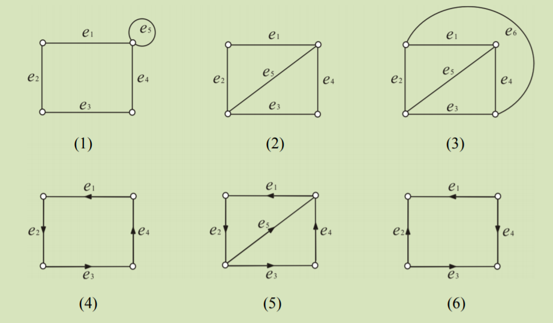
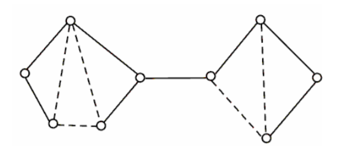

# 离散数学

---

## 第五章 图

### 5.1 基本概念 

#### 5.1.1 图的定义

- 一个**图**$G$是一个序偶$<V,E>$，其中，$V$ 是一个非空集合，$E$是$V$的$2-$元素子集的集合。 分别称$ V $和$ E $是图$G$的**顶点集**和**边集**，$ V $中的元素是图$G $的**顶点**，$ E $中的元素是图$G$的边。

  > 1. 在容易引起混淆的情况下，通常把$V$记为$V(G)$，$E$记为$E(G)$。 
  >
  > 2. 对于图$G=<V,E>$，若$|V|=p,|E|=q $，则通常称它为$(p,q)$**图**。$p$称为图$G $的**阶**。 边集$E$为空集的图称为**零图**，而$(1，0)$图称为**平凡图**。
  >
  > 3. 在图中，若边$e=(u,v)$，则称顶点$u$与顶点$v$相**邻接**；并说顶点$ u$与边$e $相**关联**，顶点$ v $与边$ e $相**关联**；若边$e$和边$f$有一个共同的端点，则称边$e$和边$f$相**邻接**；没有边关联于它的顶点称为**孤立点**，不与其他任何边相邻接的边称为**孤立边**。 
  >
  > 4. 在图中，两端点相同的边称为**环**；两端点间的若干条边称为**平行边**；有环的图称为**带环图**， 没有环的图称为**无环图**；有平行边的图称为**多重图**；没有环也没有平行边的图，称为**简单图**。 
  >
  > 5. 任何两个不同顶点之间都有边相连的简单图叫**完全图**。具有$p$个顶点的完全图记作$K_p$。 完全图的总边数为$p(p-1)/2$。下图为$K_7$图。
  >
  >    
  >
  > 6. 设$G=<V,E>$是简单图且$V=V_1\cup V_2,V_1\cap V_2=\varnothing$。若$\forall(u,v)\in E$，均有$u\in V_1$且$v\in V_2$，或$v\in V_1$且$u\in V_2$，则称$G $为**二部图**。
  >
  >    若$\forall u\in V_1,v\in V_2$，均有$(u,v)\in E$，则称$G$为**完全二部图**，$|V_1|=m,|V_2|=n$时的完全二部图记作$K_{m,n}$。容易看出，完全二部图的总边数为$m\cdot n$。
  >
  > 7. 如果$(p,q)$图$G$的每条边$e_i$都赋以一个实数$w_i$作为该边的权，则称$G$为**赋权图**。赋权图常常记作$G=<V,E,W>$，其中$W=\{w_1,w_2,w_3\dots,w_q\}$，并称
  >    $$
  >    w(G)=\sum^q_{i=1}w_i
  >    $$
  >    为$G$的**总权值数**。

- 若$G=<V,E>$及$G_1=<V_1,E_1>$时两个图，满足$V_1\sube V,E_1\sube E$，记为$G_1\sube G$。若$G_1\sube G$且$G_1\not= G$，则称$G_1$是$G$的**真子图**。更进一步，若$G_1\sube G$且$E_1=\{(u,v)|u,v\in V_1\cap E\}$，则称$G_1$是$G$的由子顶点集$V_1$确定的**导出子图**。若$G_1\sube G$且$V_1=V$，则称$G_1$是$G$的**生成子图**。

#### 5.1.2 顶点的度

- 设$G=<V, E>, v\in V$，$E$中与$v$关联的边的条数称为$v$的**度**，记作$d(v)$。若$v$处有环，则默认每一个环与该点的关联边数为2。

  > 1. 若$d(v)$是奇数，就称$v$为**奇点**；若$d(v)$是偶数，就称$v$为**偶点**。度为1的点称为**悬挂点**，与悬挂点关联的边称为**悬挂边**。
  >
  > 2. 设$G=<V, E>$是$p$阶图，$V=\{v_1,v_2,\dots,v_p\}$，称$d(v_1),d(v_2),\dots,d(v_p)$为$G$的**度数列**。
  >
  > 3. 可以定义图的最大度$\Delta(G)$、最小度$\delta(G)$：
  >    $$
  >    \Delta(G) = max\{d(v)|v\in V\},\ \ \delta(G)= min\{d(v)|v\in V\}
  >    $$
  >    显然，对于$p$阶简单图，$\Delta(G)≤ p-1$。
  >
  > 4. 度的概念可以从一个顶点推广到一个*顶点子集*。对于图$G=<V, E>$，取$V$的一个子集$V_1$，定义边的集合
  >    $$
  >    R(V_1)=\{(u, v)|u∈V_1\land v\not\in V\land (u, v)\in E\}
  >    $$
  >    称集合$R(V_1)$的基数$|R(V_1)|$为**顶点子集$V_1$的度**。它表示在图$G$中连接点集$V_1$外部点与内部点的所有边的条数。

- **握手定理** 设$G=<V, E>$是$(p, q)$图，$V=(v_1，v_2,\dots,v_p)$，则
  $$
  \sum^p_{i=1}d(v_i)=2q
  $$
  就是说，*图中各顶点度数之和是边数的两倍*。

### 5.2 图的连通性 

#### 5.2.1 通路

- $G=<V,E>$是一个图，$G$的一个点边交替序列$(v_0，e_1，v_1，…，v_{n−1}，e_n，v_n )$称为$G $的**通路**，其中$e_i=(v_{i−1}，v_i )，i =1，2，\dots，n$。通路中边的条数称为**通路的长度**。特别地，若$v_0=v_n$，则该通路称为**回路**。

- 若通路（回路）上的边各不相同，则 称为**简单通路**（**简单回路**）；若通路上的顶点各不相同，则称为**基本通路**；若回路$(v_0，e_1，v_1，\dots，v_{n−1}，e_n，v_n )$上的顶点$v_0，v_1，\dots， v_{n−1}$各不相同，则称为**基本回路**。基本回路有时也叫做**圈**。 长为1的回路是环，长为2的回路只能由平行边生成，因而在简单图中，*回路的长度至少为3*。

  - 基本通路（回路）一定是简单通路（回路）

- 如果非零图$G$中无奇点，则$G$中必有基本回路。

- 在$p$阶图$G$中，

  1. 若顶点$v$和$w ( v≠w)$有通路相连，则$v$和$w$之间存在长度小于或等于$(p-1)$的基本通路；
  2. 若存在通过顶点v的简单回路，则一定存在通过$v$的长度小于或等于$p$的基本回路。

  - 图中两个顶点之间的通路可能不止一条，但是，必然存在长度最短的一条，即最短通路。

- 设图$G=<V, E>, u, v\in V$，顶点$u, v$之间最短通路的长度称为$u, v$之间的**距离**，记为$d(u, v)$。若$u$与$v$无通路相连，则取$d(u, v) 为\infty$。

#### 5.2.2 连通图

- $G=<V, E>$是一个图。若$u, v∈V$，$u$和$v$之间存在通路，则称$u$，$v$连通，记作$u\sim v$。若$\forall u, v\in V$，均有$u$与$v$连通，则$G$称为**连通图**，否则$G$称为**非连通图**。非连通图$G$中的极大连通子图称为$G$的**连通分图**。

- 在$p$阶简单图$G$中，若对$G$的每对顶点$u$和$v$，都有$d(u)+d(v)\geq p-1$，则$G$是连通图。

  - *推论*：在$p$阶简单图$G$中，若$\delta (G)\geq(p-1)/2$，则$G$是连通图。

- 设图$G=<V, E>$，顶点子集$V_1\sube V$，边子集$E_1\sube E$。用$G-V$表示从$G$中去掉$V_1$中所有的顶点及与之相关联的所有边所得的图，当$V_1=\{v\}$时，直接记作$G-v$；用$G-E_1$表示从$G$中去掉边子集$E_1$,中所有的边，其他不变，所得到的图，当$E_1=\{e\}$时，直接记作记作$G-e$。

- 设图$G=<V, E>$，顶点子集$V_1\sube V$。若$G-V_1$的连通分图数大于$G$的连通分图数，且$\forall V_2\sub V_1$，$G-V_2$的连通分图数不大于$G$的连通分图数，则称$V$是$G$的**点割集**。当$V_1=\{v\}$时，则称$v$是$G$的**割点**；

  设图$G=<V, E>$，边子集$E_1\sube E$。若$G- E$的连通分图数大于$G$的连通分图数，且$\forall E_2\sub E_1$的连通分图数不大于$G$的连通分图数，则称E是G的**边割集**，当$E_1=\{e\}$时，则称$e$是$G$的割边。边割集简称为**割集**，割边简称为**桥**。

  显然，若$e=(u, v)$是桥，且$d(u)>1$， 则$u$一定是割点。

- 若$v$是连通图$G=<V, E>$的顶点，则下述命题等价：

  1. $v$是$G$的割点；
  2. $G$中存在与$v$不同的两点$u，w$，使$v$在从$u$到$w$的每一条基本通路上；
  3. 存在对集合$V-\{v\}$的一个划分$\{U, W\}$,使得$\forall u\in U，w\in W，v$在从$u$到$w$的每一条基本通路上。

- 若$e$是连通图$G=<V, E>$的边，则下述命题等价：

  1. $e$是$G$的桥；
  2. $G$中存在不同的两个点$u,w$，使边$e$在从$u$到$w$的每一条基本通路上；
  3. 存在对集合$V$的一个划分$\{U，W\}$，使得$\forall u\in U，w\in W$，边$e$在从$u$到$w$的每一条基本通路上；
  4. $e$不在$G$的任一条基本回路上。

- 图$G=<V, E>$的**点连通度**$\kappa(G)$，是为了由$G$产生一个不连通图或平凡图，而需从$G$中去掉的最少顶点数。显然，
  $$
  \kappa(G) = min\{|V_1||V_1为G的点割集\}
  $$

- 图$G=<V, E>$的**边连通度**$\lambda(G)$，是为了由$G$产生一个不连通的图或平凡图，而需从$G$中去掉的最少的边数。显然，
  $$
  \lambda((G) = min\{|E_1||E_1为G的边割集\}
  $$

- 对任一图$G$，有
  $$
  \kappa(G)\leq\lambda(G)\leq\delta(G)
  $$

#### 5.2.3 图的矩阵表示

- 设$G=<V, E>$是$p$阶图，其中，$V=\{v_1，v_2,\dots,v_p\}$。 $p$阶方阵$A_G =(a_{ij})_{p\times p}$称为图$G$的**邻接矩阵**，其中，元素$a_{ij}$为起点为$v_i$终点为$v_j$的边的数目。

- $(p,q)$图$G$的邻接矩阵$A_G$具有如下性质：

  1. $A_G$是对称非负整数型矩阵；
  2. $G$是简单图，当且仅当$A_G$是主对角线上元素全为$0$的$(0，1)$矩阵；
  3. $G$是完全图，当且仅当$A_G$的元素除主对角线上元素全为$0$外，其余元素全为$1$；
  4. $G$是无环图，当且仅当$A_G$主对角线上的元素全为$0$；
  5. 若$G$是无环图，则在$A_G$中，每一行元素的和等于对应顶点的度数，所有元素的和等于边个数的两倍，即$2q$。

- 设$A$为$p$阶图$G=<V, E>$的邻接矩阵，其中，$V=\{v_1，v_2,\dots,v_p\}$，则矩阵$A$的$n$次幂$A^n(n=1,2, 3,\dots)$中的元素$a^n_{ij}$等于从$v_i$到$v_j$的长度为$n$的通路的总数。

  - *推论1*： $v_i$和$v_j$之间的距离$d(v_i, v_j) $是使$A^n$中的元素$a^n_{ij}$不为零的最小正整数$n$。
  - *推论2*：$b^{(k)}_{ij}=a_{ij}+a^{(2)}_{ij}+\dots+a^{(k)}_{ij}$是图$G$中连接$v_i$到$v_j$的长度小于或等于$k$的通路的总数。

- 设$G=<V, E>$是$p$阶图，其中，$V=\{v_1，v_2,\dots,v_p\}$。$p$阶方阵$C_G=(C_{ij})_{p\times p}$称为$G$的**连通矩阵**，其中，元素
  $$
  c_{ij} = \left\{ \begin{array}\\
  1 & v_i与v_j连通 \\
  0 & v_i与v_j不连通
  \end{array}\right.
  $$

- 设$G=<V， E>$是$<p, q>$图，$V=\{v_1，v_2,\dots,v_p\},E=\{e_1，e_2,\dots,e_q\}$。$p\times q$阶矩阵$M_G=(m_{ij})_{p\times q}$称为$G$的**关联矩阵**，其中
  $$
  m_{ij} = \left\{ \begin{array}\\
  2 & e_j是环且关联v_i\\
  1 & e_j关联v_i且不是环 \\
  0 & e_j不关联v_i
  \end{array}\right.
  $$

- 从关联矩阵$M_G$的定义,可以看出它具有如下性质：

  1. 在$M_G$中，平行边的对应列相同；

  2. 在$M_G$中，若某行元素全为$0$，则其对应的顶点为孤立点；

  3. 在$M_G$中，每一列元素之和为$2$；

  4. 在$M_G$中，第$i$行元素的和等于第$i$个顶点的度数，即
     $$
     \sum ^q_{j=1}m_{ij} =d(v_i)
     $$

  5. 在$M_G$中，所有元素的和等于边数的两倍，即
     $$
     \sum ^p_{i=1}\sum ^q_{j=1}m_{ij} =\sum ^p_{i=1}d(v_i)=2q
     $$
     这正是握手定理的内容。

### 5.3 欧拉图与哈密尔顿图 

#### 5.3.1 欧拉图(考虑边的遍历性)

- 在图(无向图或有向图)中，包含了所有边的简单通路称为**欧拉通路**，包含了所有边的 简单回路称为**欧拉回路**。具有欧拉回路的图称为**欧拉图**，具有欧拉通路而无欧拉回路的图称为**半欧拉图**。

  - eg:

    

    上图中，(1)e1e2e3e4e5为一条欧拉回路，为欧拉图； (2)e1e2e3e4e5为一条欧拉通路， 但图中不存在欧拉回路，为半欧拉图； (4)e1e2e3e4为一条欧拉回路，为欧拉图； (3)、 (5)、 (6)既没有欧拉回路，又没有欧拉通路。

- 若G 是非平凡的连通图，则下述命题等价：

  > 1. G 是欧拉图；
  > 2. G 中无奇点。

- 若G是非平凡的连通图，则下述命题等价：

  > 1. G 是半欧拉图；
  > 2. G 中恰有两个奇点，而且这两个奇点即是欧拉通路的起点和终点。

- 设$G=<V,E>$是$(p,q)$欧拉图（半欧拉图），一般来说，$G$中存在若干条欧拉回路 （通路），求解欧拉回路（通路）的方法也不止一种。下面介绍一种求欧拉回路（通路）的算法， 称为**Fleury算法(弗罗莱算法)**。(算法基本思想是能不走桥就不走桥)

  > 步骤1
  > 	任取$v_0\in V$（当有奇点时，v。是G的奇数度点），令$L_0=(v_0)$。
  > 步骤2
  > 	设$L_i=(v_0,e_1,v_1,e_2,\dots,e_i,v_i)$为已经选定的通路，按下述方法从集合$E-(e_1,e_2,\dots,e_i)$中选取边$e_{i+1}$。
  > 		(a) $e_{i+1}$与$v_i$关联。
  > 		(b)除非无别的边可选择，否则，$e_{i+1}$不应该为图$G-(e_1,e_2,\dots,e_i)$的桥。
  > 	如果找到$e_{i+1}$，则将$e_{i+1}$及其相关联的另一个顶点$v_{i+1}$，加入到通路$L_i$，中得到$L_{i+1}=(v_0,e_1,v_1,e_2,\dots,e_i,v_i,e_{i+1},v_{i+1})$。
  > 步骤3
  > 	重复步骤2直到找不出边为止，所得迹即是一条欧拉回路(通路)。
  > 	可以证明，按此算法最后所得$L_q=(v_0,e_1,v_1,e_2,\dots,e_q,v_q)$为一条欧拉回路 (通路)。

#### 5.3.2 哈密尔顿图(考虑点的遍历性)

- 图$G$的经过所有顶点的基本通路称为**哈密尔顿路**，经过所有顶点的基本回路称为**哈密尔顿回路**，具有哈密尔顿回路的图称为**哈密尔顿图**，具有哈密尔顿路而不具备哈密尔顿回路的图称为**半哈密尔顿图**。

  根据上面的定义，可直接得出下面结论： 

  > 1. 每个哈密尔顿图都连通且每个顶点的度数均大于等于2；
  > 2. 若一个图有哈密尔顿回路，则任何顶点所关联的边一定有两条在该哈密尔顿回路上；
  > 3. 若一个图有哈密尔顿回路，则该哈密尔顿回路上的部分边不可能组成一个未经过所有顶点的基本回路。

#### 5.3.3 旅行商问题

- 一位旅行推销员想要访问$n$个城市中每个城市恰好一次，并且返回他的出发点。他应当以什么顺序访问这些城市以便旅行总距离最短？这就是著名的**旅行商问题**。这个问题可化归为如下的图论问题：

  > 设G是一个赋权完全图，各边的权非负，且有的边的权可能为$\infin$（对应两城市之间无交通线）， 求$G$中一条最短的哈密尔顿回路。 最直截了当的求解旅行商问题的方法是检查所有可能的哈密尔顿回路并且挑选出总权值最小的。若在图中有$n$个城市，则为了求解这个问题，得检查多少条哈密尔顿回路？一旦选定了出发点， 需要检查的不同的哈密尔顿回路就有$(n-1)!/2$条，因为第二个顶点有$n-1$种选择，第三个顶点有$n-2$种选择，依此类推。

### 5.4 最短通路 

- *本节包含大量算法例题，建议查阅[第五章PPT](第5章  图 by szh20200430.pdf)进行学习。*

- 由于在一个图的两点之间若有平行边，则最短通路只需要走其中一条边即可，而且带环图的环对最短通路的求解也没有任何影响，所以本节我们假设所考虑的图是简单图。

#### 5.4.1 广义优先搜索

- 我们希望在顶点$S $和$T $之间找到一条最短通路，并求出从$S $到$T $的距离。通常的方法是：首先考虑顶点$S$，接着考虑与$S $相邻的顶点，然后考虑与这些相邻顶点相邻且未被考虑的顶点，等等。通过记录顶点被检查的路线，就可以构造出一条从$S $到$T $的最短通路。为了求出从$S $到$T $的距离，需要对图中被考虑的顶点做标记。比如，如果顶点$V $标记为3(U )，那么从$S $到$V $的距离为$3$，且在某条从$S $到$V $的最短通路上，$U $是$V$的前驱（即从$S$到$V $的最短通路包含边$（U，V）$）。
- **广度优先搜索算法**：本算法确定图中从$S $到其他各个顶点的距离和最短通路（若$S $到这些顶 点有通路）。在这个算法中，$￡$表示已被标记的顶点的集合，顶点$A $的前驱是用来对$A $做标记的、 $￡$中的一个顶点。

#### 5.4.2 Dijkstra算法(迪杰斯特拉算法)——单源最短路径问题

- 在许多应用中，需要在赋权图中寻找权最小的通路。*两个顶点之间权最小的通路*也称为最短通路，这条通路的权也称为这两个顶点之间的距离。

  然而，并不一定都会存在权最小的通路。例如，当图中存在权为负数的情况时，最小通路就可能不存在。

- 有一个计算赋权图中两顶点$S $和$T $之间距离和最短通路的算法。事实上，这个算法可以同时用来找出$S $到其他所有各顶点之间的距离和最短通路。这个算法的思想是：先找出距S 最近的顶点，接着找出距$S $第二近的顶点……，依此类推。通过这种方法可以找出$S $到其他所有各顶点之间的距离。此外，在确定距离时，如果把用到的顶点记录下来，那么就可以找到从$S $到任意一个顶点的最短通路。这个算法归功于**迪杰斯特拉（E.Dijkstra）**，他是计算机科学的先驱之一。

#### 5.4.3 中国邮递员问题

略。

### 5.5 树 

#### 5.5.1 基本概念

- 树是保持连通图的所有顶点之间连通性的极小子图。
- 不含回路的连通图称为**树**。每个连通分图都是树的非连通图称为**林(森林)**。
- 设$G$是图，则下述命题等价：
  1. $G$是树；
  2. $G$中任意两点之间有唯一一条简单通路；
  3. $G$连通，且任何边都是桥；
  4. $G$连通，且$q=p-1$；
  5. $G$中无回路，且$q=p-1$；
  6. $G$中无回路，且在任意两个不同的顶点之间加一条边，则恰有一条基本回路。

#### 5.5.2 生成树

- 若$T$是图$G$的生成子图，且是树，则称$T$为$G$的**生成树**。$\forall e \in E(G)$，若$e$在树$T$上，则称$e$为$T$的**枝(树枝)**，否则称$e$为$T$的**弦**。称$T$的所有弦的导出子图为$T$的**余树**，余树不一定连通，也不一定不含回路。

- 设$G$为无向图： 

  1. $G$的树——$T$是$G$的子图并且是树；
  2. $G$的生成树——$T$是$G$的生成子图并且是树；
  3. 生成树$T$的树枝——$T$中的边；
  4. 生成树$T$的弦——不在$T$中的边；
  5. 生成树$T$的余树$T$——全体弦组成的集合的导出子图。

  

   注：余树如图中虚边所示，它不连通，同时含有回路。

- 有时把通过广度优先搜索算法构成出来的生成树称为**最短通路树（Shortest Path Tree）**。

- 图$G$具有生成树，当且仅当$G$是连通图。

- 设$T$是图$G$的生成树，则：

  1. $G$的任何回路都至少包含$T$的一一条弦。
  2. 若$e$为$T$的弦，则$G$中存在且只存在一条只含弦$e$，其余都是枝的基本回路，称为$G$的对应$T$的弦$e$的**基本回路**。

  > 推论1：若一个$(p, q) $图是连通图，则$q\geq p-1$。
  > 推论2：若T是$(p, q)$图$G$的生成树，则$T$有$p-1$条枝，$q-p+1$条弦。

- 设T是图$G$的生成树，则：

  1. $G$的任何回路都至少包含$T$的一条弦；
  2. 若$e$为$T$的弦，则$G$中存在且只存在一条只含弦$e$，其余都是枝的基本回路，称为$G$的对应$T$的弦$e$的**基本回路**。

- 设$T$是图$G$的生成树。

  1. $G$的任一割集（边割集）都至少含有$T$的一条枝。
  2. 若$e$为$T$的枝，则$G$中恰好存在一个只含枝$e$，其余都是弦的割集，称为$G$ 的对应$T$的枝$e$的**基本割集**。

#### 5.5.3 深度优先搜索(DFS: Depth First Search)

- 另一种求连通图生成树的算法是深度优先搜索算法。在这个算法中，用连接的整数标记顶点， 这些整数指明了遇到顶点的顺序。这个算法的基本思想是：标记顶点$V $后，在寻找应紧接着做标记的顶点时，首先要考虑的顶点是与$V $相邻但还未被标记的顶点。如果有一个与$V $相邻的未被标记的顶点W，就为W指定下一个标记数，再从$W $开始搜索下一个要标记的顶点。如果$V$没有未被标记的相邻顶点，就沿着给$V $做标记时所走过的边后退，并且，如果有必要，连续后退，直到到达一个顶点，它有未被标记的相邻顶点$U$。接着为顶点$U $指定下一个标记数，并从$U $开始搜索下一个要标记的顶点。
- 深度优先算法的关键思想是：*当已经走到所能够到达的最远端时，就后退*。
- 通常，把通过深度优先搜索算法构成出来的生成树称为**深度优先搜索树（Depth-first Search Tree）**。

#### 5.5.4 最小生成树

- 设$G$是赋权图，$G$的具有最小权值总和的生成树称为$G$的**最小生成树**。
- 一种寻找最小生成树的算法叫做**普里姆（Prim）**算法。该算法首先由一个顶点开始，每次循环都增加一个权值最小的边，且不形成回路，直到形成一个最小生成树。另一个找出最小生成树的算法叫做**克鲁斯卡尔（Kruskal）算法**，介绍略。
- Prim算法：求解连通赋权图$G＝<V,E,W>$的最小生成树$T$。
- Prim算法是一种贪心算法。所谓**贪心算法**，是指一类采用“局部最优”方式 的算法，它在每次循环时都只考虑如何使本次选择做到最优，而不考虑总体是否达到最优。
- Prim算法是正确的，也就是说，算法结束得到的边集〒组成的图是最小生成树。

### 5.6 平面图及图的着色

#### 5.6.1 平面图

- 将图$G$的图形画在一个曲面$S$（按平面理解即可）上，使$G$的任何两条边均不交叉，则称$G$被**嵌入曲面$S$**。可以嵌入平面的图称为**平面图**，平面图嵌入平面后得到的任何两条边均不交叉的图称为平面图的一个**平面嵌入**。

- 设$G$是平面图的一个平面嵌入。由G 的边将G 所在平面划分成若干个连通区域，每个连通区域都称为$G$的一个**面**。面积无限的区域称为**外部面**，面积有限的区域称为**内部面**。包围面的所有边组成的边界的长度称为该面的**围数**。常记外部面为$R_0$，内部面为$R_1,R_2,\dots,R_{f-1},$ 面$R$的围数记为$bou(R)$。

  - 显然，一个平面嵌入有唯一的外部面，其他的都是内部面。

- 设$G$是$(p, q)$连通平面图的一个平面嵌入，其面为$R_1,R_2,\dots,R_{f-1},$则这些面的围数之和等于边数的两倍，即
  $$
  \sum^{f-1}_{i=0}bou(R_i)=2q
  $$
  并称$\sum^{f-1}_{i=0}bou(R_i)$为该平面图的**总围数**，记为$bou(G)$。

- *平面图的欧拉公式*：设$G$是$(p, q)$连通平面图的一个平面嵌入，其面数为$f$，则有
  $$
  p-q+f=2
  $$

- 设$e=(u, v)$为图$G$的一条边，在$G$中增加新顶点$w$，用$(u, w)$和$(w,v)$替换原来的边$(u, v)$，这样的操作称为在$G$中**插入2度顶点**。设$w$为$G$中的一个2度顶点，$w$与$u$, $v$相邻，删除$w$及其相关联的边，增加新边$(u, v)$，这样的操作称为在G中**消去2度顶点$w$**。

- 两个图$G_1$和$G_2$，如果通过反复插入或消去2度顶点后变成同一个图，则称$G_1$和$G_2$**同胚**。

- *库拉托斯基(Kuratowski)定理* ：一个图是平面图，当且仅当它没有与$K_5$或$K_{3,3}$同胚的子图。

#### 5.6.2 图的着色

- 连通无桥平面图的平面嵌入称为**平面地图或地图**，地图的面称为**区域**。若两个区域的边界至少有一条公共边，则称这两个区域是**相邻**的。

- 对地图$G$的每个区域涂上一种颜色，使相邻的区域涂不同的颜色，称为对$G$的一种**面着色**。若能用$k$种颜色给$G$面着色，就称$G$是**$k$面可着色的**。若$G$是$k$面可着色的，但不是$k−1$面可着色的，就称$G$的**面色数**为$k$ ，记作$\chi ^*(G)=k$。

- 对无环图$G$的每个顶点涂上一种颜色，使相邻的顶点涂不同的颜色，称为对$G$的一种**点着色**。若能用$k$种颜色给G点着色，就称$G$是$k$点可着色的。若$G$是$k$点可着色的，但不是$k-1$点可着色的，就称$G$的**点色数**为$k$，记作$\chi(G)=k$。

- *四色定理*：平面图的点色数不超过4，因而，平面图的面色数不超过4。

  > 四色定理只适用于平面图，非平面图可以有很大的色数。从点色数的定义不难看出:
  >
  > 1. 若$G$是无环图，则$\chi(G)=1$,当且仅当$G$是零图；
  > 2. 若$G$是非零无环图，则$\chi(G)=2$，当且仅当$G$为二部图；
  > 3. 完全图的点色数等于它的阶数，即$\chi(G)=p$。

