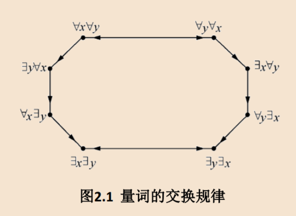

# 离散数学

---

## 第一章 命题逻辑

### 1.1 命题和逻辑连接词

#### 1.1.1 命题

> 所谓**命题**，是指能区分真假的陈述句，这与中学数学中的命题定义是一样的。
>
> 命题可分为**真命题**和**假命题**。如果命题所表述的内容与客观实际相符，则称该命题是真命题；否则称之为假命题。 
>
> 命题的这种真假属性称为命题的**真值**。当一个命题是真命题时，我们称它的真值为“真”，用T表示；当一个命题是假命题时，我们称它的真值为“假”，用F表示。

#### 1.1.2 逻辑连接词与命题符号化

**否定词($\neg$)、合取词($\land$)、析取词($\lor$)、蕴涵词($\rightarrow$)和等值词($\leftrightarrow$)**

>否定词、析取词、合取词又常被称为**逻辑非（逻辑否）**、**逻辑加（逻辑或）**和**逻辑乘（逻辑与）**，是3个最基本的逻辑运算。

- 运算顺序（从左到右）
  $$
  \neg \ \ \land \ \ \lor \ \ \rightarrow \ \ \leftrightarrow
  $$

### 1.2 命题公式及其真值表

#### 1.2.1 命题公式

​    就像数学中有变量的概念一样，数理逻辑中也有**命题变元**的概念，它是用来表示任意命题的标识符，用小写英文字母表示，而1.1节的真值$T$（或1）和$F$（或0）又通常称为**命题常元**。

>在命题公式中，由于有命题变元的出现，因而真值是不确定的，所以命题公式本身不是命题。只有对命题公式中出现的每个命题变元都解释成具体的命题，才能将命题公式“翻译”成一个具体的复合命题，这实际上相当于通过对公式中的每一变元都确定一个真值来确定命题公式的真值。

#### 1.2.2 真值表

- 设$A$是以$p_{1}，p_{2}，p_{3}，\dots，p_{n}$为变元的命题公式，给$p_{1}，p_{2}，p_{3}，\dots，p_{n}$各指定一个真值，称为对$A$的一个**解释**(**赋值**，**真值指派**)。若指定的一组值使A的真值为$1$，则
  称这组值为$A$的**成真解释**(**成真赋值**，**成真指派**)；若使$A$的真值为$0$，则称这组值为$A$的
  **成假解释**（ **成假赋值**，**成假指派**）。
- 将命题公式$A$在所有解释下的取值情况列成表，称做$A$的**真值表**，一个命题
  公式如果含有$n$个命题变元，则它有$2^n$种解释，从而，真值表有$2n$行。

设A是一个命题公式

>- 若A在所有解释下取值均为真，则称$A$是**永真式**(**有效式**)。
>- 若A在所有解释下取值均为假，则称$A$是**永假式**(**矛盾式**)。
>- 若A不是永假式，则称$A$是**可满足式**。

**代替规则** 

>把一个永真式中的某个命题变元用一个命题公式处处代替，所得公式仍为永真式。把一个永假式中的某个命题变元用一个命题公式处处代替，所得公式仍为永假式。

### 1.3 命题公式的等价演算

- 设$A$和$B$是两个命题公式，如果在任何解释下，$A$和$B$都有相同的真值，则称$A$和$B$等价，记为$A = B$。
- 设A和B是两个命题公式，$A=B$ 的充要条件是$A \rightarrow B$是永真式。

*基本等价公式*

1. 双重否定律：$\neg \neg A=A$
2. 等幂律：$A \lor A = A \ ,\  \ A \land A = A $
3. 交换律：$A\lor B = B \lor A \ ,\ \ A \land B = B \land A$
4. 结合律：$A\lor (B\lor C)=(A\lor B)\lor C \\A\land (B\land C)=(A\land B)\land C$
5. 分配律：$A\lor (B\land C) = (A \lor B)\land(A\lor C)\\A\land (B\lor C) = (A \and B)\lor(A\land C)$
6. 德·摩根律：$\neg(A\lor B) = \neg A\land \neg B\ ,\ \ \neg(A\land B) = \neg A\lor \neg B$
7. 吸收律：$A\lor (A\land B) = A\ ,\ \ A\land (A\lor B) = A $
8. 零律：$A\lor 1 = 1 \ , \ \ A\land 0 = 0$
9. 单位律：$A\lor 0 = A \ , \ \ A\land 1 = A$
10. 否定律：$A\lor \neg A = 1 \ , \ \ A\land \neg A = 0$
11. 蕴含律：$A\rightarrow B = \neg A \lor B$
12. 等值律：$A\leftrightarrow B = (A\rightarrow B)\land (B\rightarrow A)$

**置换规则**

> 设$\phi (A)$为含有 公式4作为子公式的命题公式，$\phi (B)$是用公式B置换$\phi (A)$中的A (不要求处处置换)所得到的命题公式，若$A=B$,则$\phi (A)=\phi (B)$。

### 1.4 命题公式的范式

#### 1.4.1 析取范式与合取范式

- 有限个命题变元或其否定组成的合取式称为**初等积（简单合取式），**有限个命题变元或其否定组成的析取式称为**初等和（简单析取式）**。

$$
A_{1}\lor A_{2}\lor \cdots \lor A_{m}
$$

为**析取范式**。若这个析取范式与命题公式A等价，则称它为公式A的析取范式。

> 设$A_{i}(i=1,2,\cdots ,m,m\geq 1)$是初等积，称公式
> $$
> A_{1}\lor A_{2} \lor \cdots \lor A_{m}
> $$
> 为**析取范式**。若这个析取范式与命题公式A等价，则称它为公式A的析取范式。

>设$A_{i}(i=1,2,\cdots ,m,m\geq 1)$是初等和，称公式
>$$
>A_{1}\lor A_{2} \lor \cdots \lor A_{m}
>$$
>为**合取范式**。若这个合取范式与命题公式A等价，则称它为公式A的析取范式。

- **任意命题公式都存在与之等价的析取范式和合取范式。**

#### 1.4.2 标准析取范式和标准合取范式

- 如果在命题变元$p_{1}，p_{2}，\cdots，p_{n}$组成的初等积（初等和）中，每个变元或其否定出现且只出现一次，且第*i*个命题变元或它的否定出现在从左算起的第*i*位上（若命题变元无下标，就按字典序排序），则称该初等积（初等和）为的$p_{1}，p_{2}，\cdots，p_{n}$**最小项（最大项）**。
- 在析取范式中，若每个初等积都是最小项，且最小项按下标递增排序，则称该析取范式为**标准析取范式（主析取范式）**。若这个标准析取范式与命题公式等价，则称它为公式的标准析取范式。
- 在合取范式中，若每个初等和都是最大项，且最大项按下标递增排序，则称该合取范式为**标准合取范式（主合取范式）**。若这个标准合取范式与命题公式等价，则称它为公式的标准合取范式。
- 凡不是永假式的命题公式都存在唯一的与之等价的标准析取范式。
- 凡不是永真式的命题公式都存在唯一的与之等价的标准合取范式。

#### **1.4.3** 利用真值表求解标准范式

- 最小项具有如下性质：

  1. 对每个最小项而言，只有与下标编码相同的赋值是成真赋值，其余都是成假赋值；

  2. 任意两个不同的最小项的合取式是永假式；
  3. 全体最小项的析取式是永真式。

- 最大项具有如下性质：

  1. 对每个最大项而言，只有与下标编码相同的赋值是成假赋值，其余都是成真赋值；
  2. 任意两个不同的最大项的析取式是永真式。；
  3. 全体最大项的合取式是永假式。

- 在命题公式*A*的真值表中，所有成真赋值对应的最小项的析取式（按最小项下标递增排序）为公式*A*的唯一标准析取范式。

- 在命题公式*A*的真值表中，所有成假赋值对应的最大项的合取式（按最大项下标递增排序）为公式*A*的唯一标准合取范式。

#### **1.4.4** 标准析取范式和标准合取范式的关系

命题公式*A*的标准析取范式求*A*的标准合取范式的方法，其步骤如下：

>1. 求出*A*的标准析取范式中没有包含的最小项；
>2. 求出与1. 中最小项下标相同的最大项；
>3. 将2. 中求出的最大项按下标递增的顺序构成的合取式即为*A*的标准合取范式。
>

同样的，可以得到由*A*的标准合取范式求*A*的标准析取范式的方法，其步骤为如下：

>1. 求出*A*的标准合取范式中没有包含的最大项；
>
>2. 求出与1. 中最大项下标相同的最小项；
>
>3. 将2. 中求出的最小项按下标递增的顺序构成的析取式即为*A*的标准析取范式。

设*A*是含有*n*个命题变元的命题公式，则：

>*A*是永真式当且仅当*A*的标准析取范式含有全部2*n*个最小项；
>
> *A*是永假式当且仅当*A*的标准析取范式不含任何最小项（即标准析取范式为0）；
>
> *A*是可满足式当且仅当*A*的标准析取范式至少含有一个最小项。

设*A*是含有*n*个命题变元的命题公式，则：

>*A*是永假式当且仅当*A*的标准合取范式含有全部2*n*个最大项；
>
>*A*是永真式当且仅当*A*的标准合取范式不含任何最大项（即标准合取范式为1）；
>
> *A*是可满足式当且仅当*A*的标准合取范式不包含所有最大项。

### 1.5 命题公式的推理演示

- 设$A_{1},A_{2},\dots A_{n}$和$B$都是命题公式，如果对任何赋值，当$A_{1},A_{2},\dots A_{n}$都取值1时，$B$必取值1，则称由前提$A_{1},A_{2},\dots A_{n}$到结论$B$的推理是**有效的(正确的)**，或
  者称$B$是前提$A_{1},A_{2},\dots A_{n}$的*逻辑结论(有效结论)*，记为$A_{1},A_{2},\dots A_{n} \Rightarrow B$。
- 设$A_{1},A_{2},\dots A_{n}$和$B$都是命题公式，则$A_{1},A_{2},\dots A_{n} \Rightarrow B$的充要条件是$A_{1}\land A_{2}\land \dots\land  A_{n}\rightarrow B$是永真式。
- 设$A_{1},A_{2},\dots A_{n}$和$B$都是命题公式，则$A_{1},A_{2},\dots A_{n} \Rightarrow B$的充要条件是$A_{1}\land A_{2}\land \dots\land  A_{n}\rightarrow \neg B$是永假式。

*推理公式*

1. 附加律：$A\Rightarrow A\lor B$
2. 化简律：$A\land B \Rightarrow A$
3. 合取引入：$A,B\Rightarrow A\land B$
4. 析取三段论：$(A\lor B)\land \neg B\Rightarrow A$
5. $B\Rightarrow A\rightarrow B$
6. $\neg A \Rightarrow A\rightarrow B$
7. 假言推理：$(A\rightarrow B)\land A\Rightarrow B$
8. 拒取式：$(A\rightarrow B)\land \neg B\Rightarrow \neg A$
9. 假言三段论：$(A\rightarrow B)\land(B\rightarrow C)\Rightarrow A\rightarrow C $
10. $(A\leftrightarrow B)\and A \Rightarrow B$
11. 等价三段论：$(A\leftrightarrow B)\land(B\leftrightarrow C)\Rightarrow A\leftrightarrow C $

#### **1.5.2** 演绎推理方法

- 从前提开始来构造一个有限公式序列，使得这个公式序列中的最后一个公式即为结论。

**推理规则**

>**P规则**（**前提引入规则**）：在证明的任何步骤上都可以引入前提，作为公式序列中的公式。
>
>**E规则**（**置换规则**）：在证明的任何步骤上，公式序列中命题公式的子公式都可以用与之等价的公式进行置换，得到公式序列中的公式。
>
>**T规则**（**结论引入规则**）：在证明的任何步骤上都可以引入公式序列中已有公式的逻辑结论，作为公式序列中的公式。

#### **1.5.3** 附加前提法

- 将$A_{1},A_{2},L,A_{3}\Rightarrow A$的演绎推理转变为$A_{1},A_{2},L,A_{n},\neg A\Rightarrow 0$的演绎推理，这里的$\neg A$称为**附加前提**(有的书上称为**反证法**)。

### 1.6 逻辑门电路

[参见数字电路。](数字电路.md)

## 第二章 谓词逻辑

### 2.1 个体词、谓词与量词

#### 2.1.1 个体词与谓词

- 在原子命题中，表示对象的词称为**个体词**；表示对象所具有的性质或多个对象之间关系的词称为谓词。
- 个体词一般是原子命题中的主语或宾语。个体词可以是具体事物，也可以是抽象的概念，例如，小王，夏天，偶数，思想等都可以作为个体词。特定的个体词称为**个体常元**，用小写字母$ a ， b ， c ，\dots$ 或$ a_{1} ，a_{2}，a_{3}，\dots $表示不确定的个体词称为**个体变元**，用小写字母$ x ， y ， z ，\dots$或$ x_{1} ，x_{2}，x_{3}，\dots $表示。
- **谓词**一般是原子命题中的谓语，通常用大写字母$P,Q,R$或$ P_{1} ，P_{2}，P_{3}，\dots $表示。含有$n $个$(n\geq 0)$个体变元的谓词称为**$n$元谓词**，也称为**$n$元简单命题函数**，通常记为$P( x_{1} ，x_{2}，x_{3}，\dots ，x_{n})$。 它实际上是$\overbrace{D_{1}\times D_{2}\times \cdots\times D_{n}}^{n个}$到$\{0，1\}$的一个函数，其中$D_{i}$是个体变元$x_{i}$的个体域。所谓个体域就是个体变元遍历的非空集合。一般地，个体域应事先给定，如果没有给定，则约定个体域是全体事物构成的集合，称为**全总个体域**。另外，以后除非特别声明，否则认为一个$n$元谓词的所有个体变元的个体域 是一样的。
- 由简单命题函数和命题连接词构成的表达式称为**复合命题函数**。
- **n元谓词**$( n\geq 0)$不是命题，只有当$n$元谓词中的全部个体变元在个体域中取定个体常元后它才成为命题，此时，谓词已经不含个体变元而只含个体常元。通常，我们将不含个体变元的谓词称为0元谓词，比如$P(a),Q(b,c),R(d,e,f)$等都是**$0$元谓词**。0元谓词是命题，命题逻辑中的命题都可表示为0元谓词，因此可将命题看成特殊的谓词。

#### 2.1.2 量词

设$D$为量词，

> “对$D$中的任意个体$x$”称为$D$上的**全称量词**，记为$\forall x$；
>
> “对$D$中的存在个体$x$”称为$D$上的**存在量词**，记为$\exist x$。

### 2.2 谓词公式及其解释

#### 2.2.1 谓词公式

- 设$D_{i}(1\leqslant i\leqslant n)$是相应于个体变元$x_{i}$的个体域，则相应于$D_{i}$的**项**是指按下列
  规则定义的符号串：

  1. $D_{i}$中的个体常元和个体变元是相应于$D_{i}$的项；
  2. 若$f$是从$D_{1}\times D_{2}\times \cdots\times D_{n}$到$D_{i}$的$n$元函数，$t_{i}(1\leqslant i\leqslant n)$是相应于$D_{i}$的项，则$f(t_{1},t_{2},t_{3},\dots,t_{n})$也是相应于$D_{i}$的项；
  3. 所有相应于$D_{i}$的项都是有限次使用1. 2. 得到的符号串。

  - 例如，设$f$和$g$分别表示一元函数和二元函数，$a$是个体常元，$x$，$y$是个体变元，则$a, x,y, f(x)， g(x, y)，g(f(x), x)，f(g(x, y))$等都是项。

- 设$P(x, x_{2}, x_{3},\dots ,x_{n})$是$n$元谓词,$t(1\leq i\leq n)$是相应于个体变元$x_{i}$的个体域
  $D_{i}$的项，则称$P(t, t_{2}, t_{3},\dots ,t_{n})$为**原子谓词公式**，简称**原子公式**。

  - 例如，设$R(x, y, z)$是三元谓词，$z，f(z)，g(x, y)$是三个项，则$R(z, f(z), g(x, y))$就是一个原子公式。

- **谓词公式**是按下列规则定义的符号串：

  1. $0$和$1$是谓词公式；
  2. 原子公式是谓词公式；
  3. 若$A，B$是谓词公式，则$\neg A，\neg B，A\land B, A\lor B, A\rightarrow B和A\leftrightarrow B$是谓词公式；
  4. 若$x$是个体变元，$A$是谓词公式，则$\forall xA$和$\exist xA$是谓词公式；
  5. 所有的谓词公式都是有限次使用1. 2. 3. 4. 得到的符号串。

- **谓词公式**是由**原子公式**、**逻辑连接词**、**量词**和**圆括号**等组成的符号串，命题逻辑中的命题公式仅是它的特例，所以命题逻辑包含于谓词逻辑之中。

- 在谓词公式$\forall xA$和$\exist xA$中，称$x$为**指导变元**，称$A$为相应量词的**辖域**或**作用域**，辖域中凡与指导变元相同的个体变元称为**约束变元**，不是约束变元的个体变元称为**自由变元**。

- **换名规则**

  1. 在谓词公式中，将某量词辖域中出现的某个**约束变元**以及对应的**指导变元**改成本辖域中未曾出现过的个体变元符号，其余部分保持不变，公式的等价性不变。
  2. 在谓词公式中，将某个**自由变元**的所有出现用其中未曾出现过的某**个体变元**符号代替，其余部分保持不变，公式的等价性不变。

#### 2.2.2 谓词公式的解释

- 谓词公式$A $的一个解释$I$由下面四个部分组成： 
  1. 非空个体域$D$；
  2. 对$A$中每个个体常元符号，指定$D $中一个固定元素；
  3. 对$A $中每个函数符号，指定一个具体的函数；
  4. 对$A$中每个谓词符号，指定一个具体的谓词。
- 只有约束变元而没有自由变元的谓词公式称为**封闭的谓词公式**。
- 设$A $是一个谓词公式，若$A $在任何解释下均为真，则称$A$为**永真式（有效式）**。若$A$在任何解释下均为假，则称$A $为**永假式（矛盾式）**。若存在解释使$A $为真，则称$A $为**可满足式**。
- 设$p, p_{2},\dots ,p_{n}$是命题公式$A$中出现的$n$个命题变元，$A, A_{2},\dots ,A_{n}$是$n$个谓词公式，用$A(1\leq i\leq n)$处处代替$A$中的$P_{i}$后所得谓词公式称为$A$的**代替实例**。
  - 例如，谓词公式$P(x)\rightarrow Q(x),\forall P(x)\rightarrow \exist Q(x)$等都是命题公式$p\rightarrow q$的代替实例，而$\forall x(P(x)\rightarrow Q(x))$不是$p\rightarrow  q$的代替实例。
- 永真式的代替实例是永真式，永假式的代替实例是永假式。

### 2.3 谓词公式的等价演算

- 设$A $和 $B$ 是两个谓词公式，如果在任何解释下，$A$和$B $都有相同的真值，则称$A $和$B $等价，记为$A=B$。
-  设$A $和$B $是两个谓词公式，则$A=B$的充要条件是$A \rightarrow B$是永真式。

**量词否定律**

>设$A$是命题公式，则：
>
>1. $\neg \forall xA(x)=\exist x\neg A(x)$；
>2. $\neg \exist xA(x)=\forall \neg xA(x)$。

**量词辖域的收缩与扩展律**

> 设$A,B$是谓词公式，$B$不含个体变元$x$，则：
>
> 1. $\forall x(A(x)\land B)=\forall xA(x)\land B$；
> 2. $\forall x(A(x)\lor B)=\forall xA(x)\lor B$；
> 3. $ =\exist x(A(x)\land B)=\exist xA(x)\land B$；
> 4. $\exist x(A(x)\lor B)=\exist xA(x)\or B$。

**量词分配律**

> 设$A,B$是谓词公式，则有：
>
> 1. $ \forall x(A(x)\land B(x))=\forall xA(x)\land \forall x B(x)$；
> 2. $\exist x(A(x)\lor B(x))=\exist xA(x)\or \exist x B(x)$；

**量词交换律**

> 设$A,B$是谓词公式，则有：
>
> 1. $ \forall x \forall y A(x,y)=\forall y \forall x A(x,y)$；
> 2. $\exist x \exist y A(x,y)=\exist y \exist x A(x,y)$。
>
> - ***注意！！***$\forall x \exist y A(x,y)=\exist y \forall x A(x,y)$是***错误***的!
>

**置换规则**

> 设$\phi (A)$ 为含有子公式$A$的谓词公式，$\phi (B)$是用公式$B$置换$\phi(A)$中
> 的$A $(不要求处处置换)所得到的谓词公式，若$A=B$,则$\phi(A)=\phi(B)$。

### 2.4 谓词公式的推理演算

#### 2.4.1 基本概念

- 设$A_{1},A_{2},\dots，A_{n}，B$是谓词公式，如果对$A_{1},A_{2},\dots，A_{n}$都取值 1的任何解释，$B$必取值1,则称由前提$A_{1},A_{2},\dots，A_{n}$到结论$B$的**推理是有效的(正确的)**，或者称$B$是
  前提$A_{1},A_{2},\dots，A_{n}$的**逻辑结论(有效结论)**，记为$A_{1},A_{2},\dots，A_{n}\Rightarrow B$$(A_{1}\land A_{2}\land \dots\land A_{n}\Rightarrow B)$。
- 设$A$，$B$是两个谓词公式，则$A= B$的充要条件是$A\Rightarrow B$且$B\Rightarrow A$。
- 设$A$，$B$是两个谓词公式，则$A\Rightarrow B$ 的充要条件是$A\rightarrow B$是永真式。

#### 2.4.2 演绎推理方法

- 前面我们说过，判断一个谓词公式是否为已知前提的逻辑结论可以使用**解释法**和**等价演算法**，但这些方法的缺陷在于不能清晰地表达其推理过程。同命题逻辑一样，下面介绍运用<u>*等价公式*</u>、<u>*推理公式*</u>和<u>*推理规则*</u>的**谓词逻辑演绎推理**方法。
- 谓词公式中含有量词使得谓词逻辑的演绎推理变得比命题逻辑的演绎推理要复杂。
- 在谓词公式的演绎推理中，为了便于推理，有时需要引进或消去量词。因此在谓词公式的演绎推理中，除了要用到**P规则**（**前提引入规则**）、**E规则**（**置换规则**）和**T规则**（**结论引入规则**）外，还要用到四条与量词有关的推理规则，它们在谓词公式的演绎推理方法中起着重要作用。

**谓词公式推理规则**

> **US规则**(**全称量词消去规则**)：$\forall xA(x)\Rightarrow A(a) \ or\ \forall xA(x)\Rightarrow A(y)$.其中，$y$不在$A(x)$中以约束变元的形式出现。
>
> **ES规则**(**存在量词消去规则**)：$\exist xA(x)\Rightarrow A(a)$。 其中，个体常元$a$是使$A(x)$为真的特定的个体常元，这就要求①a不在$A(x)$和已经推导出的公式中出现，②除$x$外，$A(x) $中无其他自由变元。
>
> **UG规则**(**全称量词引入规则**)：$A(y)\Rightarrow \forall x A(x)$。其中，$x$不在$A(y)$中以约束变元的形式出现。
>
> **EG规则**(**存在量词引入规则**)：$A(y)\Rightarrow \exist x A(x)\ or\ A(a)\Rightarrow \exist x A(x)$。其中，$x$不在$A(y)$和$A(a)$中以约束变元的形式出现。

## 第三章 集合与关系

### 3.1 集合及其运算

#### 3.1.1 基本概念

- 集合是数学中最基本的概念之一，如同几何中的点、线、面等概念一样，是不能用其他概念精确定义的原始概念。集合是什么呢？直观地说，把一些东西汇集到一起组成一个整体就叫做集合，而这些东西就是这个集合的元素或叫成员。

- 集合的表示方法通常有两种：**列举法**和**描述法**。

  > **列举法**：
  >
  > ​		列举法是列出集合中的所有元素，元素之间用逗号隔开，并把它们用花括号括起来。下面是用列举法表示的集合：
  > $$
  > \begin{align}
  > A&=\{sun,earth,moon\} \\
  > B&=\{a,b,c,\dots,z\}\\
  > C&=\{1,2,3,4\dots\}
  > \end{align}
  > $$
  > ​		有时列出集合中所有元素是不现实或不可能的，如上面的$B $和$C $，但只要在省略号前或后列出一定数量的元素，能使人们一看就能了解哪些元素属于这个集合就可以。

  > **描述法**：
  >
  > ​		描述法是用谓词描述出元素的公共特性，其形式为$S=\{x\vert P(x)\}$，表示$ S $是使为真的$ x $的全体。下面是用描述法表示的集合：
  > $$
  > \begin{align}
  > A&=\{x\vert x是自然数且1\le x\le100\} \\
  > B&=\{x\vert x是实数且x^2-1=0\}
  > \end{align}
  > $$

介绍表示集合的有关符号和方法：

> $a\in A$：表示$a$是集合$A$中的元素，读作$a$**属于**$A$；
>
> $A\subseteq B$：表示集合$A$中的每个元素都是集合$B$中的元素，即$A$是$B$的**子集**，读作$A$**包含**于$B$，其符号化表示为$A\subseteq B\Leftrightarrow \forall x(x\subseteq A\to x\subseteq B)$；
>
> $A\supseteq B$：与$A\subseteq B$的含义相反，表示集合$B$中的每个元素都是集合$A$中的元素，即$B$是$A$的**子集**，读作$A$**包含**$B$；
>
> $A=B$：表示集合$A, B$相等，即$A=B\Leftrightarrow A\subseteq B\land B\subseteq A$，读作$A$等于$B$；
>
> $A\subset B$：表示$A\subseteq B$且$A\ne B$，即集合$A$是集合$B$的**真子集**；
>
> $A\supset B$：与$A\subset B $的含义相反，表示$A\supseteq B$且$A\ne B$,即集合$B$是集合$A$的**真子集**；
>
> 在一个具体问题中，若一个集合包含我们讨论的每一个集合，则称它是**全集**，记作$E$。
>
> 没有元素的集合叫做空集，记作$\varnothing$。

- 设$A$为集合，把$A$的全体子集构成的集合叫做$A$的**幂集**，记作$\rho (A) (或2^A )$。幂集的符号化表示为
  $$
  \rho(A)=\{S\vert S\subseteq A\}
  $$
  像这种以集合为元素构成的集合，常称为集合的集合，也叫作**集族**。

#### 3.1.2 集合的运算

- 设$A, B$是两个集合，$E$是全集，则$A$与$B$的并$A\cup B$,交$A\cap B$，$A$的补$A^c$
  分别定义如下：
  $$
  \begin{align}
  A\cup B&=\{x|x\in A\lor x\in B\}\\
  A\cap B&=\{x|x\in A\land x\in B\}\\
  A^c&=\{x|x\in E\land x\not\in A\}
  \end{align}
  $$
  ​		由定义可以看出，$A\cup B$是由$A$或$B$中的元素构成的；$A\cap B$是由$A$和B中的公共元素构成的；$A^c$是由不在$A$中的其他元素构成的。

- 设$A, B$是两个集合，$A$与$B$的差$A- B$，对称差A由B定义如下：
  $$
  \begin{align}
  A- B&= A\cap B^c\\
  A\oplus B&=(A- B)\cup (B- A)
  \end{align}
  $$
  ​		由定义可以看出，$A-B$是由属于$A$但不属于$B$的元素构成的，即$A-B=\{x|x\in A\land x\in B\}$，$A\oplus B$是由属于$A$或属于$B$但不同时属于$A$和$B$的元素构成的，即$A\oplus B=\{x|(x\in A\land x\not\in B)\lor(x\in B\land x\not\in A)\}$。
  对称差运算的另一种定义是
  $$
  A\oplus B=(A\cup B)- (A\cap B)
  $$
  这两种定义是等价的。

  - eg:

    设$A=\{a,b,c\}$，$B=\{a,x,y\}$，全集$E=\{a,b,c,x,y,z\}$，则
    $$
    \begin{align}
    A\cup B&=\{a,b,c,x,y\}\\
    A\cap B&=\{a\}\\
    A^c&=\{x,y,z\}\\
    A-B&={b,c}\\
    A\oplus B&=\{b,c,x,y\}
    \end{align}
    $$

  - 并和交运算可以推广到有穷个集合上，即
    $$
    A_{1}\cup A_{2}\cup \dots\cup A_{n} = \{x|x\in A_{1}\lor x\in A_{2}\lor \dots\lor x\in A_{n}\}\\ 
    A_{1}\cap A_{2}\cap \dots\cap A_{n} = \{x|x\in A_{1}\land x\in A_{2}\land \dots\land x\in A_{n}\}
    $$

  - $A\subseteq B\Leftrightarrow A-B=\varnothing$

  - $A\cap B=\varnothing\Leftrightarrow A-B=A$

  > 以上集合之间的关系和运算可以用**文氏图**（Venn Diagram）形象、直观地描述。文氏图通常用一个矩形表示全集，矩形中的点表示全集$ E $中的元素，$ E $的子集用矩形区域内的圆形区域表示，图中阴影区域表示新组成的集合。下面是一些文氏图的实例：
  >
  > 
  >
  > 使用文氏图能够对一些问题给出简单、直观的解释，这种解释对分析问题有很大帮助。不过，文氏图只是起一种示意作用，可以启发我们发现集合之间的某些关系，但不能用文氏图来证明恒等式，因为这种证明是不严密的。

*集合的并、交、差、补等具有许多性质，下面列出这些性质中最主要的几条：*

1. 交换律：$A\cup B = B\cup A,A\cap B=B\cap A$
2. 结合律：$(A\cup B)\cup C = A\cup (B\cup C),\\(A\cap B)\cap C = A\cap (B\cap C)$
3. 分配律：$(A\cup B)\cap C = (A\cup B)\cap(A\cup C),\\(A\cap B)\cup C = (A\cap B)\cup(A\cap C),\\A-(B\cup C) = (A-B)\cap(A-C),\\A-(B\cap C) = (A-B)\cup(A-C)$
4. 等幂律：$A\cup A=A,A\cap A=A$
5. 单位律：$A\cup \varnothing=A,A\cap E=A$
6. 零律：$A\cup E=E,A\cap \varnothing=\varnothing$
7. 互补律：$A\cup A^c=E,A\cap A^c=\varnothing$
8. 双补律：$(A^c)^c=A$
9. 吸收律：$A\cup (A\cap B)=A,A\cap (A\cup B)=A$
10. 德摩根律：$(A\cup B)^c=A^c\cap B^c,(A\cap B)^c=A^c\cup B^c$

#### 3.1.3 集合的计算机表示

- **位串**是$0$个或多个字位的序列，而每个字位都有两个可能的值，即$0$或$1$，字位的这种取值来自二进制数字，因为0和1是用在数的二进制表示中的数字。**位串**是计算机表示信息的基本方式。
- 用$0$取代$1$,用$1$取代$0$，即可得到的补集的位串。

### 3.2 二元关系及其运算

#### 3.2.1 笛卡尔积

- 设$A$，$B$是两个集合，称下述集合：
  $$
  A\times B=\{<a, b>|a\in A\land b\in B\}
  $$
  为由$A，B$构成的**笛卡尔积**(**直接积**)。其中，$A\times B$中的元素$<a, b> $为**有序对**，通常称为**序偶**。特别当$A=B$时记$A\times A$为$A^2$。

- 序偶$<a, b>$具有以下性质：

  1. 当$a\not=b$时，$<a,b>\not=<b,a>$；
  2. $<a, b>=<c, d>$的充要条件是$a=c$且$b=d$。

  ​          这与第1节关于集合的讨论不同，在那里交换元素的次序是无所谓的，比如$\{a, b\}=\{b, a\}$。
  ​          显然，当集合$A, B$都是有限集时有$|A\times B|=|A|\cdot|B|$，因为对于任意的序偶$<a, b>$,元素$a$共有$|A|$种可能选择，而对于$a$的每一个选择，$b$又都有$| B|$种可能选择。

*笛卡尔积的几点性质*：

1. 不适合交换律
   $$
   A\times B\not=B\times A \ \ (A\not=B, A\not=\varnothing, B\not=\varnothing)
   $$

2. 不适合结合律
   $$
   (A\times B)\times C\not=A\times (B\times C)\ \ (A\not=\varnothing, B\not=\varnothing,C\not=\varnothing)
   $$

3. 对于并或交运算满足分配律
   $$
   A\times(B\cup C) = (A\times B)\cup(A\times C)\ \ \ (B\cup C)\times A = (B\times A)\cup (C\times A) \\
    A\times(B\cap C) = (A\times B)\cap(A\times C)\ \ \ (B\cap C)\times A = (B\times A)\cap (C\times A)
   $$

4. 若$ A $或$ B $中有一个为空集，则$ A\times B $就是空集
   $$
   A\times \varnothing=\varnothing \times B =\varnothing 
   $$

5. 若$|A| = m, |B| = n$,，则$ |A\times B| = mn$

- 设$A$，$B$为任意集合，则
  $$
  A\times(B\cup C) = (A\times B)\cup(A\times C),(A\cup B)\times C= (A\times C)\cup(B\times C)\\
  A\times(B\cap C) = (A\times B)\cap(A\times C),(A\cap B)\times C= (A\times C)\cap(B\times C)\\
  A\times(B-C) = (A\times B)-(A\times C),(A-B)\times C= (A\times C)-(B\times C)
  $$

#### 3.2.2 二元关系及其表示

- ​		设$A, B$是两个集合，称笛卡儿积$A\times B$的子集为从A到B的**二元关系**或简称**关系**。

  ​		假设$R$是从$A$到$B$的关系，如果$<a, b>\in R$，称$a$与$b$之间具有关系$R$，记作$aRb$；如果$<a, b>\not\in R$，称$a$与$b$之间不具有关系$R$，记作$a\not Rb$。
  ​		$R$的定义域是属于$R$的序偶的第一个元素组成的集合，记为$dom(R)$，$R$的值域是属于$R$的序偶的第二个元素组成的集合，记为$ran(R)$。
  ​		如果$R$是集合$A$到自身的关系，即$R$是$A$的子集，则称$R$是$A$上的关系。集合
  $$
  I_{A}=\{<a, a>|a\in A\}
  $$
  是$A^2$的子集，称为**恒等关系**。空集$\varnothing$和笛卡尔积本身$A^2$也是$A^2$的子集，因而也是$A$上的关系，分别称为**空关系**和**全域关系**。

对于有限集上的二元关系，除了用上面的集合表示法外，还可以用**关系矩阵**和**关系图**进行表示。

- 设$A=\{a_{1},a_{2},\dots,a_{n}\},B=\{b_{1},b_{2},\dots,b_{n}\}$，$R$是$A$到$B$的二元关系，令
  $$
  y = \left\{ \begin{array}{}
  1 & \textrm{若$a_{i}Rb_{j}$}\\
  0 & \textrm{若$a_{i}\not Rb_{j}$}
  \end{array} \right.(i=1,2,\cdots,m,j=1,2,\cdots,n)
  $$
  则称矩阵
  $$
  (r_{ij})_{m\times n}=\left[ \begin{array}\ 
  r_{11} \ \   r_{12} \ \ \dots \ \  r_{1n}\\
  r_{21} \ \  r_{22} \ \ \dots \ \ r_{11}\\ 
  \ \ \vdots \ \ \ \ \  \ \vdots \ \ \ \ \ddots \ \ \  \vdots\\
  r_{m1} \ r_{m1} \ \dots \ r_{mn}
  \end{array} \right]
  $$
  为$R$的**关系矩阵**，记为$M_{R}$。

- 设$A=\{a_{1},a_{2},\dots,a_{n}\}$，$R$是$A$上的关系，令有向图$G=<V，E>$，其中顶点集合$V=A$，边集合$E$按如下规定：
  $$
  有向边<a_{i}, a_{j}>\in E\ \Leftrightarrow \  <a_{i}, a_{j}>\in R
  $$
  则称有向图$G$为$R$的**关系图**，记为$G_{M}$。

- eg:

  设$A={1, 2, 3, 4}$，$R=\{<1, 1>,<1, 2>,<1, 3>,<1, 4>,<2, 3>\}$，
  $S=\{<1, 1>,<1, 2>,<2, 1>,<2, 2>,<3, 3>,<4, 4>\}$都是$A$上的二元关系，则$R$和$S$的关系矩阵是

  

  R 和S 的关系图如图（a）和图（b）所示。

  

#### 3.2.3 二元关系的运算

由于关系也是集合，所以对关系也可以进行并运算、交运算、补运算、差运算、对称差运算 等集合的有关运算。

- 设$R$和$S$是从集合$A$到集合$B$的两个关系，其关系矩阵分别为$M_{R}=(r_{ij})_{m\times n},M_{S}=(s_{ij})_{m\times n}$，则关系的并运算、交运算、补运算、差运算、对称差运算为
  $$
  \begin{align}
  R\cup S&={<a, b>|<a, b>\in R\ \lor <a, b>\in S}\\
  R\cap S&={<a, b>|<a, b>\in R\ \land <a, b>\in S}\\
  R^c&={<a, b>|<a, b>\in A\times B\ \land <a, b>\not\in R}\\
  R-S&={<a, b>|<a, b>\in R\ \land <a, b>\not\in S}\\
  R\oplus S&=(R-S)\cup (S-R)
  \end{align}
  $$
  相应的关系矩阵分别为：$M_{R\cup S}=(r_{ij}\lor s_{ij})_{m\times n}$，$M_{R\cap S}=(r_{ij}\land s_{ij})_{m\times n}$，$M_{R^c}=(\neg r_{ij})_{m\times n}$，$M_{R-S}=(r_{ij}\land\neg s_{ij})_{m\times n}$，$M_{R\oplus S}=((r_{ij}\land\neg s_{ij})\lor(s_{ij}\land\neg r_{ij}))_{m\times n}$。

除了一般的集合运算外，关系本身还具有两种特殊的运算：**复合运算**和**逆运算**。

- 设$R$是从集合$A$到集合$B$的关系, $S$是从集合$B$到集合$C$的关系,则从$A$到$C$的关系
  $$
  R\circ S=\{<a, c>|\exist b\in B(<a, b>\in R\ \land<b, c>\in S)\}
  $$
  称为R与S的**复合关系**。

- 设$R$是集合$A$上的关系，即$R$是$A$到自身的关系，则$R\circ R$是$R$与它自己的复合，通常记作$R^2$。类似地，$R^3=R^2\circ R=R\circ R\circ R$，等等。由此，对于所有的正整数$n$，我们可以定义$R^n$。$R^n$通常叫做$R$的$n$**次幂**。特别地，定义$R^0=I_{A}$为恒等关系。

- 用$M_{R}$和$M_{S}$分别表示二元关系$R$和$S$的关系矩阵，则复合关系$R\circ S$的关系矩阵$M_{R\circ S}$是$M_{R}$和$M_{S}$的积，即$M_{R\circ S}=M_{R}\times M_{S}$。与普通矩阵乘法不同的是，其中的相加是逻辑加(析取),相乘是逻辑乘(合取)，即
  $$
  1+1=1, 1+0=0+1=1, 0+0=0\\
  1\times1=1, 1\times0=0\times1=0, 0\times0=0
  $$
  而$R^2$的关系矩阵$M_{R^2}$是$M_{R}$与它本身的积，即$M_{R^2}=M^2_{R}$，类似地，对任何正整数$n$有$M_{R^n}=M^2_{n}$，特别地，$M^0_{R}=I_{n}$为$n$阶单位矩阵，它是恒等关系$R^0=I_{A}$的关系矩阵。

- 设$R$是从集合$A$到集合$B$的关系，$S$是从集合$B$到集合$C$的关系，$T$是从集合$C$到集合$D$的关系,则
  $$
  (R\circ S)\circ T= R\circ (S\circ T)
  $$

- 设$R$是集合$A$上的关系，$m,n\in N$，则

  1. $R^{m}\circ R^n= R^{m+n}$
  2. $(R^m)^n= R^{m\cdot n}$

- 设$R$是有限集合$A$上的关系，则存在自然数$s$和$t (s<t)$，使得$R^S=R^T$。

- 设$R$是从集合$A$到集合$B$的关系，则从$B$到$A$的关系
  $$
  R^{-1}=\{<b, a>|<a, b>\in R\}
  $$
  称为$R$的**逆关系**。

  显然，逆关系是相互的，即$(R^{-1})^{-1}=R$。

  用$M_{R}$和$M_{R^{-1}}$分别表示二元关系$R$及其逆关系$R^{-1}$的关系矩阵，显然，$M_{R^{-1}}$中位置$(j, i)$上的元素为$1$当且仅当$M_{R}$中的位置$(i, j).$ 上的元素为$1$，所以$M_{R^{-1}}$为$M_{R}$的转置矩阵。

  - *转置矩阵*

    将矩阵$A=(a_{ij})_{m\times n}$的行取作列 (或列取作行)，可得到一个$n\times m$矩阵，称此矩阵为$A$的转置矩阵，简称$A$的转置，记为$A^T$

    

- 设$R$是从集合$A$到集合$B$的关系，$S$是从集合$B$到集合$C$的关系，则
  $$
  (R\circ S)^{-1}=S^{-1}\circ R^{-1}
  $$

### 3.3 二元关系的性质与闭包

#### 3.3.1 二元关系的性质

- 设$R$是$A$上的关系，若对任意的$a\in A$都有$<a,a>\in R$，则称$R$是**自反的**；若对任意的$a$都有$<a, a>\not\in R$，则称$R$是**反自反的**。
  - 一个关系可以既不是自反关系又不是反自反关系。 例如，集合$A=\{1, 2, 3\}$上的关系$R=\{<1, 1>,<1, 2>, <2, 3>\} $既不是自反的也不是反自反的。
- 设$R$是$A$上的关系，若$<a, b>\in R$，必有$<b, a>\in R$，则称$R$是**对称的**；若$<a, b>\in R，< b,a>\in R$，必有$a=b$，则称R是**反对称的**。
  - 一个关系可以既是对称的又是反对称的。例如，集合$A=\{1，2，3\}$上的关系$R=\{<l, 1>,<2, 2>,<3, 3>\} $既是对称的又是反对称的。
- 设$R$是$A$上的关系，若<$a, b>\in R, <b, c>\in R$，必有$<a, c>\in R$，则称$R$是**传递的**。

> 空关系$(R=\varnothing)$不是自反的，是反自反的，是对称的，是反对称的，是传递的。
>
> 全域关系$(R=A\times A)$是自反的，不是反自反的，是对称的，不是反对称的，是传递的。

- 设$R$是集合$A$上的关系，则

  1. $R$是自反的当且仅当$I_{A}\subseteq R$；
  2. $R$是反自反的当且仅当$R\cap I_{A}=\varnothing$；
  3. $R$是对称的当且仅当$R= R^{-1}$；
  4. $R$是反对称的当且仅当$R\cap R^{-1}\subseteq I_{A}$；
  5. $R$是传递的当且仅当$R\circ R\subseteq R$。

- 关系R的五种性质在关系矩阵和关系图中的特点

  

- 关系的五种性质和运算之间的联系

  

#### 3.3.2 二元关系的闭包

- 设$R$是集合$A$上的关系，$R$的**自反闭包**(**对称闭包**或**传递闭包**)是$A$上的关系$R’$，它满足以下条件：

  1. $R'$是自反的(对称的或传递的)；
  2. $R\subseteq R'$；
  3. 对$A$上任何包含$R$的自反(对称或传递)关系$R''$有$R'\subseteq R''$。

- 一般将$R$的自反闭包记作$r(R)$，对称闭包记作$s(R)$，传递闭包记作$t(R)$。下面的定理给出了构造闭包的方法。

  设$R$是集合$A$上的关系，则

  > $r(R)= R\cup R^0$
  >
  > $s(R)= R\cup R^{-1} $
  >
  > $t(R)=R\cup R^{2}\cup R^{3}U\cdots$

  - 推论：设R是有限集合A上的关系，A的元素个数|A|=n，则
    $$
    t(R)=R\cup R^{2}\cup R^{3}U\cdots\cup R^{n}
    $$

  > 1. *求关系的自反闭包*，就是将关系图中所有无环的顶点加上环；将关系矩阵中对角线上的值全变为$1$,即$M_{r(R)}= M_R+ I_n$，这里$I_n$是与$M_R$同阶的单位矩阵，加法是逻辑加(析取)。
  > 2. *求关系的对称闭包*，就是在关系图中，如果顶点$x_i$和$x_j$之间仅存在一条边，则添加一条方向相反的边；在关系矩阵中，若非对角线上的某个元素$r_{ij}=1(i\not=j)$，则将它关于对角线对称的另一个元素$r_{ji}$取为$1$，写成矩阵的形式就是$M_{s(R)}=M_R+M_{R}'$，这里$M_{R}'$是$M_R$的转置矩阵，加法仍然是逻辑加(析取)。
  > 3. *求关系的传递闭包*，就是在关系图中，对任意的顶点$x_i,x_j,x_k$，若有从$x_i$到$x_j$的一条边，$x_j$到$x_k$的一条边，而从$x_i$到$x_k$没有边，则添加一条从$x_i$到$x_k$的边；在关系矩阵中，若$r_{ij}=1，r_{jk}=1$，则取$r_{ik}=1$,写成矩阵的形式就是$M_{r(R)} =M_R +M_R^2 +M_R^3 +\cdots$，这里$M_R^i$是$R^i$的关系矩阵，即$M_{R^i}$，加法仍然是逻辑加(析取)。

### 3.4 等价关系与划分

- 设$R$是集合$A$上的关系，如果$R$是自反的、对称的、传递的，则称$R$是**等价关系**。设$R$是一个等价关系，若$<a,b>\in R$，称$a$等价于$b$。

- 设$R$是非空集合$A$上的等价关系，$\forall a\in A$，称
  $$
  [a]_{R}={x\vert x\in A \and <a, x>\in R}
  $$
  为元素$a$关于等价关系$R$的**等价类**，简称$a$的等价类，记为$[a]$。

  - 因为R是等价关系，所以同样有$[a]_{R}={x\vert x\in A \and <x, a>\in R}$。

- 设$R$是非空集合$A$上的等价关系，则

  1. $\forall a\in A$，$[a]$是$A$的非空子集；
  2. $\forall a,b\in A$，如果$aRb$，则$[a]=[b]$；
  3. $\forall a,b\in A$，如果$a\not Rb$,，则$[a]\cap[b]=\varnothing$；
  4. $U{[a]\vert a\in A}=A$。

- 设$A$是一个非空集合，$A_1, A_2,\dots,A_m$是它的非空子集,如果它们满足下列条件：

  1. 对所有的$i,j(i,j=1,2,\dots，m)$，如果$i\not=j$，则$A_i\cap A_j=\varnothing$；

2. $$
   \bigcup_{i=1}^m A_i = A
   $$

  则称集合$\pi=\{A_1, A_2,\dots,A_m\}$为$A$的一个**划分**。

- 设$R$是非空集合$A$上的等价关系，以$R$的所有等价类作为元素的集合称为$A$关于$R$的商 集，记作$A/R$，即
  $$
  A/R = \{[a]_R\vert a\in A \} 
  $$

- 任给集合$A$的一个划分$m={A_1,A_2,\dots,A_m}$，定义$A$上的一个关系$R$如下：
  $$
  R=(A_1\times A-1)\cup(A_2\times A_2)\cup\dots\cup(A_m\times A_m)
  $$
  则$R$为$A$上的等价关系，且该等价关系所确定的等价类组成的商集就是$\pi=\{A_1, A_2,\dots,A_m \}$。
  由此可见，$A$上的等价关系与$A$的划分是一一对应的。

### 3.5 偏序关系与拓扑排序

### 3.6 函数

### 3.7 集合的等势与基数

### 3.8 多元关系及其应用

