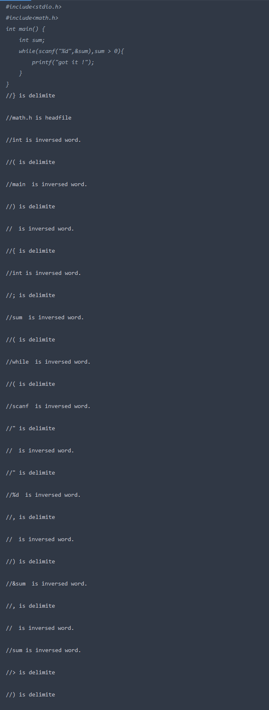
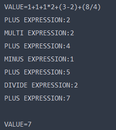

# 编译原理实践

---

[TOC]

----


## 实践 1 基于 LEX 的词法分析实验

### 实验目的

熟悉 Lex 基本语法，掌握 ParserGenerator 软件的使用

通过设计 开发通用高级语言一个单词种类的词法分析程序，加深对课堂教学内容（包括正规文法、正规表达式、有限自动机、NFA到DFA的转换、DFA的最小化）的理解，提高词法分析方法的实践能力

### 实验内容

使用正规文法描述C语言的描述,大致可以描述为如下格式:

```c
headfile #include(" "*)[<](([a-z]|[A-Z]|\.)+)[>]
```

### 实验设计

```lex
headfile  #include(" "*)[<"](([a-z]|[A-Z]|\.)+)[>"]
numbers ([0-9]+[\.|0-9]*[e|E]?[0-9]+)|0[x|X][0-9|A-F|a-f]+[\.|0-9|a-f|A-F]*
string \"(.)*\"
reserved auto|break|case|char|const|continue|default|do|double|else|enum|extern|float|for|goto|if|int|long|register|return|short|signed|sizeof|static|struct|switch|typedef|union|unsigned|void|volatile|while
delimiter  ,|;|\(|\)|\{|\}|\[|\]|\'|\"|\<|\>
identifier [_|a-zA-Z]+[_|a-zA-Z]*[0-9]*
backspace \r\n
operator \>\>=|\<\<=|\+\+|--|==|\>=|\<=|!=|&&|\|\||\<\<|\>\>|\+=|-=|\*=|\/=|\%=|&=|\|=|\^=|\+|-|\*|\/|\%|\>|\<|!|&~|\^|=
%%
/////////////////////////////////////////////////////////////////////////////
// rules section
{headfile} {printf("%s是第%d行的头文件",yytext,yylineno);}
{numbers} {printf("%s是第%d行的数字",yytext,yylineno);}
{string} {printf("%s是第%d行的字符",yytext,yylineno);}
{reserved} {printf("%s是第%d行的保留字",yytext,yylineno);}
{delimiter} {printf("%s是第%d行的分隔符",yytext,yylineno);}
{identifier} {printf("%s是第%d行的标识符",yytext,yylineno);}
{backspace} {printf("%s是第%d行的换行符",yytext,yylineno);}
{operator} {printf("%s是第%d行的操作符",yytext,yyineno);}
%%

/////////////////////////////////////////////////////////////////////////////
// programs section
int main()
{
//create a lexer, and call the lex function.
//it will read from stdin and parser the tokens.
 YYLEXERNAME lexer;
 if(lexer.yycreate()){
	 lexer.yylex();
 }
}
```


### 实验实现及结果


### 实验心得

由于对Lex的使用还不是很了解，第一次用的时候遇到了很多的问题和bug，导致输出的结果不是想要的结果。后来经过多方查询勉强解决了问题。同时在完成这个实践作业的过程中，也体验到了Lex的简单和快捷。


## 实践 2 基于高级语言的词法分析实验

### 实验目的

熟悉有限自动机的基本原理，利用熟悉的高级语言构建用于识别
单词符号的词法分析器。通过设计、开发一个高级语言的词法分析程 序，加深对课堂教学内容（包括正规文法、正规表达式、有限自动机、 NFA 到DFA 的转换、DFA 的最小化）的理解，提高词法分析方法的 实践能力。

### 实验内容

选择C语言作为实验用语言

并编写正规文法

```
headfile #include(" "*)[<"](([a-z]|[A-Z]|\.)+)[>"] 
数字（10位，16位及科学计数法） numbers
[0-9]+[\.0-9]* 
保留字 reserved auto|break|case|char|const|continue|default|do|double|else|enum |extern|float|for|goto|if|int|long|register|return|short|signed|sizeof |static|struct|switch|typedef|union|unsigned|void|volatile|while 
分隔符
delimiter ,|;|\(|\)|\{|\}|\[|\]|\’|\"|\<|\> 
标识符 identifier [_|A-Za-z]+(_|[A-Za-z][0-9])*
操作符 operate \>\>=|\<\<=|\+\+|--|==|\>=|\<=|!=|&&|\|\||\<\<|\>\>|\+=|-=| \*=|\/=|\%=|&=|\|=|\^=|\+|-|\*|\/|\%|\>|\<|!|&~|\^|=
```

### 实验设计

#### 设计程序结构

- 设计`trie`树，用于存储及查找标识符
- 设计字符分隔符识别函数，用于在`trie`树中直接引入
- 再设计一颗`trie`树，用于保存关键字
- 设计关键字识别函数，优先放入`trie`树中做处理
- 设计头文件识别函数， 用于识别出包含的头文件
- 采用朴素算法逐字分析
- 编写程序内容
- 测试程序，分析结果，对原程序改进和修复

#### 源码

```cpp
int identifyString(char tstr)
{
    if (tstr == ',' || tstr == ';' || tstr == '(' || tstr == ')' ||
        tstr == '{' || tstr == '}' || tstr == '[' || tstr == ']' ||
        tstr == '\"' || tstr == '\'' || tstr == '<' || tstr == '>')
    {
        cout << endl << "//" << tstr << " is delimite" << endl; 
        return 1;
    }
    return 0;
}
```

```cpp
int identifyHead(string tstr)
{
    if (tstr[0] == '#')
    {
        //if (tstr.substr(1, 8) == "include<")
        {
            int flag = 0;
            for (int i = 0; i < tstr.size(); i++)
            {
                char c = tstr[i];
                if (c == '<') { flag = i; break; }
            }
            cout << endl << "//" << tstr.substr(flag+1,tstr.size()-flag-2) << " is headfile"<<endl;
            return 1;
        }
    }
    return 0;
}
```

```cpp
int identifyKey(string tstr)
{
    
    for (vector<string>::iterator it = keywods.begin(); it < keywods.end(); it++)
    {
        if (tstr == *it)
        {
            cout << endl << "//" << *it << " is keywords." << endl; return 1;
        }
        return 0;
    }
}
```

```cpp
int identifyStr(string tstr)
{
    int flag = 0;
    for (int i = 0; i < tstr.size(); i++)
    {
       char c = tstr[i];
       if (!isalpha(c) || !(c != '_')) { if (judgeString(c)) { if (i > 0)cout << endl << "//" << tstr.substr(flag, i-flag) << "　is inversed word." << endl;  flag = i+1; } }
    }
    if(flag!=tstr.size())cout << endl << "//" << tstr.substr(flag, tstr.size()) << " is inversed word." << endl;
    return 0;
}
```

```cpp
int main()
{
    Trie Textlib;
    Textlib.insert("ialwaysloveu");
    string tstr;
    while (cin >> tstr)
    {
        char chars = tstr[0];
        if (identifyString(chars))
            continue;
        if (identifyHead(tstr))
            continue;
        if (identifyKey(tstr))
            continue;
        else { 
            identifyStr(tstr);
        }
    
     }

	return 0;
}
```

### 实验实现和结果

使用Jetbrains Clion 运行程序


输入测试用程序源码

```c
#include<stdio.h>
#include<math.h>
int main() {
    int sum;
    while(scanf("%d",&sum),sum > 0){
        printf("got it !");
    }
}
```





### 实验心得

在使用`trie`树的时候对自动机的应用做了更深入的了解，在识别程序的时候需要对字符串逐个识别后进行存储，就用到了数据结构相关的内容，同时还要考虑识别的速度，准确率，是否有bug等小问题，在逐渐完善过程中同时对编译过程有了全新的认识。

## 实践 3 利用 YACC 生成语法分析器

### 实验目的

熟悉 YACC 基本语法，掌握 Parser Generator 软件的使用；通过
设计、开发高级语言一个语法结构的语法分析程序。了解 YACC 处理 二义性的方法。

### 实验内容

- 设计词法分析器对基本的运算式子和表达式进行分析
- 设计语法分析器对有特点的二义文法进行分析

> 

### 实验设计

- 在Lex内写好代码，对接下来的词法分析做好准备

- 在`yacc`文件中编写文法，生成`cpp`文件

- 在`cpp`内导入`lib`文件和相关的头文件，编译生成生成可执行文件

- ```
  // place any declarations here
  delim [ \t]
  ws    {delim}+
  letter [a-zA-Z]
  digit [0-9]
  id    {letter}({letter}|{digit})*
  /* can support 12.34 */
  number {digit}+(\.{digit}+)?
  %%
  
  /////////////////////////////////////////////////////////////////////////////
  // rules section
  
  %{
  	// extract yylval for use later on in actions
  	YYSTYPE YYFAR& yylval = *(YYSTYPE YYFAR*)yyparserptr->yylvalptr;
  %}
  
  // place your Lex rules here
  {ws} {/*do nothing*/}
  
  "+" {return PLUS;}
  "-" {return MINUS;}
  "*" {return MULTI;}
  "(" {return LP;}
  ")" {return RP;}
  "=" {return EQUAL;}
  "\n" {return EOL;}
  "/" {return DIVIDE;}
  {id} {return ID;}
  {number}    { yylval = atof(yytext);return NUMBER;}
  %%
  ```

- ```cpp
  %{
  /****************************************************************************
  myparser.y
  ParserWizard generated YACC file.
  
  Date: 2020年6月4日
  ****************************************************************************/
  
  #include "mylexer.h"
  #include<string>
  %}
  
  /////////////////////////////////////////////////////////////////////////////
  // declarations section
  
  // parser name
  %name myparser
  
  // class definition
  {
  	// place any extra class members here
  }
  
  // constructor
  {
  	// place any extra initialisation code here
  }
  
  // destructor
  {
  	// place any extra cleanup code here
  }
  
  // attribute type
  %include {
  #ifndef YYSTYPE
  #define YYSTYPE int
  #endif
  }
  
  
  
  %token NUMBER ID
  %token PLUS MINUS DIVIDE MULTI
  %token LP RP EOL COMMENT
  %token EQUAL
  
  %left PLUS MINUS
  %left MULTI DIVIDE
  %right UMINUS
  // place any declarations here
  
  %%
  
  /////////////////////////////////////////////////////////////////////////////
  // rules section
  
  // place your YACC rules here (there must be at least one)
  
  lines	:	ID EQUAL expr EOL	{ printf("\nID=%d\n", $3); }
  		|	lines EOL
  		|   lines COMMENT
  		|
  		;
  
  expr	:	expr PLUS expr	{ $$ = $1 + $3; printf("PLUS EXPRESSION:%d\n",$$);}
  		|	expr MINUS expr	{ $$ = $1 - $3; printf("MINUS EXPRESSION:%d\n",$$);}
  		|	expr MULTI expr	{ $$ = $1 * $3; printf("MULTI EXPRESSION:%d\n",$$);}
  		|	expr DIVIDE expr	{ $$ = $1 / $3;printf("DIVIDE EXPRESSION:%d\n",$$);}
  		|	LP expr RP	{ $$ = $2; }
  		|	'-' expr %prec UMINUS	{ $$ = -$2; }
  		|	NUMBER {$$=$1;} //$$=$1 can be ignored
  		|   ID 
  		; 
  
  %%
  
  /////////////////////////////////////////////////////////////////////////////
  // programs section
  
  int main(void)
  {
  	int n = 1;
  	mylexer lexer;
  	myparser parser;
  	if (parser.yycreate(&lexer)) {
  		if (lexer.yycreate(&parser)) {
  			n = parser.yyparse();
  		}
  	}
  	return n;
  }
  
  
  ```

### 实验实现和结果

输入实验数据： `ID=1+1+1*2+3-2+8/4`

> 


### 实验心得

通过这次实验，我初步实现了Lex和Yacc相结合对实验数据进行分析和处理。虽然大部分内容与实验1 2基本相似，但是实验3中多了对二义性文法的处理方法，让我对编译原理有了更深层次的认识。