# 编译

原理－龙书

---

## 绪论

 ### 课程主要内容 

**编译器 Compiler**

- 编译的基本理论
- 形式文法 形式语言
- 编译器实现的技术
- 编程实现一个小型语言的编译器


### 编译器概念

> 从功能上看 一个编译程序就是一个语言翻译程序

> 将一种语言(源语言 `source language`) 书写的程序翻译成另一种语言 (目标语言 `target language`) 书写的等价程序

**编译器的重要任务之一 : 报告它在翻译过程中发现的源程序的错误**


### Q & A

1. 编译器使用C语言作为目标语言的好处是什么？

   > C语言比较底层一些 编译器能够编译并使用到几乎所有的硬件上
   >
   >  
   >
   > For the C language there are many compilers available that compile to almost
   > every hardware.

2. 编译器和解释器的区别是什么？

   > 编译器是用来读取一种程序的语言(源语言) 然后把他翻译成另一种语言的相等的程序(目标语言) 并报告在转换过程中发现的任何错误
   >
   >  
   >
   > 解释器直接处理用户输入的源程序符号
   >
   > 
   >
   > A compiler is a program that can read a program in one language - the source language - and translate it into an equivalent program in another language – the target language and report any errors in the source program that it detects during the translation process.
   >
   > Interpreter directly executes the operations specified in the source program on inputs supplied by the user.


### 编译器的结构

编译器分为两个部分组成 **分析部分 和 综合部分**

- 分析 `Analysis`
  - 把源程序分解为多个组成要素 并加入语法结构
  - 收集有关信息 并存放在符号表的数据结构中
  - 也称为 **前端 Front End**
- 综合 `Synthesis`
  - 根据中间 表示和符号表中的信息来构造用户期待的目标程序
  - 也称为 **后端 Back End**


#### 词法分析 Lexical Analysis

也称为 **扫描 Scanning**

此法分析器读入组成源程序的字符流 并将他们组织成为有意义的词素的序列

对于每一个词素 会陈胜如下形式的词法单元 `token` 作为输出

```
<token-name, attribute-value>
```

- `token-name`
  - 由语法分析使用的抽象符号
- `attribute-value`
  - 指向符号表中关于这个词法单元的条目


e.g.  `position = initial + rate * 60`

- `position` 
  - 词素
  - `<id, 1>`
- `=`
  - 词素
  - `< = >`
- `initial`
  - 词素
  - `<id, 2>`
- `+`
  - 词素
  - `<id, 3>`
- `rate`
  - 词素
  - `<id, 3>`
- `*`
  - 词素
  - `< * >`
- `60`
  - 词素
  - `<number, 4>`

`<id, 1> < = > <id, 2> < + > <id, 3> < * > <number, 4>`


### 语法分析 Syntax Analysis

也称为 解析 `Parsing`

常用的表示方法有 语法树 `Syntax Tree`


### 语义分析 Semantic Analysis

使用语法树 和 符号表中的信息来检查源程序是否和语言定义的语义一致

同时也收集类型信息 并把这些信息存放在语法树 或 符号表中 

语义分析一个很重要的部分是 **类型检查 Type Checking** 检查每个运算符是否和运算分量匹配


### 中间代码生成 Intermediate Code Generation

生成源程序的中间表示形式

- 三地址码 `Three address-code`

上面例子的三地址码序列 

> `t1 = inttofloat(60)`
>
> `t2 = id3 * t1`
>
> `t3 = id2 + t2`
>
> `id1 = t3`


### 代码优化 Code Optimization

机器无关的代码优化步骤试图改进中间代码 以便生成更好的目标代码

**提高空间 时间的效率**

有些简单的优化方法可以极大的提高目标程序的运行效率而不会过多的降低编译速度


### 代码生成 Code Generation

生成目标代码


### 符号表管理 Symbol-Table Management

管理编译过程中得到的程序中的标识符的各种信息

属性提供了 **存储分配 类型 作用域** 等信息


### 出错处理 Error Detection and Reporting

检查错误的位置

检查错误的性质

错误恢复


### 遍 Pass

书中叫 **趟** 

在一个特定实现中 多个步骤的活动可以被组合成一遍 `Pass` 

每一遍`Pass`读入一个输入文件并产生一个输出文件


- 遍数多
  - 结构清晰 但是时间效率不够高
- 遍数少
  - 编译速度快 但是对机器的内存要求高


> 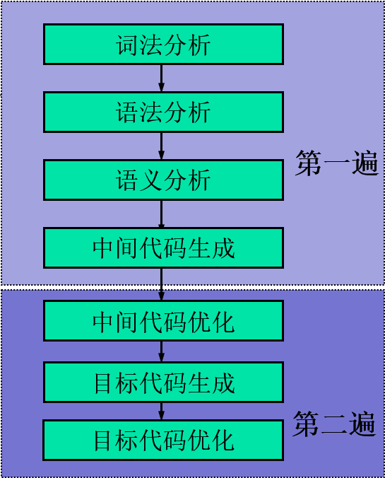


**世界上的第一个编译器只能是用机器语言开发的**


> 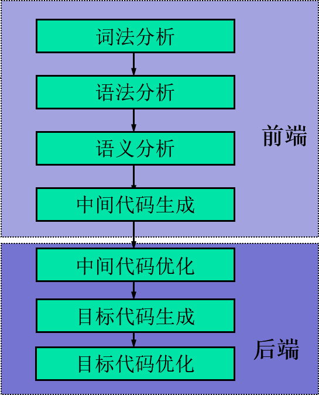
>
> - 取一个编译器的前端 重写他的后端就产生了让同一种语言在另一个机器上的编译器
> - 不同的前端用同一个后端  就达到了一个机器上多个编译器


### 自展技术

直接用目标机器上的机器语言书写源程序的编译程序 工作量大

用目标机器上的机器语言书写**源语言的一个子集的编译程序** 

然后再用这个**子集作为书写语言** 实现源语言的编译程序

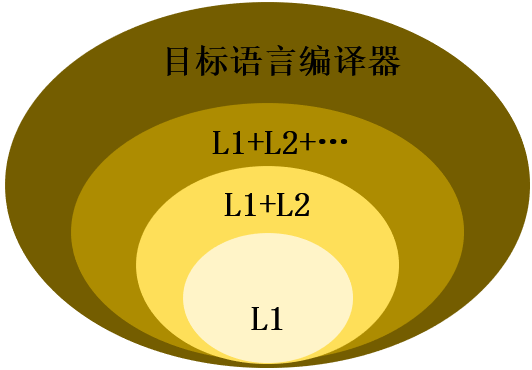

### 编译器的伙伴们

#### 预处理器 Pre-processors

- 删除注释
- 宏展开
- 将多个分开的源文件进行聚合


#### 汇编器 Assemblers

- 处理汇编语言代码 产生可重定位的机器代码


#### 链接器 Linker

解决外部内存地址的问题


#### 加载器 Loader

把所有可执行目标文件放在内存中执行


## 文法与语言

### 字母表 Alphabet


$\sum$ 是一个 **有穷符号集合**

e.g. 二进制字母表 ASCII 字符集 Unicode 字符集


#### 字母表的运算

##### 乘积 Product

$\sum_1 \sum_2 = \{ ab | a \in \sum_1 , b \in \sum_2 \} $


#### n次幂 Power

$\sum^0 = { \epsilon }$

$ \sum ^n = \sum^{n-1} \sum , n\geqslant 1 $

**长度为 n 的符号串构成的集合**


##### 正闭包 Positive closure

$\sum ^ + = \sum \cup \sum^2 \cup \sum^3 \cup ...$

**长度正数的符号串构成的集合**


##### 克林闭包 Kleene closure

$\sum ^* = \sum^0 \cup \sum^+$

**任意符号串 长度可以为 0 构成的集合**


### 串 String

设 $\sum$ 是一个字母表  $\forall x \in \sum^*$ 则 x 称为是 $\sum$ 上的一个 **串**

- 串是字母表中符号的一个有穷序列


- 串的**长度** 记作 $|s|$ 
  - 指的是 s 中符号的个数
- **空串** 是长度为 0 的串 用 $\epsilon$ 表示
  - $|\epsilon| = 0$
- 前缀 Prefix
  - 移走符号串尾部的0个或多个符号得到的符号串
- 后缀 Suffix
  - 删去符号串头部的0个或多个符号得到的符号串
- 子串
  - 删去一个前缀和一个后缀得到的符号串


#### 串的运算


##### 连接 Concatenation

如果 x 和 y 是串 那么x和y的连接 是把 y 附加到 x 后面而形成的串

记作 xy


$\epsilon s = s \epsilon = s$


##### 幂

**将 n 个 s 连接起来**


### 文法的形式化定义

$$
G = (V_T , V_N , P , S)
$$

- $V_T$ 终结符号集

  - 文法定义的语言的基本符号

- $V_N$ 非终结符号集

  - 是用来表示语法成分的符号
  - 表示一个中介符号串的集合

- $P$ 产生式集合

  - 描述了将终结符和非终结符组合成串的方法

  $\alpha \rightarrow \beta$

  

  $\alpha \in (V_T \cup V_N) ^ +$ 至少包含$V_N$ 中的一个元素

  称为产生式的**头部** 或者 **左部**

   

  $\beta \in (V_T \cup V_N) ^*$

  称为产生式的**体** 或者 **右部**

- $S$ 开始符号

  - 指定某非终结符号是开始符号


$$
\alpha \rightarrow \beta_1 | \beta_2 | \beta_3 | ... | \beta_n
$$
其中 $\beta_1 | \beta_2 | \beta_3 | ... | \beta_n$ 称为 $\alpha$ 的 **候选式**


### 推导 Derivation  与  规约 Reduction

#### 直接推导与直接规约 

进行一步推导或规约 


> 


- $\alpha \Rightarrow^0 \alpha$
- $\Rightarrow^+$ 表示经过整数步的推导
- $\Rightarrow^*$ 表示经过若干步(可以为0)步推导


**最右推导 称为 规范推导**

**最左规约 称为 规范规约**


### 句型 和 句子

$if \; S \Rightarrow ^ * \alpha ,\alpha \in (V_T \cup V_N)^*$

称$\alpha$是$G$的一个**句型 sentential form**

- 一个句型中可以包含**终结符** 也可以包含**非终结符** 也可以是**空串**


$if \; S = \Rightarrow ^* w , w \in V_T ^*$ 称 $w$是$G$ 的一个**句子 sentence** 

- 句子是**不包含非终结符的句型**


### 语言

由文法$G$的开始符号$S$推导出的所有句子构成的集合

称为 **文法G生成的语言**  记为 $L(G)$


> 一个文法对应一个语言
>
> 但一个语言可能有若干个文法产生它
>
> 这若干个文法是等价的 称为
>
> **等价 equivalent 文法**


### Chomsky 文法分类体系

> 乔姆斯基(Chomsky) 在 1956 年提出形式语言理论 他将形式文法分为4类 对应这四种语言

分类的方法是对文法的产生式进行不同的限制


#### 0 型文法 Type-0 Grammar

$\forall \alpha \rightarrow \beta \in P$ 推导式左侧至少含有 1 个非终结符

**0 型语言**

由 0 型文法生成的语言


#### 1 型文法 Type-1 Grammar

$$
\forall \alpha \rightarrow \beta \in P, |\alpha| \leq |\beta| 
$$

**上下文有关语言 1型语言**

由上下文有关文法 1型文法 生成的语言


#### 2 型文法 Type-2 Grammar

$$
\forall \alpha \rightarrow \beta \in P , \alpha \in V_N
$$

**上下文无关语言 2型语言**

由上下文无关文法 2型文法 生成的语言


#### 3 型文法 Type-3 Grammar

$$
Right \ Linear : A \rightarrow wB \ or \ A \rightarrow w \\
Left \ Linear : A \rightarrow Bw \ or \ A \rightarrow w
$$

**正则语言 3型语言**

由正则文法 3型文法 生成的语言


#### 四种文法的关系

逐级限制

- 0 型文法
  - 产生式左侧至少包含 1 个非终结符
- 1 型文法
  - $|\alpha| \leq | \beta|$
- 2 型文法
  - $\alpha \in V_N$
- 3 型文法
  - 左线性 右线性

> 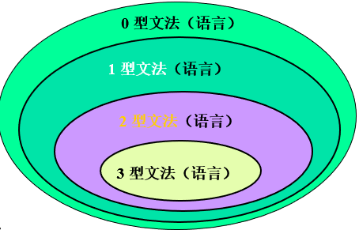


#### 识别各类语言的数学模型

> - 0 型语言
>   - 图灵机
> - 1 型语言
>   - 有界图灵机
>   - 线性有界自动机
> - 2 型语言
>   - 下推自动机
> - 3 型语言
>   - 有限自动机


### 分析树

- 根节点的标号为 文法开始符号
- 内部节点标识 为 非终结符号
- 叶结点的标号既可以是非终结符 也可以是终结符


- 一次推导对应一颗分析树
- 一颗分析树可能对应若干推导

**但是一颗分析树对应一个最左推导 也只能对应一个最右推导**


### 短语

给定一个句型 其分析树中的每一颗**子树的边缘** 称为该句型的一个**短语**

- 如果子树只有父子两代节点 那么这课子树的边缘称为该句型的一个 **直接短语**


> 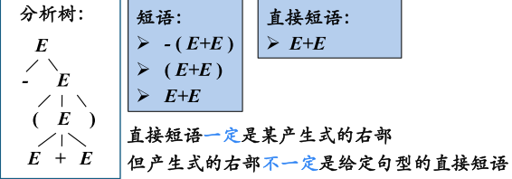


#### 句柄

最左直接短语称为 **句柄**


#### 素短语

是指至少含有一个终结符的短语 

并且除自身外 不包含更小的素短语。

**最左素短语**

是句型中最左边的素短语


### 二义性 Ambiguity

> 如果一个文法的句子有两棵或以上的分析树　称此句子是 **二义的**

> 如果已给文法**有一个**句子是二义的 此文法称为 **二义文法**

> 如果一个语言的**所有**文法都是二义的 称**此语言是二义的**


## 词法分析

### 词法分析器的作用

> 词法分析器是编译的第一阶段
>
> 词法分析器的主要内容是读入源程序的输入字符 将他们组成词素
>
> 生成并输出一个词法单元序列 每个词法单元对应于一个词素


- 单词符号 `token`
  - 词法分析器的输出形式 二元式 < 类别，属性值 >
- 模式 `pattern`
  - 描述一个单词符号的可能形式
- 词素 `lexeme`
  - 源程序中的一个字符序列 是单词符号的实例


### 词法单元的约束

> 正则表达式是一种用来描述词素模式的重要表示方式
>
> 虽然正则表达式不能表达出所有可能的模式　但是可以高效地描述在处理词法单元时要用到的模式类型


### 有限自动机

- 有限自动机是 识别器`recognizer` 它们只能对每个可能的输入串简单地回答 是 或 否
- 分类
  - 不确定的有穷自动机 NFA
    - 对其边上的标号没有任何限制
    - 一个符号标记离开同一状态的多条边 且$\epsilon$ 也可以作为标号
  - 确定的有穷自动机 DFA
    - 有且仅有一条离开该状态 以该符号为标号的边


NFA 与 DFA 能识别的语言集合是相同的

事实上 这些语言的合集正好是能用正则表达式描述的语言的集合

这个集合称为 **正则语言 Regular Language**


#### 不确定的有限自动机 NFA

NFA由以下几部分组成

- 有穷的状态集合 $S$
- 一个输入符号集合 $\sum$ 即输入字母表 假设$\epsilon$ 不是 $\sum$ 中的元素
- 一个转换函数 `transition function` 为每个状态和  $\sum \cup \{ \epsilon \}$中的每个符号都给出了相应的后继状态`next state`的集合
- $S$中的一个状态$s_0$被指定为开始状态 或者说 初始状态
- $S$ 的一个子集 $F$ 被指定为接受状态 或者说 终止状态的集合


$$
(a|b)*abb  
$$


状态转换图

> 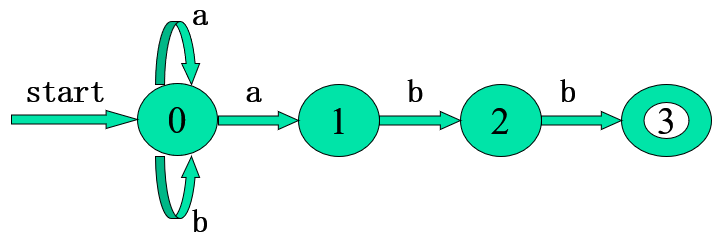


状态转换表

> 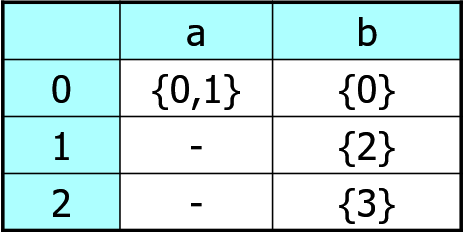
>
> 易于存储 查找转移方便
>
> 但是占用空间比较大


NFA 能识别的所有字符串构成的集合称为 NFA 定义的语言


#### 确定的有限自动机 DFA

- 没有 $\epsilon$ 边转移
- 一个状态面临一个输入符号时最多只转移到一个状态


#### NFA - DFA 的转换

子集构造法

> 让构造得到的 DFA 的每个状态对应于 NFA 的一个状态集合
>
> 将 NFA 中一个状态面临一个输入符号转换到的状态集合（子集）作为 DFA 中的一个状态


$$
\epsilon - closure (s)
$$
定义为一个状态集合，是状态 s 经过任意条 ε 边到达的状态所组成的集合


$$
\epsilon - closure (T)
$$
定义为一个状态集合，是状态集合 T 中的任何状态经过任意条 ε 边到达的状态集合


$$
Move(T,a)
$$
定义为一个状态集合，是状态集合 T 中的任何状态经过 a 边到达的状态


> e.g 
>
> 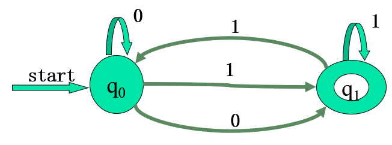
>
> 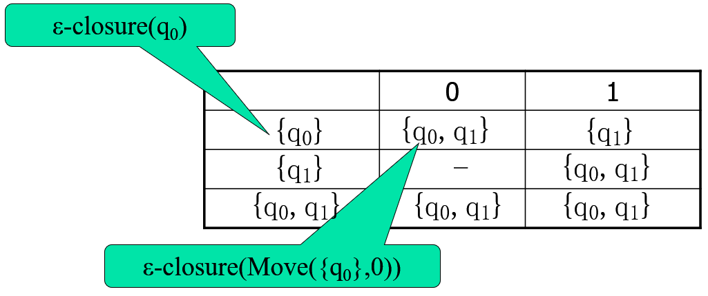
>
> 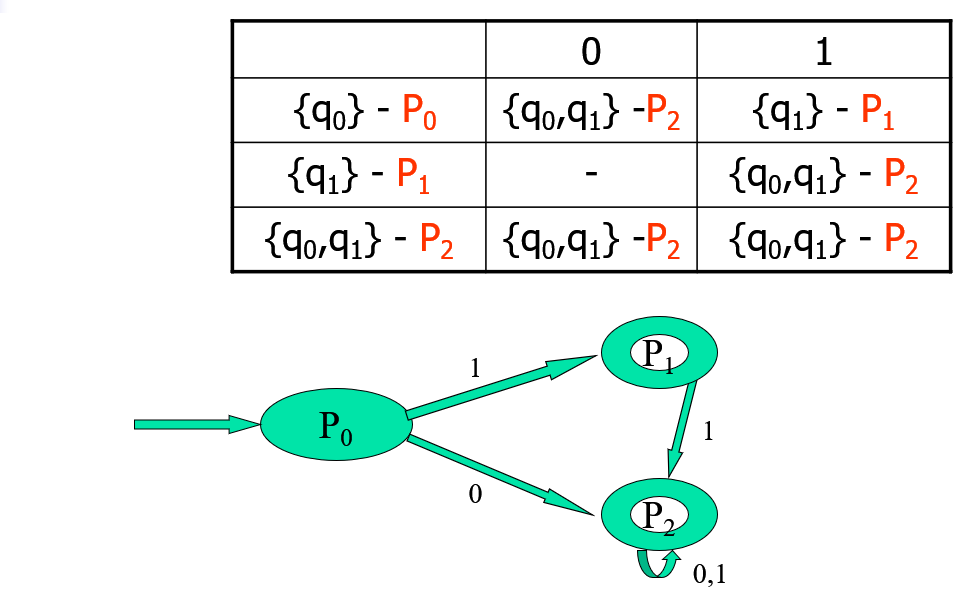


#### 从正则表达式构造NFA

1. $\epsilon$

   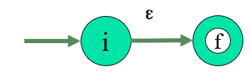

2. $a$

   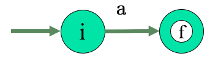

3. $s | t$

   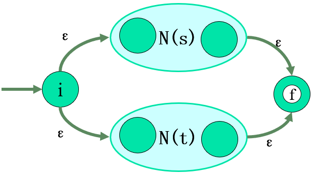

4. $st$

   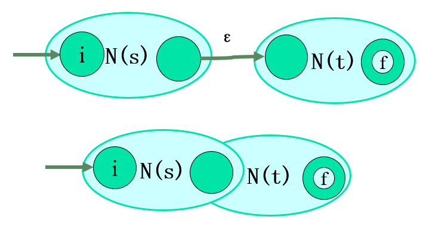

5. $s^*$

   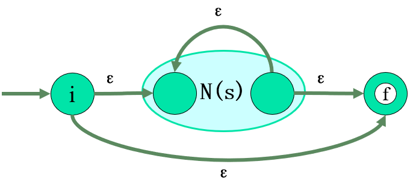


#### DFA 的化简 \ 最小化

- 为 DFA 寻找一个状态数比较少的等价 DFA
- **任何 DFA （或 NFA）都存在（唯一）一个状态数最少的 DFA 与之等价 **


##### 求同法

- 基本思想
  - 寻找等价状态 合并
- 等价状态必须满足两个条件
  - 一致性条件
    - 状态 s 和 t 必须同时为接受状态或非接受状态
  - 蔓延性条件
    - 对于所有的输入符号，状态 s 和 t 必须转移到等价的状态中


##### 求异法

- 首先把DFA D的状态集划分为非接受状态组和接受状态组，作为初始划分 П

- 执行以下过程

  - > 最初，令Пnew= П;
    > for( 对于П中的每个组G ) {
    >      将G划分为更小的组，使得两个状态s和t在同一个小组中，当且仅当对于所有的输入符号a，状态s和t都能转换到达П中的同一组;
    >      在Пnew中，将G替换为对G进行细化的那些小组;
    > }

- 如果П~new~= П，则令П~final~ = П 并执行4；否则用П~new~替换 П 并重复执行 第二步 .

- 划分П~final~ 中的每个组内的状态均是等价的，作为一个新状态


正规文法、正规式、有限自动机都是描述**正规语言**的工具

- 用正规式表示
- 用正规文法产生
- 用有限自动机识别


## 语法分析


