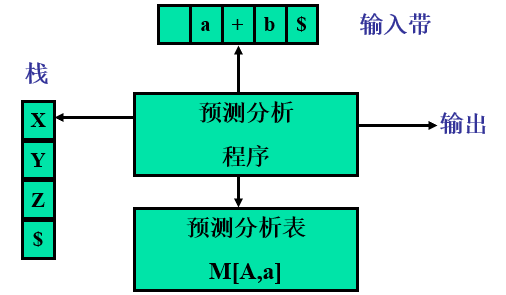
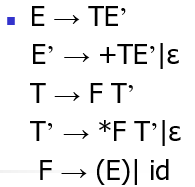
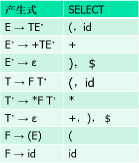
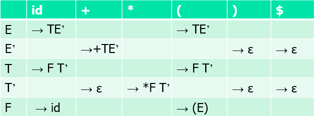
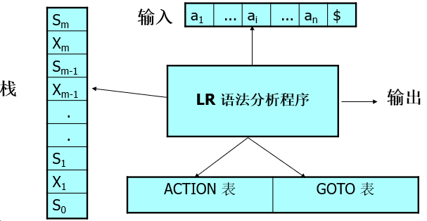

# 编译

原理－龙书

---

## 绪论

 ### 课程主要内容 

**编译器 Compiler**

- 编译的基本理论
- 形式文法 形式语言
- 编译器实现的技术
- 编程实现一个小型语言的编译器


### 编译器概念

> 从功能上看 一个编译程序就是一个语言翻译程序

> 将一种语言(源语言 `source language`) 书写的程序翻译成另一种语言 (目标语言 `target language`) 书写的等价程序

**编译器的重要任务之一 : 报告它在翻译过程中发现的源程序的错误**


### Q & A

1. 编译器使用C语言作为目标语言的好处是什么？

   > C语言比较底层一些 编译器能够编译并使用到几乎所有的硬件上
   >
   >  
   >
   > For the C language there are many compilers available that compile to almost
   > every hardware.

2. 编译器和解释器的区别是什么？

   > 编译器是用来读取一种程序的语言(源语言) 然后把他翻译成另一种语言的相等的程序(目标语言) 并报告在转换过程中发现的任何错误
   >
   >  
   >
   > 解释器直接处理用户输入的源程序符号
   >
   > 
   >
   > A compiler is a program that can read a program in one language - the source language - and translate it into an equivalent program in another language – the target language and report any errors in the source program that it detects during the translation process.
   >
   > Interpreter directly executes the operations specified in the source program on inputs supplied by the user.


### 编译器的结构

编译器分为两个部分组成 **分析部分 和 综合部分**

- 分析 `Analysis`
  - 把源程序分解为多个组成要素 并加入语法结构
  - 收集有关信息 并存放在符号表的数据结构中
  - 也称为 **前端 Front End**
- 综合 `Synthesis`
  - 根据中间 表示和符号表中的信息来构造用户期待的目标程序
  - 也称为 **后端 Back End**


#### 词法分析 Lexical Analysis

也称为 **扫描 Scanning**

此法分析器读入组成源程序的字符流 并将他们组织成为有意义的词素的序列

对于每一个词素 会陈胜如下形式的词法单元 `token` 作为输出

```
<token-name, attribute-value>
```

- `token-name`
  - 由语法分析使用的抽象符号
- `attribute-value`
  - 指向符号表中关于这个词法单元的条目


e.g.  `position = initial + rate * 60`

- `position` 
  - 词素
  - `<id, 1>`
- `=`
  - 词素
  - `< = >`
- `initial`
  - 词素
  - `<id, 2>`
- `+`
  - 词素
  - `<id, 3>`
- `rate`
  - 词素
  - `<id, 3>`
- `*`
  - 词素
  - `< * >`
- `60`
  - 词素
  - `<number, 4>`

`<id, 1> < = > <id, 2> < + > <id, 3> < * > <number, 4>`


### 语法分析 Syntax Analysis

也称为 解析 `Parsing`

常用的表示方法有 语法树 `Syntax Tree`


### 语义分析 Semantic Analysis

使用语法树 和 符号表中的信息来检查源程序是否和语言定义的语义一致

同时也收集类型信息 并把这些信息存放在语法树 或 符号表中 

语义分析一个很重要的部分是 **类型检查 Type Checking** 检查每个运算符是否和运算分量匹配


### 中间代码生成 Intermediate Code Generation

生成源程序的中间表示形式

- 三地址码 `Three address-code`

上面例子的三地址码序列 

> `t1 = inttofloat(60)`
>
> `t2 = id3 * t1`
>
> `t3 = id2 + t2`
>
> `id1 = t3`


### 代码优化 Code Optimization

机器无关的代码优化步骤试图改进中间代码 以便生成更好的目标代码

**提高空间 时间的效率**

有些简单的优化方法可以极大的提高目标程序的运行效率而不会过多的降低编译速度


### 代码生成 Code Generation

生成目标代码


### 符号表管理 Symbol-Table Management

管理编译过程中得到的程序中的标识符的各种信息

属性提供了 **存储分配 类型 作用域** 等信息


### 出错处理 Error Detection and Reporting

检查错误的位置

检查错误的性质

错误恢复


### 遍 Pass

书中叫 **趟** 

在一个特定实现中 多个步骤的活动可以被组合成一遍 `Pass` 

每一遍`Pass`读入一个输入文件并产生一个输出文件


- 遍数多
  - 结构清晰 但是时间效率不够高
- 遍数少
  - 编译速度快 但是对机器的内存要求高


> 


**世界上的第一个编译器只能是用机器语言开发的**


> 
>
> - 取一个编译器的前端 重写他的后端就产生了让同一种语言在另一个机器上的编译器
> - 不同的前端用同一个后端  就达到了一个机器上多个编译器


### 自展技术

直接用目标机器上的机器语言书写源程序的编译程序 工作量大

用目标机器上的机器语言书写**源语言的一个子集的编译程序** 

然后再用这个**子集作为书写语言** 实现源语言的编译程序


### 编译器的伙伴们

#### 预处理器 Pre-processors

- 删除注释
- 宏展开
- 将多个分开的源文件进行聚合


#### 汇编器 Assemblers

- 处理汇编语言代码 产生可重定位的机器代码


#### 链接器 Linker

解决外部内存地址的问题


#### 加载器 Loader

把所有可执行目标文件放在内存中执行


## 文法与语言

### 字母表 Alphabet


$\sum$ 是一个 **有穷符号集合**

e.g. 二进制字母表 ASCII 字符集 Unicode 字符集


#### 字母表的运算

##### 乘积 Product

$\sum_1 \sum_2 = \{ ab | a \in \sum_1 , b \in \sum_2 \} $


#### n次幂 Power

$\sum^0 = { \epsilon }$

$ \sum ^n = \sum^{n-1} \sum , n\geqslant 1 $

**长度为 n 的符号串构成的集合**


##### 正闭包 Positive closure

$\sum ^ + = \sum \cup \sum^2 \cup \sum^3 \cup ...$

**长度正数的符号串构成的集合**


##### 克林闭包 Kleene closure

$\sum ^* = \sum^0 \cup \sum^+$

**任意符号串 长度可以为 0 构成的集合**


### 串 String

设 $\sum$ 是一个字母表  $\forall x \in \sum^*$ 则 x 称为是 $\sum$ 上的一个 **串**

- 串是字母表中符号的一个有穷序列


- 串的**长度** 记作 $|s|$ 
  - 指的是 s 中符号的个数
- **空串** 是长度为 0 的串 用 $\epsilon$ 表示
  - $|\epsilon| = 0$
- 前缀 Prefix
  - 移走符号串尾部的0个或多个符号得到的符号串
- 后缀 Suffix
  - 删去符号串头部的0个或多个符号得到的符号串
- 子串
  - 删去一个前缀和一个后缀得到的符号串


#### 串的运算


##### 连接 Concatenation

如果 x 和 y 是串 那么x和y的连接 是把 y 附加到 x 后面而形成的串

记作 xy


$\epsilon s = s \epsilon = s$


##### 幂

**将 n 个 s 连接起来**


### 文法的形式化定义

$$
G = (V_T , V_N , P , S)
$$

- $V_T$ 终结符号集

  - 文法定义的语言的基本符号

- $V_N$ 非终结符号集

  - 是用来表示语法成分的符号
  - 表示一个中介符号串的集合

- $P$ 产生式集合

  - 描述了将终结符和非终结符组合成串的方法

  $\alpha \rightarrow \beta$

  

  $\alpha \in (V_T \cup V_N) ^ +$ 至少包含$V_N$ 中的一个元素

  称为产生式的**头部** 或者 **左部**

   

  $\beta \in (V_T \cup V_N) ^*$

  称为产生式的**体** 或者 **右部**

- $S$ 开始符号

  - 指定某非终结符号是开始符号


$$
\alpha \rightarrow \beta_1 | \beta_2 | \beta_3 | ... | \beta_n
$$
其中 $\beta_1 | \beta_2 | \beta_3 | ... | \beta_n$ 称为 $\alpha$ 的 **候选式**


### 推导 Derivation  与  规约 Reduction

#### 直接推导与直接规约 

进行一步推导或规约 


> 


- $\alpha \Rightarrow^0 \alpha$
- $\Rightarrow^+$ 表示经过整数步的推导
- $\Rightarrow^*$ 表示经过若干步(可以为0)步推导


**最右推导 称为 规范推导**

**最左规约 称为 规范规约**


### 句型 和 句子

$if \; S \Rightarrow ^ * \alpha ,\alpha \in (V_T \cup V_N)^*$

称$\alpha$是$G$的一个**句型 sentential form**

- 一个句型中可以包含**终结符** 也可以包含**非终结符** 也可以是**空串**


$if \; S = \Rightarrow ^* w , w \in V_T ^*$ 称 $w$是$G$ 的一个**句子 sentence** 

- 句子是**不包含非终结符的句型**


### 语言

由文法$G$的开始符号$S$推导出的所有句子构成的集合

称为 **文法G生成的语言**  记为 $L(G)$


> 一个文法对应一个语言
>
> 但一个语言可能有若干个文法产生它
>
> 这若干个文法是等价的 称为
>
> **等价 equivalent 文法**


### Chomsky 文法分类体系

> 乔姆斯基(Chomsky) 在 1956 年提出形式语言理论 他将形式文法分为4类 对应这四种语言

分类的方法是对文法的产生式进行不同的限制


#### 0 型文法 Type-0 Grammar

$\forall \alpha \rightarrow \beta \in P$ 推导式左侧至少含有 1 个非终结符

**0 型语言**

由 0 型文法生成的语言


#### 1 型文法 Type-1 Grammar

$$
\forall \alpha \rightarrow \beta \in P, |\alpha| \leq |\beta| 
$$

**上下文有关语言 1型语言**

由上下文有关文法 1型文法 生成的语言


#### 2 型文法 Type-2 Grammar

$$
\forall \alpha \rightarrow \beta \in P , \alpha \in V_N
$$

**上下文无关语言 2型语言**

由上下文无关文法 2型文法 生成的语言


#### 3 型文法 Type-3 Grammar

$$
Right \ Linear : A \rightarrow wB \ or \ A \rightarrow w \\
Left \ Linear : A \rightarrow Bw \ or \ A \rightarrow w
$$

**正则语言 3型语言**

由正则文法 3型文法 生成的语言


#### 四种文法的关系

逐级限制

- 0 型文法
  - 产生式左侧至少包含 1 个非终结符
- 1 型文法
  - $|\alpha| \leq | \beta|$
- 2 型文法
  - $\alpha \in V_N$
- 3 型文法
  - 左线性 右线性

> 


#### 识别各类语言的数学模型

> - 0 型语言
>   - 图灵机
> - 1 型语言
>   - 有界图灵机
>   - 线性有界自动机
> - 2 型语言
>   - 下推自动机
> - 3 型语言
>   - 有限自动机


### 分析树

- 根节点的标号为 文法开始符号
- 内部节点标识 为 非终结符号
- 叶结点的标号既可以是非终结符 也可以是终结符


- 一次推导对应一颗分析树
- 一颗分析树可能对应若干推导

**但是一颗分析树对应一个最左推导 也只能对应一个最右推导**


### 短语

给定一个句型 其分析树中的每一颗**子树的边缘** 称为该句型的一个**短语**

- 如果子树只有父子两代节点 那么这课子树的边缘称为该句型的一个 **直接短语**


> 


#### 句柄

最左直接短语称为 **句柄**


#### 素短语

是指至少含有一个终结符的短语 

并且除自身外 不包含更小的素短语。

**最左素短语**

是句型中最左边的素短语


### 二义性 Ambiguity

> 如果一个文法的句子有两棵或以上的分析树　称此句子是 **二义的**

> 如果已给文法**有一个**句子是二义的 此文法称为 **二义文法**

> 如果一个语言的**所有**文法都是二义的 称**此语言是二义的**


## 词法分析

### 词法分析器的作用

> 词法分析器是编译的第一阶段
>
> 词法分析器的主要内容是读入源程序的输入字符 将他们组成词素
>
> 生成并输出一个词法单元序列 每个词法单元对应于一个词素


- 单词符号 `token`
  - 词法分析器的输出形式 二元式 < 类别，属性值 >
- 模式 `pattern`
  - 描述一个单词符号的可能形式
- 词素 `lexeme`
  - 源程序中的一个字符序列 是单词符号的实例


### 词法单元的约束

> 正则表达式是一种用来描述词素模式的重要表示方式
>
> 虽然正则表达式不能表达出所有可能的模式　但是可以高效地描述在处理词法单元时要用到的模式类型


### 有限自动机

- 有限自动机是 识别器`recognizer` 它们只能对每个可能的输入串简单地回答 是 或 否
- 分类
  - 不确定的有穷自动机 NFA
    - 对其边上的标号没有任何限制
    - 一个符号标记离开同一状态的多条边 且$\epsilon$ 也可以作为标号
  - 确定的有穷自动机 DFA
    - 有且仅有一条离开该状态 以该符号为标号的边


NFA 与 DFA 能识别的语言集合是相同的

事实上 这些语言的合集正好是能用正则表达式描述的语言的集合

这个集合称为 **正则语言 Regular Language**


#### 不确定的有限自动机 NFA

NFA由以下几部分组成

- 有穷的状态集合 $S$
- 一个输入符号集合 $\sum$ 即输入字母表 假设$\epsilon$ 不是 $\sum$ 中的元素
- 一个转换函数 `transition function` 为每个状态和  $\sum \cup \{ \epsilon \}$中的每个符号都给出了相应的后继状态`next state`的集合
- $S$中的一个状态$s_0$被指定为开始状态 或者说 初始状态
- $S$ 的一个子集 $F$ 被指定为接受状态 或者说 终止状态的集合


$$
(a|b)*abb  
$$


状态转换图

> 


状态转换表

> 
>
> 易于存储 查找转移方便
>
> 但是占用空间比较大


NFA 能识别的所有字符串构成的集合称为 NFA 定义的语言


#### 确定的有限自动机 DFA

- 没有 $\epsilon$ 边转移
- 一个状态面临一个输入符号时最多只转移到一个状态


#### NFA - DFA 的转换

子集构造法

> 让构造得到的 DFA 的每个状态对应于 NFA 的一个状态集合
>
> 将 NFA 中一个状态面临一个输入符号转换到的状态集合（子集）作为 DFA 中的一个状态


$$
\epsilon - closure (s)
$$
定义为一个状态集合，是状态 s 经过任意条 ε 边到达的状态所组成的集合


$$
\epsilon - closure (T)
$$
定义为一个状态集合，是状态集合 T 中的任何状态经过任意条 ε 边到达的状态集合


$$
Move(T,a)
$$
定义为一个状态集合，是状态集合 T 中的任何状态经过 a 边到达的状态


> e.g 
>
> 
>
> 
>
> 


#### 从正则表达式构造NFA

1. $\epsilon$

   

2. $a$

   

3. $s | t$

   

4. $st$

   

5. $s^*$

   


#### DFA 的化简 \ 最小化

- 为 DFA 寻找一个状态数比较少的等价 DFA
- **任何 DFA （或 NFA）都存在（唯一）一个状态数最少的 DFA 与之等价 **


##### 求同法

- 基本思想
  - 寻找等价状态 合并
- 等价状态必须满足两个条件
  - 一致性条件
    - 状态 s 和 t 必须同时为接受状态或非接受状态
  - 蔓延性条件
    - 对于所有的输入符号，状态 s 和 t 必须转移到等价的状态中


##### 求异法

- 首先把DFA D的状态集划分为非接受状态组和接受状态组，作为初始划分 П

- 执行以下过程

  - > 最初，令Пnew= П;
    > for( 对于П中的每个组G ) {
    >      将G划分为更小的组，使得两个状态s和t在同一个小组中，当且仅当对于所有的输入符号a，状态s和t都能转换到达П中的同一组;
    >      在Пnew中，将G替换为对G进行细化的那些小组;
    > }

- 如果П~new~= П，则令П~final~ = П 并执行4；否则用П~new~替换 П 并重复执行 第二步 .

- 划分П~final~ 中的每个组内的状态均是等价的，作为一个新状态


正规文法、正规式、有限自动机都是描述**正规语言**的工具

- 用正规式表示
- 用正规文法产生
- 用有限自动机识别


## 语法分析

### 语法分析的概述

> 识别由词法分析给出的单词符号序列是否是给定（上下文无关文法）文法的正确的句子（程序）

> - 是 给出分析树
> - 否 指出错误出现的位置和错误的性质


### 自顶向下分析 Top-down parsing

> 按照先根次序(深度优先) 创建这颗语法分析树的各个节点
>
> 也可以被看作寻找输入串的最左推导的过程


> 


#### 递归下降法 - 不确定的自顶向下分析

> 带回溯的分析方法
>
> 本质上是**一种基于穷举原理的试探方法** 是个反复使用不同的产生式谋求匹配输入串的过程

> - 优点
>   - 对文法的限制小
> - 缺点
>   - 回溯 效率底下 代价高
>   - 出错时难以确定出错的位置
>
> 只有理论价值 实践中价值不大


#### 确定的自顶向下分析 - 预测分析

> 从文法的开始符号出发 根据当前的**输入符号和其他信息**
>
> **唯一地**确定选用哪条产生式往下推导 构造分析树
>
> **无论对错 没有回溯**

> 对文法有限制 不是任意的文法都适合这种分析方法


> 在每一步推导中 可以根据产生式右部的首`First`符号集 选择产生式
>
> 要做出确定分析 左部相同的产生式的右部的`First`集交集为空集
>
> 如果存在空产生式 或产生式右部可以推出空 与左部非终结符的后`Follow`跟符号集也不相交


#### First 集

构造 `First(X)`

> - X是终结符号 `FIRST(X) =  { X }`
> - $X \rightarrow \epsilon$ 则把$\epsilon$ 加入到 `FIRST(X)`
> - $X \rightarrow Y_1Y_2\dots Y_k$
>   - 把$FIRST (Y_1) - \{ \epsilon \}$ 放入到 `FIRST(X)`
>   - 如果 $Y_1 \Rightarrow^{*} \epsilon$ 则把 $FIRST (Y_2) - \{ \epsilon \}$ 加入到 `FIRST(X)`
>   - 如果 $Y_1 Y_2 \Rightarrow^{*} \epsilon$ 则把 $FIRST (Y_3) - \{ \epsilon \}$ 加入到 `FIRST(X)`
>   - ....
>   - 如果 $Y_1Y_2 \dots Y_{k-1} Y_{k} \Rightarrow^ \epsilon$ 则把 $  \epsilon$ 加入到 `FIRST(X)`


#### Follow 集

构造`FOLLOW(A)`

> 如果 $X \rightarrow AB$ 则 $FIRST(B) \subseteq FOLLOW(A) \quad FOLLOW(X) \subseteq FOOLOW(B)$
>
> 如果 $B \Rightarrow^{*} \epsilon$ 则 $FOLLOW(X) \subseteq FOLLOW(A)$
>
> 若 S 是开始符号 则 $ \$ \in FOLLOW(S) $ $是输入右端的结束符号
>
> 如果 $A \rightarrow aB\beta$ 将 $FIRST(\beta) - \{\epsilon\}$放入 $FOLLOW(B)$
>
> 如果 $A \rightarrow aB \; or \; A \rightarrow aB\beta \ (\beta \Rightarrow^{*} \epsilon)$ 将 $FOLLOW(A)$放入 $FOLLOW(B)$中 


#### SELECT 集

$A \rightarrow a ,A \in V_N, a \in V^*$

> 若 $a \nRightarrow ^ * \epsilon$ 则 $SELECT(A \rightarrow a) = FIRST(a)$
>
> 若 $a \Rightarrow^* \epsilon$ 则 $SELECT (A \rightarrow a) = ( FIRST(a) - \{ \epsilon\} ) \cup FOLLOW(A)$


#### LL(1) 文法

> 一个文法是`LL(1)` 文法的充分必要条件是
>
> 对每个非终结符号 A 的两个不同产生式 $A \rightarrow a \quad A \rightarrow \beta$ 满足：
>
> $SELECT( A \rightarrow a ) \cap SELECT( A \rightarrow \beta ) = \varnothing$

> - L
>   - **自左**而右扫描输入
> - L
>   - 生成一个**最左**推导
> - 1
>   - 做出分析前要向前看**一个**符号


#### 预测分析器

对于 `LL(1)` 文法的句子 可以用确定的分析方法进行分析 这种分析程序称为 **预测分析器**

> 

> 预测分析表是一个二维矩阵 $M [A,a]$ A 是非终结符号 a 是终结符号或者 $ 符号
>
> 矩阵中元素是产生式 如果 $a \in SELECT (A \rightarrow a)$ 则放入矩阵中


e.g.

> 
>
>  
>
> 
>
>  
>
> 


**一个文法是非 `LL(1)` 的 分析表中就会存在多重定义入口 `Multiply-defined entries` 反之也成立**

同时 `LL(1)` 文法的另外一个定义是

> 预测分析表中没有多重定义表项的文法叫做`LL(1)`文法


#### 非 LL(1) 文法 到 LL(1) 文法的等价转换

> 不一定每个语言都有`LL(1)` 文法 

##### 提取左因子 Left Factoring

> 形如
>
> $A \rightarrow a\beta | a\gamma$

> 解决方法
> $$
> A \rightarrow a\beta_1 | a\beta_2 | a\beta_3|\dots|a\beta_n \\
> A \rightarrow a (\beta_1 | \beta_2 | \beta_3 | \dots |\beta_n ) \\
> A \rightarrow a B \\
> B \rightarrow \beta_1 | \beta_2 | \beta_3 | \dots |\beta_n
> $$

##### 消除左递归 Left Recursion

> 形如
>
> $A \rightarrow Aa | \beta $ 的产生式或 $A \Rightarrow ^+ Aa$ 的推导

###### 直接左递归

> $$
> A  \rightarrow  Aa_1 |Aa_2 |\dots|Aa_m| \beta_1 | \beta_2 | \beta_3 | \dots |\beta_n 
> $$

消除直接左递归

> $$
> A \rightarrow \beta_1 B |\beta_2 B |\dots |\beta_n B | \\
> B \rightarrow a_1 B | a_2 B | \dots |a_n B | \varepsilon
> $$

###### 间接左递归

> $A \Rightarrow ^ + A a$ 的推导

消除间接左递归

> 前提条件是文法不含 回路`cycle` 即形如 $A \Rightarrow ^+ A$ 的推导
>
> > 其充要条件是 无 $A \rightarrow A \; and \; A \rightarrow \varepsilon$ 的产生式

消除间接左递归

$A_1A_2A_3\dots A_n$

> for ( 从1到n的每个i ) {
>
> ​		for ( 从 1 到 i-1 的每个 j  ) {
>
> ​				将每个形如 $A_i \rightarrow A_j\gamma$的产生式替换为产生组
>
> ​				$A_i \rightarrow \sigma_1 \gamma | \sigma_2 \gamma | \sigma_3 \gamma | \dots | \sigma_k \gamma$
>
> ​				其中 $A_j \rightarrow \sigma_1 | \sigma_2 | \sigma_3| \dots | \sigma_k \gamma$ 是所有 $A_j$ 的产生式
>
> ​		}
>
> ​		消除 $A_i$ 它产生式之间的立即左递归
>
> }


**无左因子产生式和无左递归只是文法为`LL(1)`文法的必要条件 而非充分条件**	

----

### 自底向上分析 Bottom-up parsing

> 按照先叶次序 创建语法分析树的各个节点
>
> 也可以被看作寻找输入串的规约过程

> - 每一步都是将最右推导得到的句型的最左可规约串规约为产生式的左部符号
> - 分析过程是寻找一个最左规约序列的过程
> - 输出的是一个产生式序列

自底向上分析法 又称 移进规约法

- 对输入符号串自左向右进行扫描 并将输入符逐个移入一个 `First-in-Last-out` 栈的结构
- 若栈顶符号串是某个句型的可规约串 就用相应的产生式的 **左部非终结符代替**
- 重复这一过程 直到只剩下开始符号


关键问题

- 在右句型中寻找可规约串
- 不同的寻找可规约串的方法 形成了不同的自底向上分析法


### 算符优先分析 

设 G 是一个算符文法 a b 是两个终结符号 则 a b 之间的优先关系定义如下

- `a =· b  `
  - 当且仅当 G 中含有如 $A \rightarrow \dots ab \dots$ 或者 $A \rightarrow \dots aBb \dots$ 的产生式
- `a <· b` 
  - 当且仅当 G 中含有形如 $A \rightarrow \dots aB \dots$ 的产生式 且有 $B \Rightarrow ^* b \dots $ 或者 $B \Rightarrow ^* Cb$
- `a ·> b` 
  - 当且仅当 G 中含有形如 $A \rightarrow \dots Bb \dots$ 的产生式 且有 $B \Rightarrow^+ \dots a$ 或者 $B \Rightarrow ^+ \dots aC$


若一个算符文法 G 的任意两个终结符好之间最多只有 `=· ·> <·` 三种关系中的一种 则称 G 为 **算符优先文法**


#### 算符优先关系表的构造

- 由定义直接构造
- 通过计算 `FIRSTVT`集  与  `LASTVT` 集 构造

  - $FIRSTVT(B) = \{ b| B \Rightarrow^+ b \dots \; or \; B \Rightarrow^+ Cb \dots \}$
    - 对于非终结符 B 其往下推导所可能出现的首个终结符
  - $LASTVT(B) = \{ a | B \Rightarrow ^+ \dots a \; or \; B \Rightarrow^+ \dots aC \}$
    - 对于非终结符 B 其往下推导所可能出现的最后一个终结符


- `a =· b  ` 
  - 直接看产生式的右部 $A \rightarrow \dots ab \dots$ 或 $A \rightarrow \dots aBb$ 则 `a =· b`
- `a <· b` 
  - 求出每个非终结符 B 的 `FIRSTVT(B)` 
  - 若 $A \rightarrow \dots aB \dots$ 则 $\forall b \in FIRSTVT(B) ,a <· b$
- `a ·> b` 
  - 求出每个非终结符 B 的 `LASTVT(B)`
  - 若 $A \rightarrow \dots Bb \dots$ 则 $\forall a \in LASTVT(B), a·>b$


任何一个 `a <· b` 并不意味着 `b ·> a` 和 `a =· b` 也不一定意味着 `b =· a` 

且这三种关系可能一个也成立不了


**a 和 b 之间的优先关系 与 b 和 a 之间的优先关系是根本不同的**


利用算符优先关系来寻找最左可规约串

- 从左端开始扫描串直到遇到第一个 `·>` 为止

- 向左扫描 跳过所有 `=·` 直到遇到第一个 `<·` 为止

- 句柄包括从第二步遇到的`<·`的右部到第一个`>·`的左部之间的所有符号

  包括介于其间或者两边的非终结符号


**算符优先分析法的规约过程与规范归约是不同的**

输出的事一个产生式的序列 将此产生式序列逆序推导得到一个分析树的 **基架**

**算法优先分析中的可规约串是最左素短语**

只能判断句子是否是给定文法的句子 不能给出完整的分析树


#### 优先函数 Precedence Functions

- 在实现算符优先分析时 往往不用算符优先关系表 而是两个优先函数
  - 当 `a <· b` 时
    - `f(a) < g(b)`
  - 当 `a =· b` 时
    - `f(a) = g(b)`
  - 当 `a ·> b` 时
    - `f(a) > g(b)`


- 优先函数的优点
  - 节约存储空间
  - 便于执行比较运算
- 优先函数的缺点
  - 损失了错误检测能力
  - 并不是每个优先关系表都存在优先函数


- 算符优先分析法的出错处理

  - 在以下两种情况下发现错误

    - 栈顶终结符号与当前输入符号无优先关系

      - 在优先关系表的空白处填入错误处理子程序的入口指针

      - > - $$ : 插入 id  输出信息 **缺少运算对象**
        >
        > - $) : 删除 ) 输出信息 **右括号不匹配**
        > - idid 或 )( : 插入运算符 + 输出信息 **缺少运算符号**
        > - ($ : 弹出 ( 输出信息 **缺少右括号**

    - 归约时没有产生式的右部与可归约串匹配

      - > - 若包含 `+ - * . ↑ ` 的可归约串被归约 检查两端是否出现非终结符号 (E 表达式) 若否 出错 输出 **缺少运算对象**
        > - 若归约 `id`检查两端是否出现非终结符号 若有 出错 输出 **缺少运算符号**
        > - 若归约 `()` 检查括号之间是否有一个非终结符号 若无 出错 输出 **括号之间无表达式**

        

  #### 算符优先分析法的局限性

- 不是规范规约 得不到完整的分析树
- 适用范围窄 一般的语言很难满足算符优先文法的要求 只能用来分析表达式
- 更一般的自底向下分析法是 **LR分析法**


### LR 分析

`LR (k)`分析技术

- L
  - 从左到右扫描输入串
- R
  - 构造一个最右推导的逆过程
  - 即最左规约
- k
  - 在做出分析决定前（即构造分析表）时要向前看的输入符号个数
  - 通常为 0 或 1


LR 分析技术是功能最强的（自底向上）语法分析技术 

适用文法广效率高 分析能力强


LR 分析器的逻辑结构

> 
>
> - LR分析程序
>   - 固定不变的 对于所有LR分析器都是一样的
> - 分析表
>   - 是LR分析法的核心 由两部分组成
>   - 不同的LR分析器 具有不同的分析表
>   - 如 `LR(0) SLR(1) LR(1) LALR(1)`
> - 栈
>   - 保存状态符号和文法符号
>   - $s_i$ 状态 $X_i$ 文法符号
> - 输入缓冲
> - 输出
>   - 产生式序列


- LR 分析方法是当前最广义的无回溯的 **移进 - 归约**方法
- 根据栈中的符号串和向右顺序查看输入串中的k(k≥0)个符号 就能唯一确定分析器的动作是移进还是归约 以及用哪个产生式进行归约
- `LR(k)` 分析技术是 Knuth 于 1965年首先提出来的
- 优点
  - 使用范围广 分析速度快 报错准确


#### 分析表

- 分析表由 `ACTION` 表和 `GOTO`表两部分组成
  - $ACTION[s_m,a_i]$表示当状态 s~m~ 面临输入 a~i~ 时的动作
  - 动作包括主要包括四种
    - $SHIFT s$ 将$a_i$和$s=ACTION[s_m,a_i]$分别压入符号栈中
    - $REDUCE \ A \rightarrow \beta$ 产生归约
    - $ACCEPT$ 接受 停机 成功
    - $ERROR$ 报错 调用出错处理
  - $GOTO[s_m,X_i]$ 表示当状态 $s_m$遇到文法符号$X_i$时需要跳转到的下一状态

#### 分析器运行

- 根据当前栈顶状态符号与输入符号查分析表决定下一步动作
- 把栈中符号序列和剩余输入串看成一个二元式格局，初始格局表示为$(s_0,a_1a_2\dots a_n \$)$
- 假设当前 $(s_0 X_1 X_2 s_2 \dots X_m s_m,\; a_ia_{i+1}\dots a_n \$)$
  - $ACTION[s_m,a_i] = shift \; s$
    - 二元式变为 $(s_0 X_1 X_2 s_2 \dots X_m s_ma_is, \; a_{i+1}\dots a_n \$)$
  - $ACTION[s_m,a_i] = reduce \; A \rightarrow \beta$ 
    - 假设 $|\beta| = r$ 则二元式变为 $(s_0 X_1 X_2 s_2 \dots X_{m-r} s_{m-r} As, \; a_ia_{i+1}\dots a_n \$)$
    - 其中 $s = GOTO[s_{m-r},A] , \beta = X_{m-r}X_{m-r+2}\dots X_m$


LR分析的关键问题是如何构造分析表 不同的构造方法形成不同的分析方法

主要有 `LR(0) SLR LR(1) LALR`


LR分析过程中的性质与特点

- 栈中的文法符号串并上剩余的输入串构成一个右句型
- 当该右句型出现在栈顶时 归约 否则移进
- 栈中的文法符号串是当前句型的前缀 该不包含句型句柄后面的符号 称之为 **活前缀 `Viable Prefixes`**


